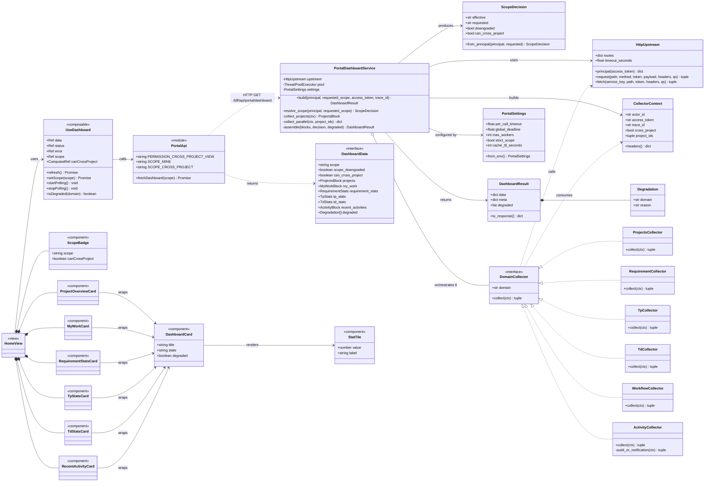
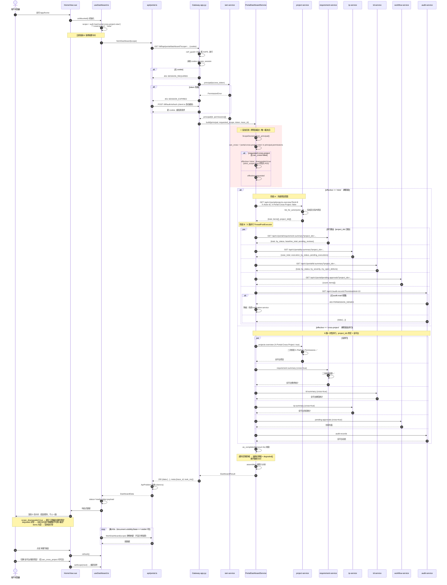
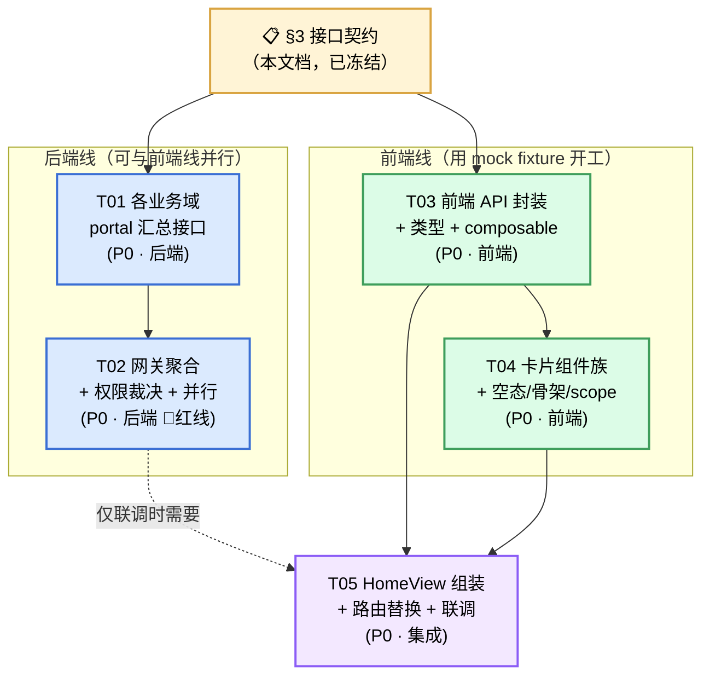

# 系统架构设计 — DevOps 平台门户首页 / 驾驶舱

> 项目代号：`portal_dashboard`
> 架构师：高见远（Gao）
> 上游输入：`docs/prd-portal-dashboard.md`
> 语言：中文 ｜ 状态：**契约冻结，可进入实现**

---

## 0. 代码库现状核查（设计前置，已逐文件确认）

本设计**不基于假设**，以下结论均已在工作区源码中核实。这决定了任务量的真实分布。

| 服务 | 已有可用接口 | 与首页需求的差距 |
|---|---|---|
| `project-service` | `GET /api/v1/projects` → **已按 actor 过滤**（`ProjectService.list_projects(actor_id)` → `repo.list_for_actor`）<br>`GET /api/v1/projects/<pid>/iterations`<br>`GET /api/v1/projects/<pid>/versions`<br>`GET /api/v1/projects/<pid>/members`<br>`GET /api/v1/projects/<pid>/tasks`（游标分页） | ⚠️ 均为**单项目**粒度。网关若逐项目调用会产生 N+1 扇出（20 项目 × 4 域 = 80 次调用）。**必须新增批量汇总接口** |
| `requirement-service` | 仅 `POST .../requirements`、`GET .../requirements/<rid>` | ❌ **无列表、无统计**。必须新增 |
| `tp-service` | 仅 `GET .../test-folders`、`GET .../traceability/<rid>`；计划/执行只有 POST | ❌ **无用例/执行统计**。必须新增 |
| `td-service` | `GET /api/v1/projects/<pid>/defects`（全量返回，无过滤） | ⚠️ 单项目 + 无状态聚合。必须新增批量汇总 |
| `workflow-service` | `GET /api/v1/workflow-instances?project_id=` | ⚠️ 单项目 + 已做 `workflow.read` 逐条鉴权。需新增待办批量查询 |
| `audit-service` | `GET /api/v1/audit-records?from=&to=&limit=` | ⚠️ **强制要求 `audit.read` 权限**，普通用户 403。动态卡需降级方案 |
| `notification-service` | `GET /api/v1/me/notifications`、`.../unread-count` | ✅ 可直接复用（作为动态卡降级源） |
| `iam-service` | 权限存于 `User.permissions`（JSON 数组），经 `platform_permissions` claim 下发 | 需在 IAM 侧登记 `portal:cross-project-view` 权限点（数据配置，非代码） |

**网关关键机制（`http_upstream.py:97 _route_key`）**：路径按首段（或 `projects/<id>/<seg>` 的第 3 段）映射到上游服务。
- `v1/portal/...` → route_key = `portal` → 不在 `routes` 字典 → **404**。
- ✅ 结论：把域内汇总接口挂在 `/api/v1/portal/*` 下，**浏览器天然无法通过通用 proxy 触达**，只有网关聚合器能调。这是零成本获得的安全隔离，本设计采纳。

**CSRF（`csrf.py:10`）**：`GET` 属于 `SAFE`，聚合接口用 `GET` 无 CSRF 负担。

---

## 1. 实现方案与框架选型

### 1.1 选型结论：沿用现有栈，零新增运行时依赖

| 层 | 选型 | 理由 |
|---|---|---|
| 前端 | Vue 3.5 + Vite 7 + Vuetify 3.9 + Pinia 3 | 已在用；Vuetify 自带 `v-skeleton-loader`/`v-progress-linear`/`v-chip`/`v-row` 栅格，**卡片网格与骨架屏无需新依赖** |
| 前端数据层 | 自研 `composables/useDashboard.ts`（不引入 TanStack Query / SWR） | 只有 1 个请求 + 1 个轮询定时器，引入查询库属于过度设计 |
| 网关 | Flask（同步 WSGI）+ `concurrent.futures.ThreadPoolExecutor` | **不用 asyncio**：`HttpUpstream._request` 基于阻塞式 `urllib.request`，Flask 跑在同步 WSGI 下，引入 asyncio 需重写整个上游客户端并改部署模型（收益为负）。线程池对「6 路 I/O 密集扇出」是正解 |
| 图表 | **本期不引入**（P2 再议） | 见 §8.3 |

### 1.2 为什么聚合放网关，而不是前端发 N 个请求

这是本设计最核心的决策，理由按权重排序：

1. **安全红线只能落在后端**（PRD §5 强制项）。网关是**唯一**持有 IAM 验证后 principal 的位置（`app.py:141 upstream.principal(access_token)`）。跨项目判定必须发生在这里。若前端并发调各域接口，跨项目校验就被分散到 6 个服务，任何一个漏判即全平台数据泄露——攻击面从 1 个点扩散到 6 个点。
2. **消除 N+1 扇出**。现有域接口全是单项目粒度。前端聚合意味着「先拿项目列表 → 再对每个项目 × 4 个域发请求」，20 个项目就是 81 个 HTTP 请求，浏览器 6 并发连接限制下首屏必然崩。网关内部用 `project_ids` 批量契约，**固定 6 次调用，与项目数无关**。
3. **网络拓扑收益**。网关与各服务同机房内网（毫秒级），浏览器到网关是公司网络。把 6 次跨服务调用从「广域 × 6」压缩为「广域 × 1 + 内网 × 6 并行」。
4. **部分失败可控**。tp-service 抖动时，网关返回其余 5 个域的数据 + `degraded` 标记，首页少一张卡；前端聚合则是 6 个 Promise 各自失败，错误处理散落在 6 处。
5. **不暴露内部拓扑**。前端只知道 `/bff/api/portal/dashboard`，服务拆分/合并对前端透明。

### 1.3 并行扇出与超时预算

```
浏览器 --(1 req)--> 网关 --[ThreadPoolExecutor(max_workers=6)]--> 6 个域服务（并行）
```

- **单域超时 3s**（`HttpUpstream.timeout_seconds` 默认 5s 对首页过长，聚合器传入 3s）
- **全局预算 4s**：`as_completed(futures, timeout=global_deadline)`，超时的域标记 `degraded` 并返回默认空值，**绝不整体 500**
- **绝不串行**：所有 6 个 future 一次性 `submit`，再统一收割
- 线程池**复用模块级单例**，避免每请求创建/销毁（`ThreadPoolExecutor` 创建成本不可忽略）

### 1.4 架构模式

BFF 聚合层（Backend for Frontend）+ 前端 MVVM（View ⟷ Composable ⟷ API Client）。网关内部按 **Collector 模式**组织：每个域一个纯函数 collector，签名统一，便于单测与并行调度。

---

## 2. 文件列表（相对路径）

### 2.1 网关 `devops-api-gateway/`

| 文件 | 动作 | 说明 |
|---|---|---|
| `src/gateway/portal_dashboard.py` | **新增** | 聚合核心：权限判定、scope 解析、6 路 collector、并行调度、结果装配 |
| `src/gateway/app.py` | **修改** | 注册 `GET /bff/api/portal/dashboard`（静态规则，Werkzeug 优先级高于 `<path:path>` 转换器规则，会先于通用 proxy 命中）；`create_app` 签名不变 |
| `src/gateway/http_upstream.py` | **修改** | 新增 `fetch(service_key, path, access_token, headers, query_string)`：**按显式 service_key 取 base_url，绕过 `_route_key` 推断**，避免为 portal 路径污染路由表 |
| `tests/test_portal_dashboard.py` | **新增** | 权限降级、部分失败、并行性、schema 契约测试 |

### 2.2 各业务服务（均为**只读新增**，不改 schema、不做迁移）

| 服务 | 文件 | 动作 |
|---|---|---|
| `project-service` | `src/project_service/projects/api.py` | **修改**：新增 `GET /api/v1/portal/projects-overview` |
| | `src/project_service/projects/service.py` | **修改**：新增 `portal_overview(actor_id, cross_project, limit)` |
| `requirement-service` | `src/requirement_service/app.py` | **修改**：新增 `GET /api/v1/portal/requirement-summary` |
| | `src/requirement_service/service.py` | **修改**：新增 `portal_summary(project_ids, actor_id, cross_project)` |
| `tp-service` | `src/tp_service/app.py` | **修改**：新增 `GET /api/v1/portal/tp-summary` |
| | `src/tp_service/service.py` | **修改**：新增 `portal_summary(...)` |
| `td-service` | `src/td_service/app.py` | **修改**：新增 `GET /api/v1/portal/td-summary` |
| | `src/td_service/service.py` | **修改**：新增 `portal_summary(...)` |
| `workflow-service` | `src/workflow_service/app.py` | **修改**：新增 `GET /api/v1/portal/pending-approvals` |

> 各服务同步补 `tests/test_portal_summary.py`。

### 2.3 前端 `devops-portal/`

| 文件 | 动作 | 说明 |
|---|---|---|
| `src/api/portal.ts` | **新增** | dashboard 请求封装 + **全部 TS 类型定义** + scope/权限点常量（单一事实源） |
| `src/composables/useDashboard.ts` | **新增** | 状态机（idle/loading/ready/error）、scope 切换、手动刷新、60s 可见性感知轮询 |
| `src/components/dashboard/DashboardCard.vue` | **新增** | 卡片外壳：标题 + scope 徽标插槽 + loading/empty/error/degraded 四态统一处理 |
| `src/components/dashboard/StatTile.vue` | **新增** | 指标瓦片（数值 + 标签 + 可选色彩） |
| `src/components/dashboard/ScopeBadge.vue` | **新增** | 「全平台 / 我的项目」标签 + 有权限时的切换器 |
| `src/components/dashboard/ProjectOverviewCard.vue` | **新增** | 我的项目概览 |
| `src/components/dashboard/MyWorkCard.vue` | **新增** | 待办 / 待审 |
| `src/components/dashboard/RequirementStatsCard.vue` | **新增** | 需求统计 |
| `src/components/dashboard/TpStatsCard.vue` | **新增** | TP 测试统计 |
| `src/components/dashboard/TdStatsCard.vue` | **新增** | TD 缺陷统计 |
| `src/components/dashboard/RecentActivityCard.vue` | **新增** | 最近动态（P1） |
| `src/components/dashboard/QuickActions.vue` | **新增** | 快捷入口（P1） |
| `src/views/HomeView.vue` | **新增** | 首页组装：固定顺序卡片网格 |
| `src/router/index.ts` | **修改** | `{ path: 'home', component: Simple, props:{title:'Home'} }` → `HomeView`（**不加 `meta.permission`**，见 §7 红线） |
| `src/views/HomeView.test.ts` | **新增** | 组件测试（vitest + @vue/test-utils，已有） |

---

## 3. 数据结构与接口契约（**冻结，前后端以此为准**）

### 3.1 对外接口：`GET /bff/api/portal/dashboard`

**请求**

| 参数 | 位置 | 值 | 默认 | 说明 |
|---|---|---|---|---|
| `scope` | query | `mine` \| `cross-project` | `mine` | 前端仅"申请"，最终由网关裁决 |

认证：Cookie `devops_session`（网关既有机制）。无需 CSRF（GET）。

**响应 `200 OK`**

```jsonc
{
  "data": {
    // ---- scope 裁决结果（前端据此渲染徽标，不据此做安全决策）----
    "scope": "mine",                    // 网关最终生效的 scope（权威）
    "scope_requested": "cross-project", // 前端申请的 scope
    "scope_downgraded": true,           // true = 越权申请已被降级
    "can_cross_project": false,         // 由 X-Platform-Permissions 推导
    "generated_at": "2026-08-10T02:11:00Z",

    // ---- 卡片 1：我的项目概览 ----
    "projects": {
      "total": 3,                       // 范围内项目总数（可 > items 长度）
      "items": [{
        "id": "uuid", "business_no": "PRJ-001", "name": "支付中台",
        "status": "active",
        "progress_percent": 65,         // 0-100，整数；无法计算时 null
        "current_iteration": {          // 可为 null
          "id": "uuid", "name": "Sprint 12", "status": "active",
          "start_date": "2026-08-01", "end_date": "2026-08-14"
        },
        "current_version": {            // 可为 null
          "id": "uuid", "name": "v2.0", "status": "active",
          "planned_release_date": "2026-08-30"
        },
        "my_open_task_count": 4
      }]
    },

    // ---- 卡片 2：我的工作（待办/待审）----
    "my_work": {
      "pending_requirement_reviews": {
        "count": 3,
        "items": [{ "id":"uuid","project_id":"uuid","business_no":"REQ-007",
                    "title":"支持批量退款","status":"reviewing","updated_at":"ISO8601" }]
      },
      "my_open_defects": {
        "count": 5,
        "items": [{ "id":"uuid","project_id":"uuid","business_no":"BUG-102",
                    "title":"对账文件解析失败","severity":"high","priority":"p1",
                    "status":"in_progress","sla_breached":false }]
      },
      "pending_test_executions": {
        "count": 12,
        "items": [{ "id":"uuid","project_id":"uuid","plan_id":"uuid",
                    "name":"回归-支付主流程","status":"pending","planned_at":"ISO8601" }]
      },
      "pending_workflow_approvals": {
        "count": 2,
        "items": [{ "id":"uuid","project_id":"uuid","business_object_type":"requirement",
                    "business_object_id":"uuid","current_state":"pending_review",
                    "started_at":"ISO8601" }]
      }
    },

    // ---- 卡片 3：需求统计 ----
    "requirement_stats": {
      "total": 128,
      "by_status": { "draft":10,"reviewing":8,"approved":95,"rejected":5,"archived":10 },
      "baseline_total": 6
    },

    // ---- 卡片 4：TP 测试统计 ----
    "tp_stats": {
      "case_total": 540, "plan_total": 12, "execution_total": 88,
      "execution_by_status": { "pending":4,"running":2,"passed":68,"failed":14 },
      "pass_rate": 0.83                 // 0-1，两位小数；分母为 0 时 null
    },

    // ---- 卡片 5：TD 缺陷统计 ----
    "td_stats": {
      "total": 76,
      "by_status": { "new":12,"in_progress":20,"resolved":30,"closed":14 },
      "by_severity": { "critical":2,"high":14,"medium":40,"low":20 },
      "sla_breached": 3
    },

    // ---- 卡片 6：最近动态 ----
    "recent_activities": {
      "source": "audit",                // "audit" | "notification"（降级时为 notification）
      "items": [{ "id":"...","occurred_at":"ISO8601","actor_id":"uuid",
                  "actor_name":"张三","action":"requirement.approved",
                  "resource_type":"requirement","resource_id":"uuid",
                  "project_id":"uuid","summary":"审批通过 REQ-007" }]
    },

    // ---- 部分失败标记：非空即表示有卡片降级 ----
    "degraded": [
      { "domain":"tp", "reason":"UPSTREAM_TIMEOUT" }
    ]
  },
  "meta": { "trace_id": "...", "took_ms": 412 }
}
```

**契约不变量（工程师必须遵守）**

1. `data` 的**六大块 key 恒存在**，即使该域失败也返回结构化零值（`{"total":0,"items":[],...}`）+ `degraded` 条目。前端**永不需要判空 key**，只需判 `degraded`。
2. 所有 `items` 数组由**网关**截断，条数见 §8.2；前端不得传 `limit`（防放大攻击）。
3. `degraded[].reason` 枚举：`UPSTREAM_TIMEOUT` / `UPSTREAM_ERROR` / `PERMISSION_DENIED` / `NOT_IMPLEMENTED`。
4. 时间一律 **ISO 8601 UTC**；日期（无时分）用 `YYYY-MM-DD`。
5. 错误响应沿用网关既有 `problem()` 格式（`application/problem+json`）。

**错误码**

| 状态 | error_code | 场景 |
|---|---|---|
| 401 | `SESSION_REQUIRED` / `SESSION_EXPIRED` | 无 cookie / IAM 校验失败 |
| 422 | `INVALID_SCOPE` | `scope` 非法枚举值 |
| 403 | `CROSS_PROJECT_FORBIDDEN` | **仅当** `PORTAL_STRICT_SCOPE=true` 时；默认关闭（默认走降级） |
| 200 | — | 部分域失败仍返回 200 + `degraded` |

### 3.2 网关 → 各域服务的内部契约

统一约定：
- 路径前缀 `GET /api/v1/portal/*`（浏览器不可达，见 §0）
- 请求头由网关注入：`X-Actor-Id`、`X-Platform-Permissions`、`X-Trace-Id`、`Authorization: Bearer <access_token>`、**`X-Portal-Cross-Project: true|false`**
- **纵深防御**：域服务收到 `X-Portal-Cross-Project: true` 时，**必须自行再次校验** `X-Platform-Permissions` 含 `portal:cross-project-view`，缺失则按 `false` 处理。**不得仅因 `project_ids` 为空就返回全平台数据。**
- 响应统一 `{"data": {...}, "meta": {...}}`

| # | 服务 | 端点 | 入参（query） | 出参 `data` 最小字段 |
|---|---|---|---|---|
| 1 | project-service | `GET /api/v1/portal/projects-overview` | `limit`（默认 8） | `total`、`items[]`（`id,business_no,name,status,progress_percent,current_iteration{},current_version{},my_open_task_count`）、**`project_ids[]`（范围内全部 id，供网关下发给其他域）** |
| 2 | requirement-service | `GET /api/v1/portal/requirement-summary` | `project_ids`（CSV，cross-project 时可空）、`review_limit`（默认 5） | `total`、`by_status{}`、`baseline_total`、`pending_reviews{count,items[]}` |
| 3 | tp-service | `GET /api/v1/portal/tp-summary` | `project_ids`、`execution_limit`（默认 5） | `case_total`、`plan_total`、`execution_total`、`execution_by_status{}`、`pass_rate`、`pending_executions{count,items[]}` |
| 4 | td-service | `GET /api/v1/portal/td-summary` | `project_ids`、`defect_limit`（默认 5） | `total`、`by_status{}`、`by_severity{}`、`sla_breached`、`my_open_defects{count,items[]}`（按 `X-Actor-Id` 匹配 `assignee_id` 且 status ∉ {closed}） |
| 5 | workflow-service | `GET /api/v1/portal/pending-approvals` | `project_ids`、`limit`（默认 5） | `count`、`items[]`（`id,project_id,business_object_type,business_object_id,current_state,started_at`） |
| 6 | audit-service | `GET /api/v1/audit-records`（**复用**） | `from`、`to`（近 7 天）、`limit=10`、`project_id`（可选） | 既有格式 |
| 6b | notification-service | `GET /api/v1/me/notifications`（**复用，降级源**） | `limit=10` | 既有格式 |

**关键调度约束：两阶段扇出**

`project_ids` 是其余 4 个域的入参，因此存在**唯一一处串行依赖**：

```
阶段 A（1 次）: project-service → 拿到 project_ids
阶段 B（5 路并行）: requirement / tp / td / workflow / audit(或 notification)
```

- **`mine` scope**：必须两阶段（B 依赖 A 的 project_ids）。总耗时 ≈ A + max(B) ≈ 3s 上限。
- **`cross-project` scope**：**A 与 B 全部 6 路一次性并行**（B 不需要 project_ids，传空表示全平台）。总耗时 ≈ max(all) ≈ 3s 上限。
- 阶段 A 失败时：**不放弃**，B 以空 `project_ids` + `X-Portal-Cross-Project: false` 调用（各域返回零值），项目卡标 `degraded`。

### 3.3 类图



---

## 4. 程序调用流程（时序图）



---

## 5. 需要的依赖包

### 5.1 前端：**零新增**

| 包 | 版本 | 状态 |
|---|---|---|
| `vue` | ^3.5.18 | 已有 |
| `vuetify` | ^3.9.3 | 已有 — 提供 `v-row/v-col`（栅格）、`v-skeleton-loader`（骨架屏）、`v-chip`（scope 徽标）、`v-progress-linear`（进度）、`v-btn-toggle`（scope 切换）、`v-empty-state`（空状态）、`v-list`（列表） |
| `pinia` / `vue-router` | ^3.0.3 / ^4.5.1 | 已有 |
| `vitest` / `@vue/test-utils` | ^3.2.4 / ^2.4.6 | 已有（测试） |

> **明确结论：本期不引入任何前端依赖。** Vuetify 3 的组件集完全覆盖 P0/P1 所需 UI 原语。

### 5.2 后端：**零新增**

`concurrent.futures.ThreadPoolExecutor` 属 Python 标准库；`HttpUpstream` 基于 `urllib.request` 标准库。**不引入 `httpx` / `requests` / `aiohttp`**——现有客户端已满足，引入会带来新的部署镜像层与安全审计面。

### 5.3 P2 图表（本期不落地，仅备案）

若后续要做趋势图，推荐 `vue-chartjs@^5` + `chart.js@^4`（体积约 70KB gzip，支持通过 CSS 变量适配 Vuetify 主题），而**不用** ECharts（体积大 3 倍，主题适配需手写 registerTheme）。

---

## 6. 任务列表（按依赖排序）

> **说明**：团队 Lead 提出的 T1–T7 共 7 项关注点，已按「同层次文件聚合」原则归并为 **5 个可交付任务单元**（映射见下表末列），避免碎片化任务与过长的线性依赖链。

| ID | 任务名 | 源文件 | 依赖 | 优先级 | 覆盖 Lead 的 |
|---|---|---|---|---|---|
| **T01** | **各业务域 portal 只读汇总接口** | `project-service/src/project_service/projects/{api,service}.py`<br>`requirement-service/src/requirement_service/{app,service}.py`<br>`tp-service/src/tp_service/{app,service}.py`<br>`td-service/src/td_service/{app,service}.py`<br>`workflow-service/src/workflow_service/app.py`<br>+ 各服务 `tests/test_portal_summary.py` | — | **P0** | T1 |
| **T02** | **网关聚合接口 + 权限裁决 + 并行扇出** | `devops-api-gateway/src/gateway/portal_dashboard.py`（新增）<br>`devops-api-gateway/src/gateway/app.py`（注册路由）<br>`devops-api-gateway/src/gateway/http_upstream.py`（新增 `fetch`）<br>`devops-api-gateway/tests/test_portal_dashboard.py` | T01 | **P0** | T2 |
| **T03** | **前端 API 封装 + 类型 + 数据编排** | `devops-portal/src/api/portal.ts`（新增，含全部类型与常量）<br>`devops-portal/src/composables/useDashboard.ts`（新增）<br>`devops-portal/src/api/portal.test.ts` | 契约 §3.1（**非 T02 代码**） | **P0** | T3 + T7(状态机) |
| **T04** | **仪表盘卡片组件族（含空态/骨架/scope 标识）** | `devops-portal/src/components/dashboard/DashboardCard.vue`<br>`.../StatTile.vue`、`.../ScopeBadge.vue`<br>`.../ProjectOverviewCard.vue`、`.../MyWorkCard.vue`<br>`.../RequirementStatsCard.vue`、`.../TpStatsCard.vue`、`.../TdStatsCard.vue`<br>`.../RecentActivityCard.vue`、`.../QuickActions.vue` | T03（仅类型） | **P0**（RecentActivity/QuickActions 为 P1） | T4 + T6 + T7 |
| **T05** | **HomeView 组装 + 路由替换 + 端到端联调** | `devops-portal/src/views/HomeView.vue`（新增）<br>`devops-portal/src/router/index.ts`（修改 home 指向）<br>`devops-portal/src/views/HomeView.test.ts`<br>`devops-portal/src/router/index.test.ts`（更新断言） | T03, T04, T02 | **P0** | T5 |

### 6.1 并行化建议（缩短关键路径）

**契约先行（contract-first）**：§3 的 JSON schema 已冻结，是唯一事实源。因此：

- **T01 + T02**（后端）与 **T03 + T04**（前端）**可完全并行开工**，前端用 schema 手写 mock fixture 开发。
- T03 依赖的是**契约文档**而非 T02 的代码产物 —— 这是打破线性依赖链的关键。
- 仅 **T05 的联调**环节需要 T02 真实就绪。
- 若人力紧张，实施顺序：`T01 → T02` 与 `T03 → T04` 双线并行 → `T05` 汇合。

### 6.2 任务依赖图



---

## 7. 共享知识（跨文件约定）

### 7.1 🔴 安全红线（不可协商）

1. **跨项目裁决唯一发生在 `portal_dashboard.py` 的 `ScopeDecision.from_principal()`**，输入只能是 `upstream.principal()` 返回的 IAM 验证结果。
2. **绝不信任任何客户端输入的身份/权限**。`proxy_headers` 白名单只放行 `content-type/idempotency-key/if-match/x-trace-id`，`X-Actor-Id` 与 `X-Platform-Permissions` 由网关覆写——聚合器**必须复用此机制**，不得自行拼装 header。
3. **路由不加 `meta.permission`**。`/app/home` 对所有登录用户开放（千人一面）；权限只影响**数据范围**，不影响**页面可达性**。给 home 加 permission 会导致无权限用户看到 403 页面，直接违背 PRD 核心目标。
4. **前端的 `auth.has('portal:cross-project-view')` 仅用于决定是否渲染切换器**，不是安全边界。即便用户篡改前端强行传 `scope=cross-project`，网关也会降级。
5. **域服务纵深防御**：收到 `X-Portal-Cross-Project: true` 必须二次校验权限点，不得仅凭 `project_ids` 为空推断权限。

### 7.2 常量与类型的唯一归属

| 内容 | 位置 | 说明 |
|---|---|---|
| `DashboardData` 及全部子类型 | `src/api/portal.ts` | **唯一 TS 类型源**。不新建 `src/types/`（项目现无此目录，保持结构简洁） |
| `PERMISSION_CROSS_PROJECT_VIEW = 'portal:cross-project-view'` | `src/api/portal.ts` | 前端**禁止**任何地方硬编码该字符串字面量 |
| `SCOPE_MINE = 'mine'` / `SCOPE_CROSS_PROJECT = 'cross-project'` | `src/api/portal.ts` | 同上 |
| `PORTAL_CROSS_PROJECT_PERMISSION` | `src/gateway/portal_dashboard.py` | 网关侧常量 |
| 各域 portal 端点路径 | `src/gateway/portal_dashboard.py` 顶部 `_ENDPOINTS` 字典 | 集中管理，便于测试替身 |

### 7.3 通用约定

- **响应格式**：全平台统一 `{data, meta}`；错误统一 RFC7807 `{type,title,status,detail,error_code,trace_id}` + `Content-Type: application/problem+json`。
- **时间**：一律 ISO 8601 UTC 字符串；纯日期用 `YYYY-MM-DD`。前端展示层再本地化，**不在 API 层做时区转换**。
- **前端请求**：一律走 `api<T>()`（`src/api/client.ts`），自带 401 自动 refresh + 重放 + CSRF。**禁止裸 `fetch`**。
- **错误处理**：`api()` 抛 `ApiProblem`（`src/api/problem.ts`）。`useDashboard` 捕获后置 `status='error'`，**整页级错误**才显示全局错误态；**单域降级**（`degraded`）只影响单张卡片。
- **代码风格**：后端 `ruff`（仓库已配置）；前端 `vue-tsc --noEmit` 必须零错误（`npm run typecheck`）。
- **命名**：后端 JSON 字段一律 `snake_case`；前端 TS 接口**直接沿用 snake_case**，不做驼峰转换（与 `auth.ts` 里 `display_name`/`break_glass` 的既有风格一致，避免引入转换层）。
- **可观测性**：网关聚合响应 `meta.took_ms` + `meta.trace_id`；每个 collector 失败记 WARN 日志（含 domain + trace_id），**不记录 token/PII**。

### 7.4 部署注意

- 网关新增环境变量（**全部有默认值，不配置也能跑**）：
  `PORTAL_PER_CALL_TIMEOUT=3.0`、`PORTAL_GLOBAL_DEADLINE=4.0`、`PORTAL_MAX_WORKERS=6`、`PORTAL_STRICT_SCOPE=false`、`PORTAL_CACHE_TTL_SECONDS=0`
- IAM 侧需为目标用户/角色的 `User.permissions` 追加 `portal:cross-project-view`（数据操作）。开发环境可在 `iam_service/auth/service.py:25` 的自动置备规则中为特定用户名加上，便于联调。
- 前端构建产物经 `npm run build`（含 `vue-tsc --noEmit` 门禁）→ 部署至 `192.168.3.177:18081`。

---

## 8. 待明确事项 — 架构层面拍板建议

> PRD §6 的 8 个问题，以下给出**可直接执行的结论**，工程师无需再等决策。

### 8.1 数据实时性 → **实时查询，缓存留开关但默认关闭**

聚合总耗时 ≈ 单域 max ≈ 3s 上限（实际内网预期 200–500ms），数据量级小。首页展示**过期的待办数**比慢 200ms 更糟。
**决策**：P0 实时查询。同时实现 `PORTAL_CACHE_TTL_SECONDS`（默认 `0`=关闭），缓存 key = `(actor_id, effective_scope)`，**必须包含 scope 与 actor**，否则跨用户串数据。可复用现成的 `gateway/singleflight.py` 做并发合并。上线后观测 p95，若 > 1.5s 再开 60s TTL。

### 8.2 分页 / 数量上限 → **不分页，固定条数 + "查看全部"跳转**

首页是入口不是工作台。**决策**：

| 卡片 | 条数 |
|---|---|
| 我的项目概览 | 8 |
| 待审需求 / 我的缺陷 / 待执行用例 / 待审流程 | 各 5 |
| 最近动态 | 10 |

**限制由网关硬编码，不接受前端传 `limit`**（防止 `limit=999999` 的放大攻击）。每张卡片右下角「查看全部 →」跳转到对应业务域视图。`count` 字段返回真实总数（可远大于 items 长度），卡片显示「5 / 共 23」。

### 8.3 全局搜索 → **本期不做（P2）**

跨项目搜索需要独立的检索索引（ES 或 DB 全文索引），与本期聚合读完全不同的技术路径，塞进本期会拖垮排期。
**决策**：顶部搜索框本期**不出现**（不放置 disabled 的占位框，避免用户困惑）。未来实现时**权限点必须独立**（如 `search:cross-project`），**不得复用** `portal:cross-project-view`——查看统计与检索明细是不同的敏感级别。

### 8.4 空状态 → **三态统一由 `DashboardCard.vue` 兜底 + 引导式文案**

**决策**：`DashboardCard` 封装 4 种状态，各业务卡片只管数据渲染：

| 状态 | 表现 |
|---|---|
| `loading` | `v-skeleton-loader`（首次加载才显示；轮询刷新时**保持旧数据**，不闪骨架） |
| `empty` | Vuetify `v-empty-state`：图标 + 一句引导文案 + 主行动按钮 |
| `error`/`degraded` | 「该模块数据暂不可用」+「重试」按钮，**只重拉整个 dashboard**（不做单域重试，避免 N 个重试端点） |
| `ready` | 正常内容 |

空态文案（**引导而非空白**）：
- 无参与项目 → 「你还没有参与任何项目」+ 按钮「浏览项目」（有创建权限时额外显示「创建项目」）
- 无待办 → 「太棒了，当前没有待处理事项 🎉」（**不放行动按钮**，避免制造焦虑）
- 无动态 → 「近 7 天暂无相关动态」

### 8.5 「我的项目」范围 → **严格以 project-service 成员关系为准**

`ProjectMembership.status == 'active'` 的项目（即现有 `list_for_actor` 语义），**不含**关注 / 被分派。
**理由**：若「被分派缺陷的项目」也算我的项目，会出现用户在项目概览看到一个自己没有成员权限的项目名，点进去 403 —— 体验断裂，且实质上泄露了项目元数据。
**决策**：项目范围 = 成员关系。被分派的缺陷/任务通过 `my_work` 板块单独呈现（那里只暴露具体条目，不暴露项目全貌），语义清晰且无越权。此语义与 `td-service` 按 `assignee_id` 过滤天然兼容。

### 8.6 聚合接口字段契约 → **本文档 §3 即契约，已冻结**

无需再拉会对齐。§3.1 是对外契约，§3.2 是内部契约。任何字段变更需走文档更新 + 前后端同步确认。**契约先行使前后端可并行开工**（见 §6.1）。

### 8.7 刷新策略 → **手动刷新 + 60s 可见性感知轮询；骨架屏必需**

**决策**：
- 卡片区右上角「刷新」按钮（`mdi-refresh`，带旋转动画）
- 自动轮询 60s，**但 `document.visibilityState === 'hidden'` 时暂停**，切回前台立即拉一次。这条很关键——否则用户开着标签页过夜会产生数千次无效请求。
- 轮询刷新采用 **stale-while-revalidate**：保留旧数据、不显示骨架屏、不重置滚动位置，仅顶部显示 2px 细进度条。
- **首屏骨架屏必需**：6 张卡片同时打骨架，避免布局抖动（CLS）。
- 组件 `onUnmounted` 必须 `clearInterval`，防止路由切走后泄漏定时器。

### 8.8 跨项目入口可见性 → **完全隐藏，无权限用户零感知**

**决策**：
- `can_cross_project === false` → 只渲染静态 `v-chip`「我的项目」，**不渲染任何切换控件**，不出现禁用态按钮、不出现「升级权限」提示。
- `can_cross_project === true` → 渲染 `v-btn-toggle` 切换器：`[我的项目 | 全平台]`，默认选中「全平台」（有权限者通常就是要看全局）。
- **理由**：展示一个禁用的「全平台」按钮等于告诉用户"存在你看不到的数据"，既产生权限咨询工单，又暴露了系统能力边界。
- **注意**：`can_cross_project` 取自**后端响应**（权威），不取前端 `auth.has()`。权限被回收后前端 principal 可能仍是旧的，以后端为准可自动收敛。若发生 `scope_downgraded === true`，顶部显示一次性提示「你的跨项目查看权限已变更，已切换为「我的项目」视图」。

---

## 9. 其他需注意的风险

1. **`degraded` 与 `empty` 必须严格区分**。「TP 服务超时」和「确实没有测试用例」在 UI 上是完全不同的语义。工程师容易把两者都渲染成空卡片——这会让用户误以为数据丢失。契约里 `degraded` 数组就是为此存在。
2. **`audit-records` 需要 `audit.read`**（`audit-service/src/audit_service/app.py:109`），普通用户会 403。动态卡**必须实现降级到 `notification-service`** 的分支，并在响应中用 `recent_activities.source` 标明来源。这是 T02 里最容易被漏掉的分支，需在测试中显式覆盖。
3. **`audit-records` 强制要求 `from`/`to` 参数**，缺失返回 422。聚合器需自动计算「近 7 天」时间窗。
4. **网关线程池与 WSGI worker 的乘积**：若 gunicorn 起 4 worker × 每 worker 6 线程 = 24 并发上游连接。需确认各域服务承载能力，必要时下调 `PORTAL_MAX_WORKERS`。
5. **`_route_key` 的 `projects/<id>/<seg>` 规则**导致 `iterations`/`versions`/`members`/`tasks` 当前**不在网关 routes 表中**，浏览器无法直接访问。本期聚合走 `fetch()` 显式 service_key 不受影响；但 §8.2 的「查看全部」跳转若指向这些资源，需**另行补网关路由表**——建议在 T05 联调时确认跳转目标可达，不可达的先跳到已有页面。
6. **Werkzeug 路由优先级**：静态规则 `/bff/api/portal/dashboard` 优先于 `/bff/api/<path:path>`，无需调整注册顺序；但仍建议在 T02 补一条测试固定此行为，防止未来有人改成动态规则后被通用 proxy 静默截胡（那会导致 404 而非报错，极难排查）。
