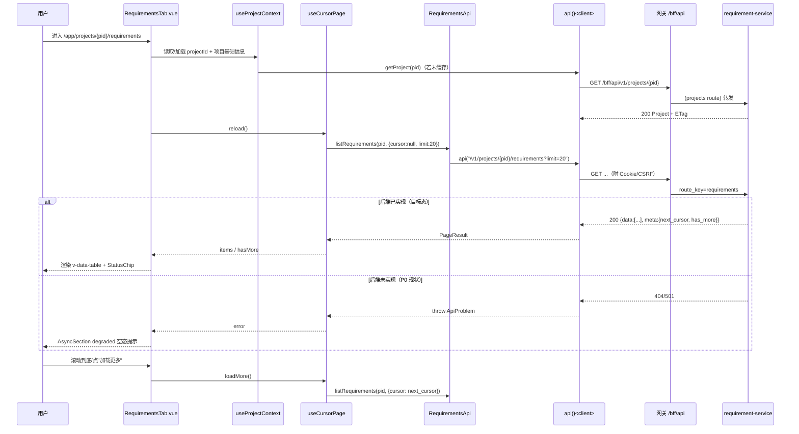
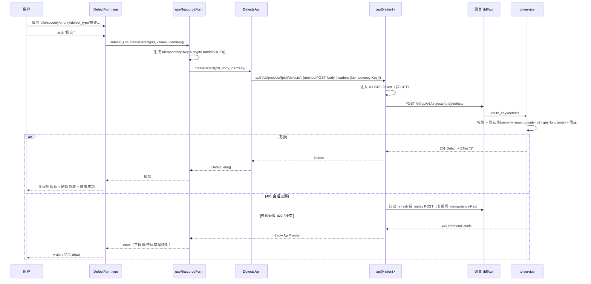
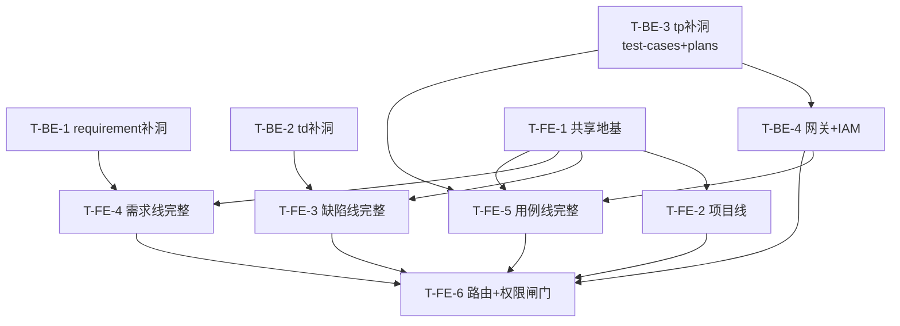

# 门户四个管理页面 — 系统架构设计与任务分解

> 架构师：高见远（Gao） ｜ 目标读者：工程师（Engineer） ｜ 语言：简体中文
> 关联文档：`prd-portal-management-pages.md`（产品需求）、`architecture-portal-dashboard.md`（既有约定基线）
> 适用范围：纯前端页面新增，`devops-portal`（Vue3 + Vuetify3 + Vue Router + Pinia + TS + Vite，端口 `:18081`），经网关 `/bff/api` 访问后端。原则上不改后端。

---

## 0. 前置结论（先读，直接影响实现边界）

本设计基于对**四个后端服务源码 + 网关路由表 + OpenAPI 契约**的逐一勘察，而非仅凭 OpenAPI（契约中 `requestBody` 多为 `type: object`，无字段级 schema）。勘察结论直接决定了各页面在 P0 阶段的"可用程度"，工程师必须据此实现，不要按 PRD/契约的"理想接口"盲目对接。

**契约声明 vs 后端已实现 差异矩阵（关键约束）：**

| 领域 | 端点 | OpenAPI 契约 | 后端已实现 | 网关路由表 | P0 结论 |
|------|------|:---:|:---:|:---:|------|
| 项目 | `GET /projects` 列表 | ✅ | ✅（actor 范围） | ✅ `projects` | **可用** |
| 项目 | `GET /projects/{id}` 详情 | ✅ | ✅（带 ETag） | ✅ | **可用** |
| 项目 | `POST /projects` 创建 | ✅ | ✅（仅 name/description/owner_id） | ✅ | **可用** |
| 项目 | 成员/版本/迭代 | ✅ | ✅（collaboration blueprint） | ✅ | **可用**（P1 挂载） |
| 项目·任务 | `GET /projects/{id}/tasks` | ✅ | ✅（`after`+`limit`→`meta.next_cursor/has_more`） | ✅ | **可用**（游标分页样板） |
| 需求 | `POST .../requirements` 创建 | ✅ | ✅（返回 id/business_no/title/type/status/version + ETag `"1"`） | ✅ `requirements` | **可用** |
| 需求 | `GET .../requirements/{id}` 详情 | ✅ | ✅（id/project_id/title/status/version + ETag） | ✅ | **可用（字段偏少）** |
| 需求 | `GET .../requirements` **列表** | ✅ | ❌ **未实现** | ✅ | ⚠️ **不可用**→需后端补 |
| 需求 | `PATCH`/`transitions`/`reviews`/`baselines`/`change-requests` | ✅ | ❌ **未实现** | 部分 | ⚠️ **不可用**→UI 预留 |
| 缺陷(TD) | `GET .../defects` 列表 | ✅ | ✅ **但无分页**（返回全量 + `meta.count`） | ✅ `defects` | **可用（无游标）** |
| 缺陷 | `POST .../defects` 创建 | ✅ | ✅（+ ETag） | ✅ | **可用** |
| 缺陷 | `GET .../defects/{id}` 详情 | ✅ | ✅（+ ETag） | ✅ | **可用** |
| 缺陷 | `POST .../defects/{id}/transitions` | ✅ | ✅（强制 `If-Match`） | ✅ | **可用** |
| 缺陷 | `GET .../defects/{id}/history` | ✅ | ✅ | ✅ | **可用** |
| 缺陷 | `PATCH .../defects/{id}` | ✅ | ❌ **未实现** | 部分 | ⚠️ 编辑走 transition/后端补 |
| 缺陷 | `traceability-links` | ✅ | ❌ **未实现** | — | ⚠️ P1 |
| 用例(TP) | `test-cases` 列表/创建/versions | ✅ | ❌ **零 HTTP 端点**（仅有领域模型 + `test_cases` 表） | ❌ **路由表无 `test-cases`** | 🔴 **完全不可用** |
| 用例(TP) | `test-plans` 列表 | ✅ | ❌ 仅 `create` + `freeze` | ✅ `test-plans` | ⚠️ 列表不可用 |
| 用例(TP) | `test-plans/{id}/transitions` | ✅ | ❌ 仅 `/freeze`（无通用 transition） | ✅ | ⚠️ 仅冻结 |

**由此得出的实现策略：**

1. **契约先行、字段对齐真实源码。** 所有 TS 接口按"真实源码字段"定义，PRD 里假设但源码没有的字段一律标注 `// 假设字段，联调需与后端校验`，不臆造。
2. **P0 分级交付。** 项目/缺陷两条线后端支撑最完整，作为 P0 主可验证目标；需求列表、用例库整体因后端缺失，P0 只交付"可独立验证的前端骨架 + 已实现端点（需求创建/详情、缺陷全链路）"，其余以"降级占位 + 待后端补"处理，并在 §8 待明确事项显式列出。
3. **用例管理（TP test-cases）P0 明确降级为只读占位页。** 后端无端点、网关无路由，前端无法对接，任何"对接实现"都会 404。P0 只做页面骨架 + 空态提示"能力建设中（依赖 tp-service test-cases 端点与网关路由）"，待 §8 阻塞项解除后再挂接。

---

## 1. 实现方案与框架选型

### 1.1 技术栈（零新增运行时依赖）

沿用 `architecture-portal-dashboard.md` 既定基线，**不引入任何新的运行时依赖**：

- **Vue 3 SFC + `<script setup lang="ts">`**：与现有视图一致。
- **Vuetify 3 原语**：`v-data-table-server`（服务端分页表格）、`v-data-table`（客户端表格，用于 TD 无分页列表）、`v-dialog`、`v-form` + `v-text-field`/`v-select`/`v-textarea`、`v-chip`（状态徽标）、`v-tabs`、`v-skeleton-loader`、`v-alert`、`v-pagination`/游标"加载更多"。**不引入** `@tanstack/vue-table`、`@vueuse/core`。
- **Pinia**：仅承载会话/权限（既有 `auth` store）与"当前项目上下文"（新增 `project-context` store）。各页面列表状态由页面级 composable 管理，不进全局 store（避免跨页脏数据）。
- **Vue Router**：在既有 `/app/projects/:project_id/*` 下扩展四个工作区 Tab 路由。
- **`api<T>()` 客户端**：统一走 `src/api/client.ts`，自动处理 401 刷新、`X-CSRF-Token`、204→undefined、抛 `ApiProblem`。

**选型理由：** dashboard 架构已确立"零新增依赖 + Vuetify 原语 + `{data, meta}` 信封 + snake_case TS + RFC7807 错误"的团队约定，四个新页面属于同构 CRUD/列表场景，复用既有能力即可满足，新增依赖只会增加构建/审计负担且违背既有基线。

### 1.2 核心技术难点与应对

| 难点 | 应对方案 |
|------|---------|
| **分页策略分裂**（project-tasks 用 `after`+`limit`→`has_more`；需求/TD 契约声称 `cursor`→`next_cursor`，但 TD 实测无分页） | 抽象**两个游标 composable**：`useOffsetPage`（`after`+`limit`，读 `meta.has_more`/`meta.next_cursor`）与 `useCursorPage`（`cursor`→`meta.next_cursor`）。TD 列表当前无分页→用 `useClientPage`（全量拉取 + 前端切页）兜底，接口对齐后可平滑替换为 `useCursorPage`。三者对外暴露统一形态 `{ items, loading, error, hasMore, loadMore, reload }`。 |
| **乐观并发（If-Match / ETag）** | 详情读取时保存 `ETag`；transition/编辑提交时回填 `If-Match`；`409` 冲突时提示"数据已被他人修改，请刷新后重试"。ETag 形如 `"1"`（正则 `^"[1-9][0-9]*"$`），来自响应头。 |
| **写操作幂等** | 所有 `POST` 创建/transition 由前端生成 `Idempotency-Key`（`crypto.randomUUID()`），提交失败重试复用同 key。 |
| **状态机可视化** | 需求 7 态、缺陷 9 态各自的合法动作集来自真实源码（见 §3）；前端按"当前状态 → 可用动作"映射渲染动作按钮，不硬编码全量按钮。 |
| **权限点未在 IAM 注册** | P0 **临时放宽**：路由仅挂 `requiresAuth`，不挂 `meta.permission` 写级门禁（否则 `auth.has()` 恒 false 锁死全部页面）。权限点命名与门禁位置在代码里预留（注释 `// TODO: 待 IAM 注册后启用 meta.permission`），§8 明确列为待办。 |
| **后端能力缺口** | 见 §0 差异矩阵。前端按契约/真实 shape 构建，缺失端点处以降级占位；已实现端点（需求创建/详情、缺陷全链路、项目全链路）做成可独立验证。 |

### 1.3 架构模式

- **分层：** `views`（页面/容器） → `components`（展示组件） → `composables`（页面状态与分页/表单逻辑） → `api`（领域 API 模块，纯函数封装 `api<T>()`） → `client.ts`（传输层）。
- **项目上下文：** 工作区 Tab 页面共享 `:project_id`，由 `useProjectContext` 从路由解析并缓存项目基础信息（名称/business_no/status），避免每个 Tab 重复拉取。
- **组件复用：** 抽取 `StatusChip`（状态→颜色映射）、`AsyncSection`（loading/error/empty/degraded 四态包裹）、`FormDialog`（创建/编辑通用对话框壳）为跨页面通用组件。

---

## 2. 文件清单（相对 `devops-portal/`）

> 图例：🆕 新建 ｜ ✏️ 修改 ｜ 🧪 测试

```
src/
├── api/
│   ├── projects.ts            🆕 项目/成员/版本/迭代 API（list/get/create + ETag 读取）
│   ├── requirements.ts        🆕 需求 API（create/get 已实现；list/patch/transition 预留并标注 stub）
│   ├── defects.ts             🆕 缺陷 API（list/create/get/transition/history 全部已实现）
│   ├── testcases.ts           🆕 用例/测试计划 API（多为占位 stub，标注后端未实现）
│   └── types/
│       ├── project.ts         🆕 Project/Membership/Version/Iteration/Task 接口（源码字段）
│       ├── requirement.ts     🆕 Requirement/枚举/transition action 接口
│       ├── defect.ts          🆕 Defect/枚举(9态)/severity(5级)/transition action 接口
│       └── testcase.ts        🆕 TestCase/TestPlan 接口（含假设字段标注）
├── composables/
│   ├── useProjectContext.ts   🆕 解析 :project_id、缓存项目基础信息
│   ├── useOffsetPage.ts       🆕 after+limit → has_more/next_cursor 分页
│   ├── useCursorPage.ts       🆕 cursor → next_cursor 分页
│   ├── useClientPage.ts       🆕 全量拉取 + 前端切页（TD 无分页兜底）
│   └── useResourceForm.ts     🆕 创建/编辑表单：Idempotency-Key、If-Match、错误映射
├── components/
│   ├── common/
│   │   ├── StatusChip.vue      🆕 状态/严重度 → 颜色徽标
│   │   ├── AsyncSection.vue    🆕 loading/error/empty/degraded 四态包裹
│   │   └── FormDialog.vue      🆕 通用创建/编辑对话框壳
│   ├── requirements/
│   │   ├── RequirementList.vue     🆕
│   │   ├── RequirementDetail.vue   🆕
│   │   └── RequirementForm.vue     🆕（创建；编辑待 PATCH 补齐）
│   ├── defects/
│   │   ├── DefectList.vue           🆕
│   │   ├── DefectDetail.vue         🆕（含 history 时间线 + transition 动作区）
│   │   └── DefectForm.vue           🆕（创建）
│   ├── testcases/
│   │   ├── TestCaseList.vue         🆕（P0 降级占位）
│   │   └── TestPlanList.vue         🆕（P0 仅创建/冻结）
│   └── projects/
│       ├── ProjectList.vue          🆕
│       └── ProjectForm.vue          🆕（创建）
├── views/
│   ├── ProjectsView.vue             🆕 项目列表页（/app/projects 承载）
│   ├── ProjectWorkspaceView.vue     🆕 项目工作区（四 Tab 容器，替代/扩展 DomainWorkspaceView）
│   ├── RequirementsTab.vue          🆕
│   ├── DefectsTab.vue               🆕
│   ├── TestCasesTab.vue             🆕
│   └── TraceabilityTab.vue          ✏️（沿用既有 traceability，仅接入新 Tab 框架）
├── stores/
│   └── projectContext.ts            🆕 当前项目上下文（Pinia）
└── router/
    └── index.ts                     ✏️ 扩展工作区 Tab 路由 + defects 路由 + meta.permission 预留

tests/（🧪 与源码同级或 __tests__）
├── api/requirements.test.ts         🧪
├── api/defects.test.ts              🧪
├── composables/useCursorPage.test.ts 🧪
├── composables/useOffsetPage.test.ts 🧪
├── components/defects/DefectList.test.ts 🧪
└── router/index.test.ts             ✏️ 补充新路由与门禁用例
```

> `views/DomainWorkspaceView.vue`（既有）将被 `ProjectWorkspaceView.vue` 取代其"工作区 Tab 容器"职责；若为降低风险，可保留原文件、由新容器渐进接管（见任务 T05）。

---

## 3. 数据结构与接口（Mermaid 类图）

> 所有字段均来自后端源码真实定义；`// 假设` 标注的字段为 PRD 需要但源码/详情响应当前不返回，联调须与后端确认。
> API 网关映射：浏览器请求 `GET /bff/api/v1/projects/{project_id}/<resource>` → 网关剥离 `v1`、取第 3 段为 `route_key`。

### 3.1 网关路径映射表

| 前端 API 函数 | 浏览器请求路径（`/bff/api` 前缀） | route_key | 后端状态 |
|---|---|---|---|
| `listProjects()` | `GET /bff/api/v1/projects` | `projects` | ✅ |
| `getProject(id)` | `GET /bff/api/v1/projects/{id}` | `projects` | ✅ |
| `createProject(body)` | `POST /bff/api/v1/projects` | `projects` | ✅ |
| `createRequirement(pid,body)` | `POST /bff/api/v1/projects/{pid}/requirements` | `requirements` | ✅ |
| `getRequirement(pid,rid)` | `GET /bff/api/v1/projects/{pid}/requirements/{rid}` | `requirements` | ✅ |
| `listRequirements(pid,q)` | `GET /bff/api/v1/projects/{pid}/requirements` | `requirements` | ❌ 未实现 |
| `patchRequirement / transitionRequirement` | `PATCH/POST .../requirements/{rid}...` | `requirements` | ❌ 未实现 |
| `listDefects(pid,q)` | `GET /bff/api/v1/projects/{pid}/defects` | `defects` | ✅（无分页） |
| `createDefect(pid,body)` | `POST /bff/api/v1/projects/{pid}/defects` | `defects` | ✅ |
| `getDefect(pid,did)` | `GET /bff/api/v1/projects/{pid}/defects/{did}` | `defects` | ✅ |
| `transitionDefect(pid,did,body)` | `POST .../defects/{did}/transitions` | `defects` | ✅（强制 If-Match） |
| `getDefectHistory(pid,did)` | `GET .../defects/{did}/history` | `defects` | ✅ |
| `createTestPlan / freezeTestPlan` | `POST .../test-plans`, `POST .../test-plans/{id}/freeze` | `test-plans` | ✅（仅这两个） |
| `listTestCases / createTestCase` | `.../test-cases...` | — | 🔴 网关无路由 + 后端无端点 |

### 3.2 类图

```mermaid
classDiagram
    %% ===================== 传输/通用 =====================
    class ApiClient {
        <<module>>
        +api(path, init, replayed) Promise~T~
    }
    class ApiProblem {
        +type: string
        +title: string
        +status: number
        +detail: string
        +error_code: string
        +trace_id: string
    }
    class PageResult~T~ {
        +items: T[]
        +next_cursor: string|null
        +has_more: boolean
    }

    %% ===================== 项目 =====================
    class Project {
        +id: string
        +business_no: string
        +name: string
        +description: string
        +owner_id: string
        +status: string
        +version: number
        +created_at: string
        +updated_at: string
    }
    class ProjectSummary {
        +id: string
        +business_no: string
        +name: string
        +status: string
        +progress_percent: number
        +current_iteration: string
        +current_version: string
        +my_open_task_count: number
    }
    class ProjectMembership {
        +id: string
        +project_id: string
        +user_id: string
        +role: string  %% owner|admin|member|viewer
        +status: string
        +joined_at: string
        +version: number
    }
    class ReleaseVersion {
        +id: string
        +project_id: string
        +status: string  %% planned|active|released|archived|canceled
        +version: number
    }
    class Iteration {
        +id: string
        +project_id: string
        +status: string  %% planned|active|completed|canceled
        +version: number
    }

    %% ===================== 需求 =====================
    class Requirement {
        +id: string
        +project_id: string
        +business_no: string
        +title: string
        +type: string  %% epic|feature|user_story|fr|nfr|ac
        +status: string %% draft|in_review|rejected|approved|active|completed|canceled
        +version: number
        +owner_id: string
        +release_version_id: string
        +description: string
        +parent_id: string
        +priority: string  %% p0|p1|p2|p3
        +acceptance_criteria: string[]
        +current_revision: number
        +baseline_status: string  %% unbaselined|baselined
        +created_at: string  %% 补洞新增(9.A.8，可能暂时为 null)
        +updated_at: string  %% 补洞新增(9.A.8，可能暂时为 null)
        +tags: string[]       %% 补洞新增(9.A.9，源码模型无此列)
    }

    %% ===================== 缺陷(TD) =====================
    class Defect {
        +id: string
        +project_id: string
        +business_no: string
        +title: string
        +description: string
        +severity: string  %% blocker|critical|major|minor|trivial
        +priority: string  %% p0|p1|p2|p3
        +defect_type: string %% functional|performance|security|compatibility|usability|data|configuration|other
        +status: string %% new|assigned|in_progress|fixed|pending_verification|closed|reopened|rejected|duplicate
        +reporter_id: string
        +assignee_id: string
        +verifier_id: string
        +expected_result: string
        +actual_result: string
        +reproduction_steps: string
        +affected_version_id: string
        +fix_version_id: string
        +root_cause: string
        +duplicate_of_id: string
        +reopen_count: number
        +version: number
    }
    class DefectHistoryEntry {
        +action: string
        +from_status: string
        +to_status: string
        +actor_id: string
        +at: string
        +reason: string
    }
    class DefectTransitionRequest {
        +action: string %% assign|start|reject|mark_fixed|submit_verification|verify_close|verify_fail|manual_reopen|mark_duplicate
        +assignee_id: string
        +verifier_id: string
        +reason: string
        +fix_version_id: string
        +root_cause: string
        +duplicate_of_id: string
    }

    %% ===================== 用例(TP) =====================
    class TestCase {
        +id: string
        +project_id: string
        +business_no: string
        +folder_id: string
        +title: string
        +owner_id: string
        +type: string  %% functional|api|ui|android|android_tv|other
        +priority: string %% p0|p1|p2|p3
        +status: string   %% draft|active
        +automation_mode: string %% manual|automated|candidate
        +current_version_id: string|null
        +requirement_refs: string[]
        +version: number
    }
    class TestCaseVersion {
        +id: string
        +case_id: string
        +version_no: number
        +content_hash: string
        +source: string %% design|manual|import|automation
        +steps: TestStep[]
    }
    class TestStep {
        +sequence: number
        +action: string
        +expected: string
        +test_data: string
    }
    class TestPlan {
        +id: string
        +project_id: string
        +business_no: string
        +owner_id: string
        +status: string
        +scope_hash: string
        +version: number
        +scope: string[]
    }

    %% ===================== API 模块 =====================
    class ProjectsApi {
        <<module>>
        +listProjects() Promise~Project[]~
        +getProject(id) Promise~[Project, string]~
        +createProject(body, idemKey) Promise~Project~
    }
    class RequirementsApi {
        <<module>>
        +createRequirement(pid, body, idemKey) Promise~[Requirement, string]~
        +getRequirement(pid, rid) Promise~[Requirement, string]~
        +listRequirements(pid, query) Promise~PageResult~ %% STUB 未实现
        +transitionRequirement(pid, rid, body, etag) Promise %% STUB 未实现
    }
    class DefectsApi {
        <<module>>
        +listDefects(pid, query) Promise~PageResult~
        +createDefect(pid, body, idemKey) Promise~[Defect, string]~
        +getDefect(pid, did) Promise~[Defect, string]~
        +transitionDefect(pid, did, body, etag) Promise~[Defect, string]~
        +getDefectHistory(pid, did) Promise~DefectHistoryEntry[]~
    }
    class TestCasesApi {
        <<module>>
        +createTestPlan(pid, body, idemKey) Promise~[TestPlan, string]~
        +freezeTestPlan(pid, id, etag) Promise
        +listTestCases(pid) Promise~PageResult~ %% STUB 后端/网关缺失
    }

    %% ===================== Composables =====================
    class useProjectContext {
        +projectId: string
        +project: Project|null
        +load() void
    }
    class useCursorPage {
        +items: T[]
        +loading: boolean
        +error: ApiProblem|null
        +hasMore: boolean
        +loadMore() void
        +reload() void
    }
    class useOffsetPage
    class useClientPage
    class useResourceForm {
        +values: object
        +submitting: boolean
        +error: ApiProblem|null
        +submit(fn) Promise
    }

    ApiClient ..> ApiProblem : throws
    ProjectsApi ..> ApiClient
    RequirementsApi ..> ApiClient
    DefectsApi ..> ApiClient
    TestCasesApi ..> ApiClient
    ProjectsApi --> Project
    RequirementsApi --> Requirement
    DefectsApi --> Defect
    DefectsApi --> DefectHistoryEntry
    DefectsApi ..> DefectTransitionRequest
    TestCasesApi --> TestPlan
    TestCasesApi --> TestCase
    Project --> ProjectMembership
    Project --> ReleaseVersion
    Project --> Iteration
    useCursorPage ..> PageResult
    useOffsetPage ..> PageResult
    useResourceForm ..> ApiProblem
```



---

## 4. 程序调用流程（Mermaid 时序图）

### 4.1 需求列表加载（`RequirementsTab` 打开）

> ⚠️ 当前后端 `GET .../requirements` 列表未实现。时序图描述**目标态**；P0 阶段 `listRequirements` 为 stub，捕获 404/501 后 `AsyncSection` 进入 degraded 空态（"需求列表能力建设中"）。



### 4.2 缺陷创建提交（`DefectForm` 提交，后端已完整实现）



---

## 5. 任务分解（**后端先行 + 前端完整版**）

> 用户已拍板：**先补后端缺口，再建完整前端，不做降级占位**。因此原"降级占位"任务列表（T01–T05）作废，替换为下方「后端优先、前端四页完整」的合并任务列表。
> 每个任务 ≥3 个相关文件；后端各服务可独立验证；前端 T-FE-2/T-FE-3 不依赖后端补洞（已有完整端点），可先行；T-FE-4/T-FE-5 严格依赖对应 T-BE 完成。

### 后端补洞（T-BE-*）

#### T-BE-1 · requirement-service 补洞（列表/PATCH/transitions/reviews/baselines/change-requests）
- **优先级：** P0
- **依赖：** 无
- **源文件（服务内）：**
  - `requirement-service/src/requirement_service/app.py`（新增 6 组路由）
  - `requirement-service/src/requirement_service/repository.py`（UoW 的 `portal_requirements` 复用；新增 `list_requirements` / `versions` / `reviews` / `baselines` / `change_requests` 集合读写方法）
  - `requirement-service/src/requirement_service/service.py`（新增 `list()` / `patch()` / `transition()` / `create_review()` / `decide_review()` / `create_baseline()` / `activate_baseline()` / `create_change_request()` / `transition_change_request()`）
- **验收：** `list` 返 `{data, meta:{next_cursor,has_more}}`；`patch`/`transitions` 校验 `If-Match`；reviews/baselines/change-requests 端点可达（P0 至少 200/201+ETag）。详见 §9.A。
- **可独立验证：** 用 `MemoryUnitOfWork`（服务内已支持）跑路由级测试，无需网关。

#### T-BE-2 · td-service 补洞（defects 游标分页 + PATCH + traceability-links）
- **优先级：** P0
- **依赖：** 无
- **源文件（服务内）：**
  - `td-service/src/td_service/app.py`（`list_defects` 改游标分页；新增 `PATCH .../defects/{id}`、`GET .../defects/{id}/traceability-links`）
  - `td-service/src/td_service/repository.py`（新增 `list_defects_cursor`）
  - `td-service/src/td_service/service.py`（新增 `patch()`、`get_traceability_links()`）
- **验收：** `list` 返 `{data:{items,meta:{next_cursor,has_more}}}`；`patch` 校验 `If-Match`；`traceability-links` 可达。详见 §9.B。
- **可独立验证：** 独立单测，无需网关。

#### T-BE-3 · tp-service 补洞（test-cases 全套 + test-plans 列表/详情/通用 transitions）
- **优先级：** P0
- **依赖：** 无
- **源文件（服务内）：**
  - `tp-service/src/tp_service/app.py`（新增 `test-cases` 列表/创建/详情/PATCH/`{id}/versions`，`test-plans` 列表/详情/通用 `transitions`）
  - `tp-service/src/tp_service/repository.py`（新增 `cases` / `case_versions` / `plans` 集合读写）
  - `tp-service/src/tp_service/service.py`（新增 `create_case()` / `patch_case()` / `publish_case_version()` / `list_plans()` / `get_plan()` / `transition_plan()`）
- **验收：** `test-cases` 全套 200/201+ETag；`test-plans` 列表/详情/通用流转可达。详见 §9.C。
- **可独立验证：** 独立单测，无需网关。

#### T-BE-4 · 网关 route_key + IAM 权限点注册
- **优先级：** P0
- **依赖：** T-BE-3（网关 `test-cases` key 才被使用）
- **源文件：**
  - `devops-api-gateway/src/gateway/http_upstream.py`（`from_env` 的 `routes` 字典新增 `"test-cases": os.getenv("TP_URL", "")`；**仅此一处改动**，`_route_key` 已能路由 `projects/{pid}/test-cases`）
  - `iam-service/src/iam_service/seed_permissions.py` 🆕（一次性 seed：将 8 个权限点挂到本地 dev 用户；见 §9.D）
  - `iam-service/src/iam_service/auth/repository.py`（`save_user` 已支持，seed 复用；无改动）
- **验收：** 网关启动不再因 `test-cases` 缺失而 404（路由表已含 key）；IAM dev 用户的 `permissions` 含 `requirement.read/write`、`defect.read/write`、`testcase.read/write`、`project.read/write`；前端 `auth.has('requirement.write')` 返回 true。详见 §9.D。

### 前端完整（T-FE-*，无占位降级）

#### T-FE-1 · 共享地基（类型 + API 传输封装 + 通用组件 + 分页 composable）
- **优先级：** P0
- **依赖：** 无（先于 T-BE 亦可）
- **源文件：**
  - `src/api/types/{project,requirement,defect,testcase}.ts`（按 §3 真实字段，去掉所有"假设"占位——后端已补齐）
  - `src/api/{projects,requirements,defects,testcases}.ts`（全部端点接真实路径与签名，与 §9 字段 schema 对齐）
  - `src/composables/{useOffsetPage,useCursorPage,useClientPage,useResourceForm}.ts`（缺陷列表后续切 `useCursorPage`）
  - `src/components/common/{StatusChip,AsyncSection,FormDialog}.vue`
  - 🧪 `composables/useCursorPage.test.ts`、`composables/useOffsetPage.test.ts`
- **验收：** `vue-tsc --noEmit` 通过；三个分页 composable 单测通过；`StatusChip` 覆盖需求 7 态/缺陷 9 态/严重度 5 级；`AsyncSection` 四态；所有 API 函数签名与 §9 对齐，无 STUB。

#### T-FE-2 · 项目线（完整：列表/创建/工作区容器/项目上下文/成员/版本/迭代挂载）
- **优先级：** P0
- **依赖：** T-FE-1
- **源文件：** `src/views/ProjectsView.vue`、`src/components/projects/{ProjectList,ProjectForm}.vue`、`src/views/ProjectWorkspaceView.vue`（四 Tab）、`src/composables/useProjectContext.ts`、`src/stores/projectContext.ts`
- **验收：** 项目列表/创建/进入工作区四 Tab 全通。**可独立验证（不依赖 T-BE）。**

#### T-FE-3 · 缺陷线（完整：列表/详情/创建/编辑 PATCH/流转/历史/追溯链接）
- **优先级：** P0
- **依赖：** T-FE-1、T-BE-2（PATCH/traceability 需 T-BE-2；列表已可用）
- **源文件：** `src/views/DefectsTab.vue`、`src/components/defects/{DefectList,DefectDetail,DefectForm}.vue`、`src/api/defects.ts`
- **验收：** 列表（游标）/详情/创建/编辑（PATCH+If-Match）/状态流转/历史/追溯链接全部可用。**列表部分可独立验证（不依赖 T-BE-2）。**

#### T-FE-4 · 需求线（完整：列表/详情/创建/编辑 PATCH/流转/评审/基线/变更请求）
- **优先级：** P0
- **依赖：** T-FE-1、T-BE-1
- **源文件：** `src/views/RequirementsTab.vue`、`src/components/requirements/{RequirementList,RequirementDetail,RequirementForm}.vue`、`src/api/requirements.ts`
- **验收：** 列表（游标）/详情（补全字段）/创建/编辑（PATCH+If-Match）/流转（含 reopen 的 reason）/评审/基线/变更请求全部可用，无占位。**强依赖 T-BE-1。**

#### T-FE-5 · 用例线（完整：用例库列表/创建/详情/编辑/版本 + 测试计划列表/详情/创建/冻结/通用流转）
- **优先级：** P0
- **依赖：** T-FE-1、T-BE-3、T-BE-4（网关 test-cases key）
- **源文件：** `src/views/TestCasesTab.vue`、`src/components/testcases/{TestCaseList,TestCaseDetail,TestCaseForm,TestPlanList,TestPlanDetail}.vue`、`src/api/testcases.ts`
- **验收：** 用例库全套（含版本化编辑模型）/测试计划全套全部可用，无占位。**强依赖 T-BE-3 + T-BE-4。**

#### T-FE-6 · 路由集成 + 权限闸门（按临时放宽，注释预留写级权限点）+ 回归测试
- **优先级：** P0
- **依赖：** T-FE-2、T-FE-3、T-FE-4、T-FE-5、T-BE-4（权限点）
- **源文件：** `src/router/index.ts`（四 Tab 路由 + `defects` 路由 + `meta.permission` 写级门禁**以注释预留、P0 不启用**）、`src/layouts/AppShell.vue`、`🧪 router/index.test.ts`
- **验收：** 四 Tab 路由可达；未登录跳登录；`meta.permission` 注释预留，IAM 注册后一行启用；`npm run build` + `vitest run` 全绿。

### 任务依赖图



### 关键结论

> **后端补洞完成后，前端四页均可完整实现（列表/详情/创建/编辑/流转/评审/基线/版本），无任何占位降级。** 原「降级占位」方案作废。前端 T-FE-2/T-FE-3 在后端补洞前即可先行（项目/缺陷后端已完整）；T-FE-4/T-FE-5 须等对应 T-BE 完成方可联调。

---


## 6. 依赖包

**运行时依赖：新增 0 个。** 全部复用现有：

```
- vue@^3.x            现有
- vue-router@^4.x     现有
- pinia@^2.x          现有
- vuetify@^3.x        现有（v-data-table-server / v-data-table / v-dialog / v-form / v-chip / v-tabs / v-skeleton-loader）
```

**开发依赖：新增 0 个。** 复用：`typescript`、`vite`、`vue-tsc`、`vitest`、`@vue/test-utils`、`jsdom`、`@vitejs/plugin-vue`。

> 明确**不引入** `@tanstack/vue-table`、`@vueuse/core` 等，理由见 §1.1。`crypto.randomUUID()` 为浏览器/Node 原生，无需依赖。

---

## 7. 共享知识（跨文件约定，工程师必读）

1. **数据信封：** 列表响应统一 `{ data: T[], meta: {...} }`；`meta` 可能含 `next_cursor`/`has_more`（游标）或 `count`（TD 无分页）。单资源直接返回对象 + 响应头 `ETag`。
2. **命名：** TS 接口字段一律 **snake_case**，与后端 JSON 一致，不在前端转 camelCase。
3. **传输：** 一律走 `api<T>(path, init)`；`path` 以 `/v1/...` 开头（`client` 内部拼 `/bff/api` 前缀，与 dashboard 一致）；非 GET 自动注入 `X-CSRF-Token`；401 自动 refresh 并 replay。
4. **加载/错误/空/降级四态：** 所有异步区块用 `AsyncSection` 包裹。error 展示 `ApiProblem.detail`；对已知"后端未实现"端点，捕获后进入 **degraded** 态（友好占位而非红色报错）。
5. **分页：** 优先 `useCursorPage`（需求，目标态）；project-tasks 用 `useOffsetPage`；TD 列表当前用 `useClientPage`（全量 + 前端切页），后端补分页后一行切换为 `useCursorPage`。三者对外形态统一。
6. **权限：** 命名 `<domain>:<action>`（`requirement.read/write`、`defect.read/write`、`testcase.read/write`、`project.read/write`）。**P0 不在路由启用写级 `meta.permission`**（IAM 未注册会锁死），仅 `requiresAuth`；代码里以注释预留门禁位置。
7. **写操作幂等 + 并发：** 所有创建/transition 由 `useResourceForm` 生成并携带 `Idempotency-Key`；编辑/流转携带 `If-Match: <ETag>`；`409` → "数据已被他人修改，请刷新重试"；重试复用同 Idempotency-Key。
8. **状态机驱动 UI：** 动作按钮由"当前状态 → 合法动作集"映射生成（需求/缺陷动作集见 §3），禁止硬编码全量按钮。
9. **严重度真实枚举：** TD 严重度为 `blocker/critical/major/minor/trivial`（**非** dashboard 文档示例里的 `critical/high/medium/low`——那是 portal 折叠展示口径）。`StatusChip` 以真实枚举为准。
10. **项目上下文：** 工作区 Tab 通过 `useProjectContext` 共享 `project_id` 与项目基础信息，禁止各 Tab 重复拉取 `getProject`。

---

## 8. 待明确事项（含临时处理建议）

> 用户已决策"先补后端、再建完整前端"，因此下表 2–7 后端缺口的**解决方案已写入 §9（后端补洞设计）**，前端不再降级占位。下方仅保留仍需产品/平台拍板或被 §9 列为 P1 的事项。

| # | 事项 | 影响 | 处理结论 | 责任方 |
|---|------|------|----------|--------|
| 1 | **权限点未在 IAM 注册**（`requirement.write` 等） | 若路由挂写级 `meta.permission`，`auth.has()` 恒 false，页面全锁死 | **P0 临时放宽**：路由仅 `requiresAuth`，写级门禁注释预留；IAM 注册方案已定（§9.D，seed 把 8 个权限点挂 dev 用户）；seed 跑通后写按钮与门禁一并生效，无需改前端 | IAM / 平台 |
| 2 | requirement 列表/PATCH/transitions/reviews/baselines/change-requests 未实现 | 需求页无法完整 | **已规划：§9.A 全部补齐**（列表游标/PATCH/transitions/reviews/baselines/change-requests + 详情字段补全） | requirement-service |
| 3 | td `GET /defects` 无分页 | 大项目性能/体验 | **已规划：§9.B.1** 改游标分页，前端 `useCursorPage` 直接消费 | td-service |
| 4 | td PATCH 与 traceability-links 未实现 | 缺陷编辑/追溯受限 | **已规划：§9.B.2 PATCH + §9.B.3 traceability-links** | td-service |
| 5 | tp `test-cases` 零端点 + 网关无路由 key | 用例页无法对接 | **已规划：§9.C 全套端点 + §9.C.4 网关加 `test-cases` route_key** | tp-service + 网关 |
| 6 | tp test-plans 仅 create/freeze | 测试计划无列表/流转 | **已规划：§9.C.3** 列表/详情/通用 transitions（保留 `/freeze` 兼容） | tp-service |
| 7 | 需求详情字段偏少 | 详情页数据不全 | **已规划：§9.A.7** 按领域模型补全；`created_at/updated_at` 需加列（§9.A.8，P0 可暂返 null） | requirement-service |
| 8 | 契约 requestBody 均为 `type: object` | 表单字段靠源码推断 | 表单字段以领域模型 + service 默认值为准（见 §3 / §9），"集成时需与后端校验" | 契约维护方 |
| 9 | 跨项目全局视图（PRD 提及） | 是否 P0 | 本迭代 **P1**；P0 仅项目内工作区，复用 `portal:cross-project-view` | 产品 |
| 10 | DomainWorkspaceView.vue 处置 | 容器职责重叠 | 新建 `ProjectWorkspaceView` 渐进接管，旧文件回归通过后清理 | 工程师 |

---

## 9. 后端补洞设计（用户决策：先补后端，再做完整前端）

> 本节承接 §0 的差异矩阵，给出四个服务 + 网关 + IAM 的**精确补洞方案**。所有设计均对齐既有服务代码风格（requirement/td 的 `problem()`/`_serialize()` + ETag + Idempotency-Key；tp 的 `replay_response`/`commit_response`/`_plan()` 模式）。字段取自真实领域模型；**不再出现"假设"占位**，因为后端将补齐。

---

### 9.A · requirement-service 补洞

**现状（已读 `app.py`/`domain.py`/`service.py`）：** 仅 `POST .../requirements`（create）、`GET .../requirements/{id}`（get，字段偏少）、`GET /portal/requirement-summary` 三端点。UoW 已声明 `reviews`/`baselines`/`change_requests`/`revisions` 集合属性但无读写方法。

**需新增文件/方法：**
- `requirement-service/src/requirement_service/app.py` —— 新增 6 组路由（风格完全对齐现有 `create_requirement`/`get_requirement`）。
- `requirement-service/src/requirement_service/repository.py` —— UoW 新增：`list_requirements(project_id, cursor, limit)`、`get_versions(req_id)`、`list_reviews(req_id)`、`create_review(...)`、`decide_review(...)`、`list_baselines(project_id)`、`get_baseline(id)`、`create_baseline(...)`、`activate_baseline(...)`、`list_change_requests(req_id)`、`create_change_request(...)`、`transition_change_request(...)`。
- `requirement-service/src/requirement_service/service.py` —— `RequirementService` 新增对应方法（复用 `AllowAllAuthorizer`）。

#### 9.A.1 `GET /api/v1/projects/{project_id}/requirements` 列表（游标分页）

- **签名：** `GET /api/v1/projects/<uuid:project_id>/requirements?limit=20&cursor=<opaque>`
- **Header：** 浏览器经网关自动带 `Authorization`；读操作无 CSRF。
- **响应（200）：**
```json
{
  "data": {
    "items": [
      {
        "id": "uuid", "project_id": "uuid", "business_no": "REQ-xxxx",
        "title": "string", "type": "epic|feature|user_story|fr|nfr|ac",
        "status": "draft|in_review|rejected|approved|active|completed|canceled",
        "priority": "p0|p1|p2|p3", "owner_id": "uuid",
        "release_version_id": "uuid", "parent_id": "uuid|null",
        "description": "string", "acceptance_criteria": [{"text":"..."}],
        "current_revision": 1, "version": 1,
        "baseline_status": "unbaselined|baselined",
        "created_at": "ISO8601", "updated_at": "ISO8601",   // 服务内加时间戳列（见 9.A.8）
        "tags": ["string"]   // 补洞新增(9.A.9，源码模型无 tags 列)
      }
    ]
  },
  "meta": { "next_cursor": "opaque|null", "has_more": true }
}
```
- **游标语义：** 与 td 一致，`meta.next_cursor` 为不透明游标（可为 `base64(offset)` 或 last `id`）；缺省 `cursor` 取首页。`limit` 走既有 `parse_portal_limit`（建议单独 `REQ_LIST_LIMIT_MAX=100`）。
- **注意：** 列表项字段来自 `Requirement` 领域模型真实字段（见 §3.2 类图 `Requirement`）；`created_at/updated_at` 当前领域模型无列（见 9.A.8 处理）。

#### 9.A.2 `PATCH /api/v1/projects/{project_id}/requirements/{requirement_id}`

- **签名：** `PATCH .../requirements/<uuid:requirement_id>`，Header `If-Match: "<version>"`；Body（open object，仅含变更字段）= `Requirement` 可编辑字段子集：`title`/`description`/`priority`/`owner_id`/`release_version_id`/`parent_id`/`acceptance_criteria`/`tags`。
- **行为：** 校验 `If-Match` ≠ 当前 `version` → `412 PRECONDITION_FAILED`（对齐 td `transition_defect`）；**不走轻量 patch，改为走 ChangeRequest 治理**（领域模型 `ChangeRequest.ALLOWED_FIELDS` 已定义允许字段集）；`patch` 端点内部创建一个 `draft` 变更请求并 `submit`→`approve`→`apply`，或直接对未基线化需求应用（依状态机）。P0 简化：**未基线化（baseline_status=unbaselined）直接应用；已基线走变更请求流**。
- **响应（200）：** 同 9.A.1 单项 + `ETag: "<new_version>"`。

#### 9.A.3 `POST .../requirements/{requirement_id}/transitions`

- **签名：** `POST .../requirements/<uuid:requirement_id>/transitions`，Header `Idempotency-Key` + `If-Match`；Body（open object）：
```json
{
  "action": "submit_review|approve|reject|return_to_draft|activate|complete|cancel|reopen",
  "approved_review": false,        // approve 时 true
  "baselined": false,              // activate 时 true
  "completion_evidence": false,    // complete 时 true
  "privileged": false,             // reopen 时 true
  "reason": "string"               // ⚠️ 仅 reopen 必需（领域模型 transition: reason.strip() 强制）；其余动作可选
}
```
- **依据：** `Requirement.transition(action, *, approved_review, baselined, completion_evidence, privileged, reason="")`（`domain.py:158`）——只有 `reopen` 分支 `privileged and reason.strip()` 才强制 `reason`；其余动作 `reason` 选填（用于审计留痕）。**前端在 reopen 表单强制 reason 必填。**
- **响应（200）：** 单项 + `ETag`。

#### 9.A.4 评审（reviews）

- `POST /api/v1/projects/{project_id}/requirements/{requirement_id}/reviews`
  - Body：`{"reviewer_ids": ["uuid", ...], "note": "string"}` → 创建 `ReviewRound`（领域 `ReviewRound`）；返回 `201` + 评审 `{id, round_no, revision_id, reviewer_ids, status:"open"}` + `ETag`。
- `POST /api/v1/projects/{project_id}/requirements/{requirement_id}/reviews/{review_id}/decisions`
  - Body：`{"reviewer_id": "uuid", "decision": "approved|rejected|changes_requested", "comments": "string"}` → 调 `ReviewRound.decide()`；返回 `200` + 更新后的评审（含 `decisions`）。**注意领域禁止自审（`SELF_REVIEW_FORBIDDEN` 403）。**
- P0 至少接口可达（200/201 + ETag）；网关路由 key 复用 `requirements`（已存在）。

#### 9.A.5 基线（requirement-baselines）

- `POST /api/v1/projects/{project_id}/requirement-baselines`
  - Body：`{"baseline_no": "B1", "release_version_id": "uuid", "revision_refs": [["uuid","hash"], ...]}` → 创建 `Baseline`（领域 `Baseline`）。
- `POST /api/v1/projects/{project_id}/requirement-baselines/{baseline_id}/activate`
  - 调 `Baseline.activate()`（仅非空 draft 可激活一次）；返回 `200` + 基线（含 `status:"active"`）+ `ETag`。

#### 9.A.6 变更请求（change-requests）

- `POST /api/v1/projects/{project_id}/requirements/{requirement_id}/change-requests`
  - Body：`{"base_revision_id": "uuid", "proposed_patch": {...ALLOWED_FIELDS...}}` → 创建 `ChangeRequest`（领域 `ChangeRequest`，`__post_init__` 校验字段 ∈ `ALLOWED_FIELDS`）。
- `POST /api/v1/projects/{project_id}/requirements/{requirement_id}/change-requests/{cr_id}/transitions`
  - Body：`{"action": "submit|approve|reject|apply|cancel"}` → 调 `ChangeRequest.transition()`；`apply` 时把 patch 应用到需求主体。

#### 9.A.7 详情响应字段补全

- 现有 `get_requirement` 仅返 `id/project_id/title/status/version`。**补齐**（与列表项一致）：`business_no`、`type`、`priority`、`owner_id`、`release_version_id`、`parent_id`、`description`、`acceptance_criteria`、`current_revision`、`baseline_status`、`created_at`、`updated_at`，以及 `tags`（补洞新增，见 9.A.9）。除 `created_at/updated_at/tags` 三项为补洞新增外，其余字段全部来自 `Requirement` 领域模型真实属性（`domain.py:107`），非臆造。

#### 9.A.8 时间戳列

- 领域模型 `Requirement` 当前**无 `created_at/updated_at` 列**（service.py `_portal_review_item` 注释明确："requirement table intentionally carries no timestamp"）。**补洞方案：** 在 `repository.py` 的 `Requirement` 持久化表追加 `created_at`/`updated_at`（SQLAlchemy `DateTime(default=now)`）；SQL 模式新增轻量迁移。**若 P0 暂不做迁移，则响应中 `created_at/updated_at` 返回 `null` 并在文档标注"P1 补齐时间戳"**——但列表/详情其余字段完整，不影响"完整前端"判定。

#### 9.A.9 `tags` 字段（源码模型无此列）

- **勘察结论：** `Requirement` 领域模型（`domain.py:107-125`）**没有 `tags` 属性**，门户/PRD 希望需求带标签，但后端未建模。属于"源码缺失、需补洞新增"的字段，**与 `created_at/updated_at` 同类**。
- **补洞方案（二选一，P0 均不阻塞"完整前端"）：**
  1. **轻量方案（推荐 P0）：** 在 `repository.py` 的 `Requirement` 持久化表追加 `tags`（`SQLAlchemy` `ARRAY(String)` 或 `JSON` 默认 `[]`），并加入序列化；响应直接返回数组，列表/详情一致。
  2. **延后方案：** P0 响应 `tags` 返回 `[]`（空数组，非 null，避免前端 `v-chip` 渲染判空报错），标注"P1 补齐标签建模"。
- **前端契约（`T-FE-4`）：** `Requirement.tags: string[]` 始终存在（即便为空 `[]`），标签区以 `.length` 判空，不依赖后端是否真正持久化。

---

### 9.B · td-service 补洞

**现状（已读 `app.py`）：** `list_defects` 无分页（返全量 + `meta.count`）；无 `PATCH`；无 `traceability-links`。`transition_defect`/`get_defect`/`history` 已完整，`ETag`/`If-Match`/`Idempotency-Key` 模式成熟。

#### 9.B.1 `GET .../defects` 改游标分页

- **现状改动点：** `td-service/src/td_service/app.py:241` `list_defects` 函数体（当前 `return {"data": values, "meta": {"count": len(values)}}`）。
- **新签名：** `GET .../defects?limit=20&cursor=<opaque>`
- **新响应（200）：**
```json
{
  "data": { "items": [ /* _serialize(defect) 全字段，见 §3.2 类图 `Defect` */ ] },
  "meta": { "next_cursor": "opaque|null", "has_more": true }
}
```
- **改动：** repository 新增 `list_defects_cursor(project_id, cursor, limit)`，返回 `(items, next_cursor, has_more)`；`next_cursor` 与 requirement 同语义（不透明）。前端 `useCursorPage` 直接消费。
- **severity 枚举固化：** 真实枚举 `blocker|critical|major|minor|trivial`（来自 `td_service.domain` `_SLA_HOURS` keys）。响应里 `severity` 即此值；**门户折叠展示口径**（`critical→高` 等）仅发生在 `TdPortalService` 的 `portal_severity` 映射，不影响该端点。

#### 9.B.2 `PATCH /api/v1/projects/{project_id}/defects/{defect_id}`

- **签名：** `PATCH .../defects/<uuid:defect_id>`，Header `If-Match: "<version>"`；Body（open object）= 可编辑字段：`title`/`description`/`severity`/`priority`/`defect_type`/`assignee_id`/`verifier_id`/`expected_result`/`actual_result`/`reproduction_steps`/`affected_version_id`/`fix_version_id`/`root_cause`/`duplicate_of_id`。
- **行为：** 校验 `If-Match`（对齐 `transition_defect` 的 412 逻辑）；调 `DefectService.patch()` 更新并 `version+=1`。
- **响应（200）：** `_serialize(defect)` + `ETag: "<new_version>"`。

#### 9.B.3 `GET .../defects/{defect_id}/traceability-links`

- **签名：** `GET .../defects/<uuid:defect_id>/traceability-links?direction=both&depth=4&limit=500`
- **行为：** 复用 tp-service 已有的 `TraceProjectionService`/`TraceGraph` 思路，但在 td 内独立实现（td 与 tp 解耦）：从缺陷关联的 `requirement_id`/`test_case_refs` 等反查链路。P0 至少接口可达，返回：
```json
{ "data": { "nodes": [{"domain":"defect|requirement|test-case","resource_id":"uuid","revision":0}],
            "links": [{"id":"uuid","source":{...},"target":{...},"link_type":"string","status":"string"}],
            "completeness": 0.0 },
  "meta": { "trace_id": "local" } }
```
- **P0 范围：** 端点可用 + 返回结构化空图（无关联时 `nodes:[]/links:[]`）；关联数据回填为 P1。

---

### 9.C · tp-service 补洞（test-cases 全套 + test-plans 列表/详情/通用 transitions）

**现状（已读 `app.py`/`domain.py`）：** `TestCase`/`TestCaseVersion` 领域模型完整（`domain.py:254`、`50`），但 `app.py` **零 `test-cases` 端点**；`test-plans` 仅 `create_plan` + `freeze_plan`。`store.folders`/`plans` 用 `(project_id, id)` 字典键；写操作统一 `replay_response`/`commit_response`/`ETag`/`Idempotency-Key`。

**需新增文件/方法：**
- `tp-service/src/tp_service/repository.py` —— UoW 新增 `cases`（`(project_id, case_id)`→`TestCase`）、`case_versions`（`(case_id, version_id)`→`TestCaseVersion`）集合读写。
- `tp-service/src/tp_service/service.py` —— `TpService` 新增 `create_case()`、`patch_case()`、`publish_case_version()`、`list_plans()`、`get_plan()`、`transition_plan()`。
- `tp-service/src/tp_service/app.py` —— 新增 5 个 `test-cases` 路由 + 3 个 `test-plans` 路由（风格对齐 `create_plan`/`freeze_plan`）。

#### 9.C.1 test-cases 列表/创建/详情/PATCH

- `GET /api/v1/projects/{project_id}/test-cases?limit=20&cursor=<opaque>`
  - 响应：`{"data": {"items": [_case(c) ...]}, "meta": {"next_cursor": "...", "has_more": true}}`。
  - **`_case(c)` 序列化**（字段取自 `TestCase` 领域模型 `domain.py:254`，真实）：`id, project_id, business_no, folder_id, title, owner_id, type(functional|api|ui|android|android_tv|other), priority(p0-p3), status(draft|active|...), automation_mode(manual|automated|candidate), current_version_id, requirement_refs[], version`。
- `POST /api/v1/projects/{project_id}/test-cases`
  - Header `Idempotency-Key`；Body：`{"business_no":"","folder_id":"uuid","title":"string","owner_id":"uuid","type":"functional","priority":"p2","automation_mode":"manual","requirement_refs":["uuid"]}`。
  - 校验对齐 `TestCase.__post_init__`（type/priority/automation_mode 枚举；title 非空）。
  - 响应 `201` + `_case(c)` + `ETag`。
- `GET /api/v1/projects/{project_id}/test-cases/{resource_id}` → 200 + `_case(c)`（含 `current_version_id`）+ `ETag`。
- `PATCH /api/v1/projects/{project_id}/test-cases/{resource_id}` → Header `If-Match`；Body 可编辑字段 `title`/`owner_id`/`type`/`priority`/`automation_mode`/`folder_id`/`requirement_refs`。

#### 9.C.2 `POST .../test-cases/{resource_id}/versions`（版本化编辑模型，呼应 PRD Q5）

- **这是用例"编辑"的核心：** 用例主体（head）只读，`TestCaseVersion` 是不可变内容快照（`domain.py:50`），编辑 = 新建一个版本。
- **Body：** `{"steps": [{"sequence":1,"action":"...","expected":"...","test_data":""}], "source": "design|manual|import|automation"}`。
- **行为：** 调 `TestCaseVersion.create(case_id, version+1, steps, source)` 建版本 → 调 `TestCase.publish(version)` 设为 `current_version_id` 且 `status="active"`（需 `steps` 非空，否则 `INVALID_CASE_VERSION`）。
- **响应（201）：** `{"data": {"id":"uuid","case_id":"uuid","version_no":2,"content_hash":"sha256","source":"manual","steps":[...]}}` + `ETag`（case 的 `version`）。
- **版本查看：** `GET .../test-cases/{resource_id}/versions` 列表所有版本（只读）；`GET .../versions/{version_id}` 查单版本。
- **前端对应（T-FE-5）：** 用例"编辑"按钮 → 打开版本编辑器（编辑 steps）→ 提交走 `POST .../versions`；用例详情页展示 `current_version` 的 steps 与历史版本列表。

#### 9.C.3 test-plans 列表/详情/通用 transitions

- `GET /api/v1/projects/{project_id}/test-plans?limit=20&cursor=<opaque>` → 200 + `{"data":{"items":[_plan(p)...]}}`（`_plan` 已存在于 `app.py:128`，字段 `id,project_id,business_no,owner_id,status,scope_hash,version,scope[]`）。
- `GET /api/v1/projects/{project_id}/test-plans/{resource_id}` → 200 + `_plan(p)` + `ETag`。
- `POST /api/v1/projects/{project_id}/test-plans/{plan_id}/transitions`
  - Body（open object）：`{"action": "submit|approve|reject|activate|start_execution|complete|cancel", "scope":[...], "valid_case_versions":["uuid"], "reason":"string"}`。
  - 复用现有 `freeze_plan` 的 `If-Match` + `scope` 校验逻辑；通用状态机在 `TpService.transition_plan()` 实现（draft→submitted→approved→ready/active...）。
  - 响应 `200` + `_plan(p)` + `ETag`。
  - **保留**现有 `/freeze` 端点（向后兼容），`freeze` 等价于 `transition action=freeze`。

#### 9.C.4 网关联动（关键，T-BE-4 配套）

- 即便 tp-service 补了 `test-cases` 端点，**网关路由表缺 `test-cases` key 仍会 404**。`devops-api-gateway/src/gateway/http_upstream.py` 的 `from_env()` `routes` 字典（`http_upstream.py:26-41`）**新增一行**：
```python
"test-cases": os.getenv("TP_URL", ""),
```
- **精确位置：** 紧跟 `"test-folders": os.getenv("TP_URL", "")` 之后（行 29 附近）。`_route_key()`（`http_upstream.py:140`）已能解析 `projects/{pid}/test-cases` → `segments[2] == "test-cases"`，**无需改路由逻辑**。
- **P0 检查：** `test-design-sessions/{id}/stage-runs`、`imports`、`automation-*` 等路由 key **已存在**（行 30/37/34），无需补；仅 `test-cases` 缺。

---

### 9.D · IAM 权限点注册

**现状（已读 `app.py`/`persistence.py`/`repository.py`）：** IAM **无中央权限目录/seed/配置**——权限是 `UserRow.permissions: JSON list[str]`（每个用户自带一串字符串，见 `persistence.py:22`）。前端 `authStore.has(permission)` 直接查 `principal.permissions.includes(permission)`（`stores/auth.ts`），`principal` 来自网关 `/bff/session` → IAM `/api/v1/me` 返回的 `permissions` 列表（`iam_service/app.py:118` `me()`）。

**结论：权限点无需"注册到目录"，只需把权限字符串挂到用户。** 这是最小、与现有模型一致的方式。

#### 9.D.1 权限点全集（前端计划使用）

```
requirement.read    requirement.write
defect.read         defect.write
testcase.read       testcase.write
project.read        project.write
```

#### 9.D.2 最小注册方案（P0）

1. 新增脚本 `iam-service/src/iam_service/seed_permissions.py` 🆕：
```python
"""One-off seed: attach the four domain read/write permission points to the
local development user so the portal write-gates can be exercised in P0.
Production rollout should drive permissions from the platform RBAC role model
instead of mutable user rows."""
from iam_service.auth.repository import SqlAlchemyIamRepository  # 复用已实现的 save_user
from iam_service.config import Settings

POINTS = [
    "requirement.read", "requirement.write",
    "defect.read", "defect.write",
    "testcase.read", "testcase.write",
    "project.read", "project.write",
]

def seed(target_username: str) -> None:
    repo = SqlAlchemyIamRepository(Settings.from_env().database_url 或 engine)
    user = repo.get_user_by_username(target_username)
    if user is None:
        raise SystemExit(f"user {target_username} not found")
    merged = tuple(dict.fromkeys([*user.permissions, *POINTS]))
    repo.save_user(user._replace(permissions=merged))   # User 为 dataclass，_replace 生成新实例
```
   - 注：IAM 当前 `InMemoryIamRepository` 仅用于测试/本地；生产走 `SqlAlchemyIamRepository`。脚本按运行环境复用对应 repo 即可。
2. **P0 临时放宽仍保留**（见 §7 第 6 条 / T-FE-6）：路由 `meta.permission` 注释预留，`auth.has()` 已能在 IAM 注册后返回 true；即便 seed 未跑，页面也不会被锁死（仅不展示写按钮）。seed 跑通后写按钮与门禁一并生效，**无需改前端代码**。

#### 9.D.3 验证

- 跑 seed → 调 `/bff/session` 或 IAM `/api/v1/me` → `permissions` 含上述 8 项 → 前端 `useAuthStore().has('requirement.write')` 返回 `true`。
- 若 IAM 走内存模式（本地 dev），seed 需在进程启动后对该内存 repo 执行；或直接在本地 dev 的 `create_app` fixture 里预置 dev 用户权限（二选一，文档标注即可）。

---

## 10. 附：落盘文件

- 系统设计（本文件）：`devops-portal/docs/architecture-portal-management-pages.md`
- 类图源：见本文件 §3.2（如需独立文件，可导出至 `docs/class-diagram-management-pages.mermaid`）
- 时序图源：见本文件 §4（如需独立文件，可导出至 `docs/sequence-diagram-management-pages.mermaid`）
