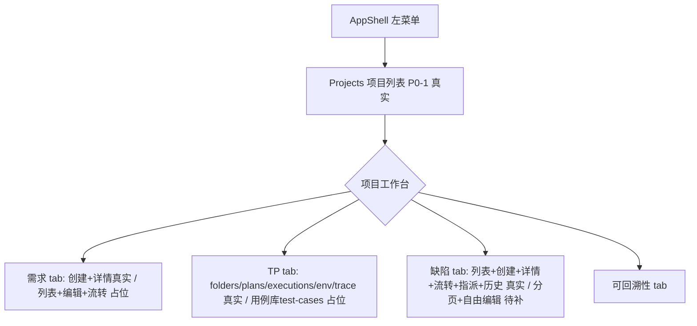

# 门户四个缺失管理页面 — 简单 PRD（v2，已按后端实现现状重订优先级）

> 文档类型：简单 PRD（默认档，仅需求分析，不含实现代码）
> 作者：许清楚（Xu），产品经理 · DevOps 平台门户团队
> v2 变更说明：v1 依据 OpenAPI 契约撰写，但**架构勘察证实契约与后端实现存在大量落差**（契约有端点、代码未实现）。本版已**逐条亲自核实后端源码**（requirement-service / tp-service / td-service 的 `app.py`、网关 `http_upstream.py` 路由表、IAM `test_permission_seeding.py`），据实重订 P0/P1 边界。所有"已核实"结论均给出代码证据，请勿凭契约臆测。

---

## 0. 后端实现现状速查（已逐条核实，供架构师对齐）

| 域 | 已核实的**已实现** HTTP 端点 | 与契约/PRD 的落差（已核实） |
|----|------------------------------|------------------------------|
| 项目 `projects` | `GET /api/v1/projects`（列表，project-service 已实现，字段完整：business_no/name/status/进度/当前迭代/版本） | 契约齐全，门户侧可直接做列表+详情+成员/版本/迭代管理 UI。 |
| 需求 `requirements` | `POST .../requirements`（创建）、`GET .../requirements/{id}`（详情） | **仅此两个**。列表 / `PATCH` 编辑 / `transitions` 流转 / `reviews` / `baselines` / `change-requests` **全部未实现**（已读 `requirement-service/app.py`，仅 2 个路由）。详情返回字段极少：`id/project_id/title/status/version`（创建时多 business_no/type），**owner/优先级/描述/验收标准等均取不到**。 |
| TP `tp` | `test-folders`(list/create/move)、`test-design-sessions`(create/run-stage/review-gate/import)、`test-environments`(create)、`test-plans`(create/freeze)、`test-executions`(create/start)、`traceability`(query) | **`test-cases`（用例库）完全没有 HTTP 端点**（已读 `tp-service/app.py`，无任何 `/test-cases*` 路由；领域模型有 test_cases 表但无接口）。网关路由表 `http_upstream.py` 也**没有 `test-cases` 键**，前端调用会 404（`UPSTREAM_ROUTE_NOT_FOUND`）。即：用例管理核心能力后端零供给。 |
| TD `td` | `GET .../defects`（列表）、`POST .../defects`（创建）、`GET .../defects/{id}`（详情）、`POST .../defects/{id}/transitions`（流转+指派）、`GET .../defects/{id}/history`（历史） | 相对最完整。但：① **列表无分页**——返回全量，`meta` 仅有 `count` 无 `next_cursor`/`has_more`（已读 `td-service/app.py` `list_defects`）；② **无 `PATCH`**——编辑字段只能靠 `transitions`（其 body 含 `assignee_id` 等）；③ 契约列的 `traceability-links` 端点**代码未实现**。详情字段丰富：business_no/title/description/severity/priority/defect_type/status/reporter_id/assignee_id/verifier_id/reopen_count/sla。 |
| 权限 IAM | 仅注册：`portal:cross-project-view`(developer)、`audit.read`(auditor)、`workflow.template.manage`(workflow-admin) | PRD 原拟的 `requirement.write`/`td.read`/`tp.write`/`project.*` 等**均未在 IAM 注册**（已读 `iam-service/tests/.../test_permission_seeding.py`）。若页面路由用 `meta.permission` 门禁这些点，**会全员锁定**。

> 结论：**TD 是四个页面里 P0 最可用的**（列表/创建/详情/流转/历史/指派齐活，仅缺分页）；**需求仅能做"创建+看详情"**；**用例（TP）核心为零**，只能只读占位或先做 folders/plans/executions 等周边；**项目管理**后端最就绪。

---

## 1. 产品目标

补齐四域实体管理页，与现有 AppShell/驾驶舱首页/左菜单集成。本期采用**"已实现端点接真实、未实现端点降级占位 + 标注待后端补"**策略（与架构师设计 `architecture-portal-management-pages.md` 对齐），保证前端骨架可独立验证、后端补齐后平滑挂接。

- 解决：数据只能看统计无法逐条操作；驾驶舱统计卡无落地页；缺统一"项目列表→项目内工作台"导航。
- 角色：developer（增删改+流转）、auditor（`audit.read` 只读）、workflow-admin（评审/审批流转）。
- **P0 权限策略（已据 IAM 现状调整）**：P0 阶段**仅做登录校验（`requiresAuth`）**，**不引入写级权限门禁**；域级只读/编辑权限点（requirement.read/write 等）待 IAM 注册后于 P1 接入（见 Q3）。否则按原方案全员无法进入页面。

---

## 2. 用户故事（全部 project-scoped）

### 2.1 项目管理（后端最就绪，P0 可较完整）
- 作为 developer，我希望在「Projects」看到我参与项目列表（business_no/name/status/进度/迭代/版本）并进入工作台。
- 作为 developer，我希望创建项目（name/description/owner_id）。
- 作为 owner/admin，我希望管理成员（角色 owner/admin/member/viewer）、转移所有者、管理版本与迭代。
- 作为 auditor，我希望只读查看项目信息/成员/版本/迭代。

### 2.2 需求管理（后端仅创建+详情，P0 大幅收窄）
- 作为 developer，我希望**创建一条需求**（`POST`，字段见 Q4）并能**查看其详情**（`GET`，但仅 id/title/status/version，owner/描述等缺失）。
- 作为 developer，我希望**查看某项目的需求列表**——⚠️ 后端**无列表端点**，P0 只能做"新建后凭返回 id 跳详情"或**只读占位列表**，真实列表待后端补 `listRequirements`（见 Q2）。
- 作为 developer，我希望**编辑需求 / 推动状态流转 / 评审 / 基线**——⚠️ 后端均未实现，P0 降级为占位入口，待后端补端点。
- 作为 auditor，我希望只读查看需求详情（受限字段）。

### 2.3 用例管理 / TP（核心 test-cases 零供给，P0 仅周边 + 占位）
- 作为 测试，我希望**查看用例库**——⚠️ 后端**无 `test-cases` 端点且网关无路由**，P0 只能做**只读占位页**（提示"后端能力建设中"），真实用例库待后端加端点+网关加路由双重前置（见 Q1）。
- 作为 测试，我希望管理**测试计划**（create/freeze 已实现）与**测试执行**（create/start 已实现）、测试环境（create 已实现）、测试文件夹（list/create 已实现）——这些周边能力 P0 可先行接入。
- 作为 测试，我希望查看可回溯性（traceability query 已实现）。
- 作为 auditor，我希望只读查看上述周边概览。

### 2.4 TD 管理（后端最完整，P0 可最贴近完整闭环）
- 作为 developer，我希望查看缺陷列表（business_no/title/severity/priority/status，⚠️ 全量无分页见 Q5）、创建缺陷、查看详情（含丰富字段+SLA）、执行状态流转与指派（`transitions` 带 `assignee_id`）、查看历史（history）。
- 作为 developer，我希望**编辑缺陷字段**（如改标题/描述/严重度）——⚠️ 后端**无 PATCH**，编辑只能经 `transitions` 携带，P0 仅支持流转式更新，自由编辑待后端补 PATCH（见 Q4）。
- 作为 auditor，我希望只读查看缺陷详情与历史。

---

## 3. 需求池（按后端现状重订 P0/P1/P2）

> 标注【真实】= 后端已实现端点，前端可直接接；【降级】= 本期仅占位/只读提示，待后端补；【周边】= TP 非用例库的已实现能力，可先行。
> 原 v1 的 P0-4/5/7/8（需求列表/编辑/流转）、P0-9/10/11（用例库）、P0-16/17 自由编辑/流转指派等，因后端未实现已下调。

### P0 — 必须有（仅纳入后端已核实实现的端点；其余降级为占位）
| # | 功能点 | 页面 | 状态 |
|---|--------|------|------|
| P0-1 | 项目列表 `GET /bff/api/v1/projects`（表格 business_no/name/status/进度）【真实】 | 项目管理 | P0 |
| P0-2 | 项目详情入口（ProjectData 字段）【真实】 | 项目管理 | P0 |
| P0-3 | 项目工作台分区导航（需求/TP/TD/可回溯性，复用 DomainWorkspaceView tabs） | 全部 | P0 |
| P0-4 | 需求**创建** `POST .../requirements`（Idempotency-Key）【真实，但返回字段少】 | 需求管理 | P0 |
| P0-5 | 需求**详情** `GET .../requirements/{id}`（仅 id/title/status/version）【真实，字段受限】 | 需求管理 | P0 |
| P0-6 | 缺陷**列表** `GET .../defects`（全量，无分页）【真实】 | TD 管理 | P0 |
| P0-7 | 缺陷**创建** `POST .../defects`（Idempotency-Key）【真实，字段丰富】 | TD 管理 | P0 |
| P0-8 | 缺陷**详情** `GET .../defects/{id}`（含 sla/history 入口）【真实】 | TD 管理 | P0 |
| P0-9 | 缺陷**流转+指派** `POST .../defects/{id}/transitions`（body 含 action/assignee_id/reason 等）【真实】 | TD 管理 | P0 |
| P0-10 | 缺陷**历史** `GET .../defects/{id}/history`【真实】 | TD 管理 | P0 |
| P0-11 | TP **测试文件夹**列表/创建 `GET/POST .../test-folders`【周边·真实】 | 用例管理 | P0 |
| P0-12 | TP **测试计划**创建/冻结 `POST .../test-plans`、`POST .../test-plans/{id}/freeze`【周边·真实】 | 用例管理 | P0 |
| P0-13 | TP **测试执行**创建/开始 `POST .../test-executions`、`.../start`【周边·真实】 | 用例管理 | P0 |
| P0-14 | TP **测试环境**创建 `POST .../test-environments`【周边·真实】 | 用例管理 | P0 |
| P0-15 | TP **可回溯性**查询 `GET .../traceability/{resource_id}`【周边·真实】 | 用例管理 | P0 |
| P0-16 | **降级占位页**：需求列表、用例库（test-cases）、需求编辑/流转/评审/基线、缺陷自由编辑——均渲染"能力建设中/后端待补"占位，结构预留真实组件挂载点 | 各域 | P0（占位） |
| P0-17 | 统一错误处理（Problem: error_code/trace_id；409/412/422 提示；401 client 自动刷新） | 全部 | P0 |
| P0-18 | 路由仅做登录校验 `requiresAuth`，**不**挂未注册的写权限点（避免全员锁定，见 Q3） | 全部 | P0 |

### P1 — 重要（依赖后端补齐端点/网关路由/IAM 注册）
| # | 功能点 | 依赖 | 级别 |
|---|--------|------|------|
| P1-1 | 需求**列表** `listRequirements`（cursor 分页）+ 状态筛选 | 后端补端点 | P1 |
| P1-2 | 需求 **PATCH 编辑**（If-Match）、**状态流转** `transitions`、评审 reviews/decisions、基线 baselines、变更请求 change-requests | 后端补端点 | P1 |
| P1-3 | **用例库** test-cases 列表/创建/版本：需**后端加端点 + 网关加 `test-cases` 路由**双重前置 | 后端+网关 | P1（原 v1 P0 下调） |
| P1-4 | 缺陷**分页**（列表加 cursor/limit，对齐 meta.next_cursor） | 后端补分页 | P1 |
| P1-5 | 缺陷**自由字段编辑 PATCH**（标题/描述/严重度等） | 后端补 PATCH | P1 |
| P1-6 | 跨项目全局视图（复用 `portal:cross-project-view`+SCOPE；BFF 路径待 Q1） | 后端/网关 | P1 |
| P1-7 | **域级权限门禁**：`requirement.read/write`、`tp.read/write`、`td.read/write`、`project.read/write` 等，先由 IAM 注册后再接 `meta.permission` | IAM 注册 | P1 |
| P1-8 | 高级组合筛选（状态/严重度/优先级/负责人/迭代版本） | 后端支持筛选参数 | P1 |
| P1-9 | 字段级权限（auditor 隐藏编辑按钮） | P1-7 | P1 |
| P1-10 | 项目内成员/版本/迭代管理 UI（members/versions/iterations 的 create/transitions，project-service 字段已齐） | 基本就绪，可随 P0 一并做 | P1 |

### P2 — 增强
| # | 功能点 | 级别 |
|---|--------|------|
| P2-1 | 列表导出 | P2 |
| P2-2 | 收藏/保存筛选 | P2 |
| P2-3 | 看板视图（拖拽流转） | P2 |
| P2-4 | 驾驶舱统计卡点击跳转（现卡片均无 @click，需先选项目） | P2 |
| P2-5 | 任务/工作日志（project 域，另线） | P2 |
| P2-6 | 自动化资产（automation-*） | P2 |
| P2-7 | 缺陷 `traceability-links`（契约有、代码未实现，待补） | P2 |

---

## 4. UI 设计稿（同 v1 布局，新增"降级占位"态）

### 4.1 与 AppShell 集成
复用 AppShell（左 `v-navigation-drawer` + `v-list` nav，右 `v-main>v-container>router-view`）。顶层菜单入口 = **Projects（项目列表）**；需求/用例/缺陷为 project-scoped，进入项目后顶部 tab 切换。

### 4.2 通用三段式（已实现域）
顶部筛选栏（[关键字][状态▾][重置][+新建]）+ 中部 `v-data-table` + 底部分页 → 行点击开右侧详情抽屉；创建/编辑用 `v-dialog` 表单（提交带 Idempotency-Key / If-Match）。

### 4.3 降级占位态（未实现域）
对 P0-16 的占位页，渲染统一 `ComingSoonPanel`：展示该域的"规划能力清单 + 当前后端状态徽标（已实现/待补端点/待加网关路由）"，并预留真实列表组件挂载位，后端就绪后仅替换内部组件。

### 4.4 Mermaid（同 v1，增加降级分支）

---

## 5. 待确认问题 / 待明确事项（合并 v1 + 后端核实结论）

### Q1. 用例库落地需"后端端点 + 网关路由"双前置（阻塞用例管理 P1-3）
- 已核实：`tp-service/app.py` **无 `/test-cases*` 路由**；网关 `http_upstream.py` 路由表**无 `test-cases` 键**（仅有 test-folders/design-sessions/environments/plans/executions/automation-result-ingestions/traceability）。前端即便调 `GET /bff/api/v1/projects/{pid}/test-cases` 也会 404。需后端加端点 + 网关加路由后才可落地。建议 PRD 用例库列表/创建/版本查看**从 P0 降至 P1 并标注"依赖后端能力建设"**（已采纳）。

### Q2. 需求列表/编辑/流转/评审/基线后端均未实现（阻塞需求 P1-1/1-2）
- 已核实：`requirement-service/app.py` 仅 `POST .../requirements`（创建）与 `GET .../requirements/{id}`（详情）两个路由。列表、PATCH、transitions、reviews、baselines、change-requests **均不存在**。详情返回字段极少（id/project_id/title/status/version），owner/优先级/描述/验收标准取不到。P0 仅留"创建+看详情+降级占位"，其余待后端补端点。

### Q3. 权限点 IAM 未注册（阻塞 P0-19 原方案 → 已改为 P0-18）
- 已核实：IAM 仅注册 `portal:cross-project-view`(developer)、`audit.read`(auditor)、`workflow.template.manage`(workflow-admin)（见 `iam-service/tests/.../test_permission_seeding.py`）。PRD 原拟的 requirement/tp/td/project 读写点**均未注册**。若路由挂 `meta.permission:<未注册点>`，`auth.has()` 恒 false → 全员进 /403。**决定：P0 仅 `requiresAuth`，写级门禁推迟到 P1-7（IAM 注册后）**。域权限点命名待安全确认（建议 `<域>:<动作>`）。

### Q4. 字段/schema 缺口（影响所有表单）
- 需求创建 body 契约为 `type: object` 且无实现参考，仅能从详情反推（title/status/type/business_no 出现在响应）。**需求创建必填字段待后端明确**。
- 缺陷字段已较明确（见 td-service `_serialize`：business_no/title/description/severity/priority/defect_type/status/reporter_id/assignee_id/verifier_id/reopen_count/sla）；transitions body 含 `action/privileged/assignee_id/verifier_id/reason/fix_version_id/fix_evidence/verification/root_cause/duplicate_of_id`（已核实）。**指派 = transitions 带 `assignee_id`**（非 PATCH），已确认，原 Q 待确认项可关闭。
- 用例（test-cases）字段完全未知（端点不存在），待后端定义。
- 分页不一致：project tasks 用 `after`+`limit`(has_more)；req/TD 用 `cursor`(next_cursor)；TD 列表**当前无分页**。前端需适配，或请后端统一（TD 补分页为 P1-4）。

### Q5. 缺陷列表无分页（影响 P0-6 体验）
- 已核实：`td-service` `list_defects` 返回全量数组 + `meta.count`，**无 `next_cursor`/`has_more`**。项目多时前端需自行在前端分页或等后端补 cursor 分页（P1-4）。P0 先用前端截断/本地分页兜底。

### Q6. BFF 路径（已部分澄清）
- 网关 `_route_key`：路径去 `v1` 后，若首段 `projects` 且 ≥3 段则取**第 3 段**作路由键（如 `projects/{pid}/requirements` → 键 `requirements` → REQUIREMENT_URL；`projects/{pid}/defects` → `defects` → TD_URL）。故需求 `GET /bff/api/v1/projects/{pid}/requirements`、缺陷 `/defects` 路径**已证实可用**；TP 周边键（test-folders 等）已映射；**`test-cases` 键缺失** → 印证 Q1。

### Q7. 卡片跳转（同 v1，不阻塞）
- 现有统计卡纯展示无 @click，P2-4 需补跳转+选项目交互。

---

## 附：本版核实证据索引（供架构师/主理人复核）
- 需求仅 2 端点：`requirement-service/src/requirement_service/app.py`（create_requirement / get_requirement，无 list/patch/transitions）。
- TP 无 test-cases：`tp-service/src/tp_service/app.py`（仅 test-folders/design-sessions/environments/plans/executions/traceability）。
- 网关无 test-cases 路由：`devops-api-gateway/src/gateway/http_upstream.py` routes 表（test-folders/design-sessions/.../defects，无 test-cases）。
- TD 无分页/无 PATCH、transitions 含 assignee_id：`td-service/src/td_service/app.py`（list_defects 全量；无 PATCH；transition_defect body）。
- IAM 仅 3 权限点：`iam-service/tests/unit/test_permission_seeding.py`（DEV_PERMISSION_SEEDS 仅 portal:cross-project-view；auditor=audit.read；admin=workflow.template.manage）。
- 前端调用约定：`devops-portal/src/api/client.ts`、`router/index.ts`（requiresAuth + meta.permission）、`stores/auth.ts`（has）。
