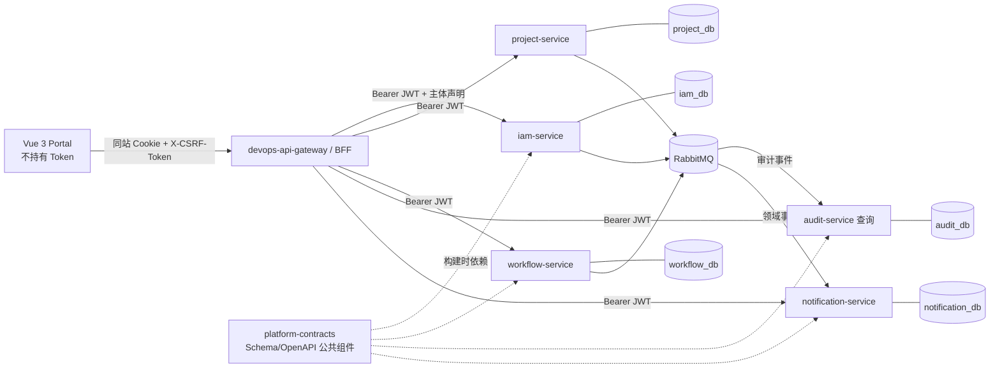
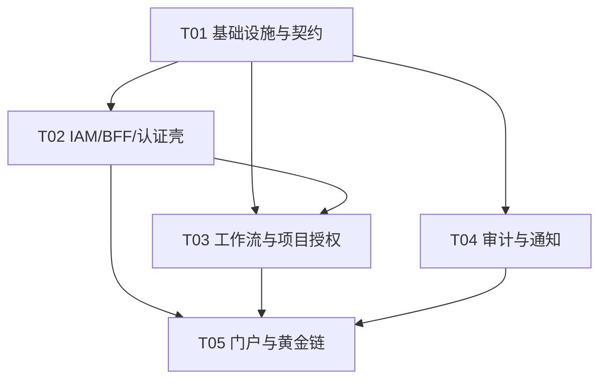

# 平台底座增量架构与实施计划

- 日期：2026-08-02
- 状态：架构裁决完成，可进入实现
- 输入：`docs/superpowers/specs/2026-08-02-platform-foundation-increment-prd.md`
- 既有基线：`project-service`（Feature-first、SQLAlchemy UoW、持久化幂等、事务 Outbox、项目成员/角色）
- 本轮目标：在本地代码、PostgreSQL/RabbitMQ 集成测试、Mock 集成和前端构建条件下，形成“登录 → 项目 → 工作流 → 审计/通知 → 登出”的可运行黄金链

## Part A：系统设计

## 1. 实施方法与架构裁决

### 1.1 核心难点

1. 浏览器会话不能把 Token 暴露给 JavaScript，同时要完成刷新轮换、并发 401 合并、CSRF 与撤销。
2. IAM 的平台权限和 `project-service` 的项目成员角色必须分离，避免“平台管理员即全项目管理员”。
3. 四个后端服务都需要私有数据库、独立迁移、Outbox/消费幂等，却不能复制出四套不兼容基础设施。
4. 工作流模板语义需兼容现有任务状态，但不得把 `project-service` 写路径同步耦合到尚处骨架期的工作流服务。
5. 审计既要可查询又要在应用/数据库权限层追加写；通知既要事件驱动、去重，又要用户级状态和安全渲染。
6. 门户须统一处理认证、RFC 9457、主题、响应式和 WCAG 2.2 AA，不能让页面各自实现。

### 1.2 总体架构



### 1.3 已确认决策（不留给工程师）

#### ADR-01：采用同站 BFF + HttpOnly Cookie

- 浏览器只访问同源 BFF；Access/Refresh Token 均由 BFF 会话层管理，浏览器不可读。
- Cookie：`__Host-devops_rt`（Refresh，`HttpOnly; Secure; SameSite=Lax; Path=/`）与 `__Host-devops_csrf`（随机 CSRF 值，可被前端读取；同样 Secure/SameSite）。本地 HTTP 使用无 `__Host-` 的明确开发 Cookie 名，生产配置严禁降级。
- BFF 不持久保存完整 Access Token；登录/刷新后 Access Token 仅在加密服务端会话缓存或请求内存中存在。P0 简化为 BFF 以 Refresh Cookie 向 IAM 换取短期 Access Token，并对并发刷新做单飞锁；生产扩展可使用 Redis 加密会话缓存。
- 所有非安全方法（POST/PUT/PATCH/DELETE）执行双提交 CSRF：`X-CSRF-Token` 必须与 CSRF Cookie 恒时比较，并校验 `Origin`/`Sec-Fetch-Site` 为同源。登录与应急登录也执行 CSRF；OIDC callback 另校验 `state`、PKCE 和 nonce。
- Access JWT：10 分钟；Refresh：绝对 8 小时、空闲 2 小时（均配置化）。JWT 包含 `iss/aud/sub/sid/iat/nbf/exp/jti/auth_method/platform_permissions/break_glass`，不包含项目角色全集。
- Refresh Token 每次使用即轮换；数据库只存带 pepper 的 SHA-256/HMAC 摘要。旧 token 再用：在同一事务撤销 `family_id` 全族、记录安全审计、拒绝请求。
- 禁用/锁定用户立即批量撤销 Refresh 会话；Access 最大残留窗口为 10 分钟。高风险应急/会话管理 API额外查询 IAM session/user 状态；P0 不维护分布式 JWT 黑名单。
- 登出先撤销本地会话再清 Cookie，幂等返回 204；OIDC RP-Initiated Logout 作为 P1，失败不恢复本地会话。

#### ADR-02：主体传播和服务身份

- BFF 验证 IAM 签名 JWT 后，以原 JWT 调用业务服务；业务服务本地校验 JWKS、`iss/aud/exp`，不得信任客户端可伪造的 `X-Actor-Id`。
- BFF 生成或透传 `traceparent`、`X-Trace-Id`；`project_id` 来自路径/对象，不以任意 Header 作为授权依据。
- 内部摄取 API使用 OAuth 2.0 client credentials 的短期服务 JWT，`sub=service:<name>`、细粒度 scope（`audit:ingest`、`notification:create`）；RabbitMQ 使用每服务独立账号、vhost 权限和 TLS（生产）。
- 迁移期间 `project-service` 的开发 `X-Actor-Id` 仅在 `APP_ENV=development && DEV_TRUSTED_HEADERS=true` 可用；生产启动时该组合失败。

#### ADR-03：IAM 与项目角色边界

- IAM 持有：不可变主体、身份提供者映射、用户状态、平台角色/权限（如 `workflow.template.manage`、`audit.read`、`identity.manage`）、会话、服务身份。
- `project-service` 是项目成员与 Owner/Admin/Member/Viewer 的唯一事实源，并最终判定项目/对象访问。
- workflow-service 不缓存“授权结论”。启动/转换时同步调用 `project-service` 内部授权检查 `POST /internal/api/v1/authorization/check`（超时 800ms，失败关闭），传 `actor_id/project_id/action/resource_ref`；同一命令内只调用一次。平台权限与项目授权取交集。
- 事件中的角色仅作审计上下文，不能作为后续授权依据。平台安全管理员、工作流管理员均不会自动获得项目数据。

#### ADR-04：服务与共享底座边界

- 交付物是四个独立 Flask 微服务（IAM、workflow、audit、notification）和一个 Vue SPA；BFF 是独立薄网关进程/仓库，不与 IAM 合库。
- 每个服务拥有独立 PostgreSQL database/schema owner、运行账号与 Alembic version table；禁止跨库外键和跨服务 ORM import。
- `platform-contracts` 只共享 JSON Schema、OpenAPI 公共组件和事件样例；可选 `platform-python-sdk` 只共享 Trace、Problem、JWT 验证、Outbox 技术组件，禁止业务实体、业务 Repository 和联合迁移。
- 本轮控制文件规模：先在每个服务使用 `app/config/database/api/models/service/repository` 的最小 Feature-first 切分；功能稳定后再拆细，不预建空目录。

#### ADR-05：工作流与任务弱耦合

- workflow-service 独立拥有模板、版本、实例和转换历史；内置只读发布模板 `system.task-lifecycle@1`：`todo → in_progress → done → closed`，另有 `todo|in_progress → canceled`、`done|closed → in_progress`（reopen）。
- P0 不改造 `project-service` 的任务状态写路径，也不反向写任务状态。黄金链中的工作流实例以 `business_object_type=task`、`business_object_id=<task_id>` 引用任务。
- 启动前通过 project-service 授权/存在性接口校验；之后接收 `Task.StatusChanged` 仅用于未来一致性观察，不自动流转实例。
- 为未来接入发布 `Workflow.Transitioned`，包含业务对象引用、from/to/action/version；project-service 将来可选择命令式接入或事件投影，契约不要求双写。任何状态对账差异仅告警，不做隐式修复。

#### ADR-06：审计追加边界

- 事件消费为主要摄取，受信 REST 为补充。入库前执行 JSON Schema、字段大小、允许分类、敏感键拒绝/脱敏。
- 物理账号：`audit_migrator`（仅迁移窗口）、`audit_ingest`（表 INSERT/序列 USAGE；无 UPDATE/DELETE）、`audit_reader`（SELECT）。应用拆分 ingest worker 与 query web 进程，分别使用不同 DSN。
- 无 UPDATE/DELETE API；Alembic downgrade 不删除 `audit_records` 数据。P0 明确不声称 WORM/密码学不可抵赖。
- 默认在线保留 180 天但 P0 不自动删除；到期只作为后续归档策略输入。项目 Owner 的审计摘要 P0 禁止，只有 `audit.read` 且带 IAM 数据范围的审计员可查。

#### ADR-07：通知模型与渲染

- 事件消费者匹配模板后创建 Notification 事实与 Delivery 用户状态；P0 每个事件通常单收件人，但模型允许共享 Notification。
- 唯一去重 `(recipient_id, source_event_id, template_key)`；消费者另以 `(consumer_name,event_id)` 去重。
- 偏好 `(user_id,category,channel)`；默认 `workflow/project/general=true`，`security=true` 且禁止关闭。
- 模板由代码/受控种子管理，使用 Jinja2 `StrictUndefined + autoescape`，最终仅保存/返回纯文本；`target_url` 必须是以 `/app/` 开始且不含 scheme/host/反斜杠的内部路径。前端禁止 `v-html`。
- P0 采用 30 秒轮询未读数，不实现 SSE/WebSocket；页面可见/聚焦时立即刷新。

#### ADR-08：Vue 技术与体验

- Vue 3 Composition API + TypeScript strict + Vite + Vue Router + Pinia。
- 组件体系只选 **Vuetify 3**（含主题、ARIA 基线与响应式组件），不引入 Tailwind/MUI，避免 CSS 体系重叠；自定义样式只使用语义 Design Token/CSS variables。
- Store：`auth`（主体、权限、会话态、single-flight refresh）、`theme`（light/dark/system 与无闪烁初始化）、`notification`（未读数/轮询）。服务器列表数据留在页面 composable，不塞入全局 Store。
- 路由 meta 声明 `requires_auth/permissions`；全局守卫只做会话与平台权限的 UX 收敛，后端仍最终授权。`redirect` 仅允许站内命名路由。
- 统一 API client：`credentials: include`、CSRF header、RFC 9457 → `ApiProblem`；401 最多一次共享刷新和一次重放，刷新失败清状态并跳 `/session-expired`。
- CSP 禁止 inline script，提供 skip link、语义 landmark、焦点恢复、live region、44px 触控目标、reduced motion；axe + 三宽度 Playwright 门禁。

### 1.4 框架与库选择

- 后端：Flask 3.1（延续黄金样板）、SQLAlchemy 2、Alembic、psycopg 3、PyJWT[crypto]（JWT/JWKS）、Authlib（OIDC/OAuth 2.1 适配）、argon2-cffi（应急凭据）、pyotp（P0 TOTP 适配器）、Pydantic 2（边界校验）、jsonschema（事件契约）、kombu（RabbitMQ/Outbox worker）、Jinja2（安全通知模板）、OpenTelemetry。
- 架构模式：Feature-first + API/Application Service/Repository/UoW；领域聚合内部状态机；端口-适配器用于 IdP、MFA、项目授权和消息总线。
- 前端：Vue 3、Vue Router、Pinia、Vuetify 3、openapi-typescript + 自建薄 fetch client、Vitest、Vue Test Utils、MSW、Playwright、axe-core。

## 2. 文件列表（首批受控范围）

```text
platform-contracts/
  schemas/{identity-context,event-envelope,audit-event,workflow-events,notification-event}.schema.json
  openapi/common.yaml
  tests/test_contracts.py

devops-api-gateway/
  pyproject.toml .env.example
  src/gateway/{app.py,config.py,auth_proxy.py,csrf.py,upstream.py}
  tests/{test_auth_proxy.py,test_csrf.py,test_refresh_singleflight.py}

iam-service/
  pyproject.toml alembic.ini .env.example
  src/iam_service/{app.py,config.py,database.py}
  src/iam_service/auth/{api.py,models.py,schemas.py,service.py,repository.py,tokens.py,providers.py}
  src/iam_service/emergency/{api.py,service.py,mfa.py}
  src/iam_service/outbox/{models.py,publisher.py}
  migrations/{env.py,versions/0001_iam_core.py}
  openapi/openapi.yaml
  tests/{unit/test_session_rotation.py,integration/test_auth_api.py,contract/test_openapi.py}

workflow-service/
  pyproject.toml alembic.ini .env.example
  src/workflow_service/{app.py,config.py,database.py}
  src/workflow_service/workflows/{api.py,models.py,schemas.py,state_machine.py,service.py,repository.py,policies.py,events.py}
  src/workflow_service/integrations/project_authorization.py
  src/workflow_service/outbox/{models.py,publisher.py}
  migrations/{env.py,versions/0001_workflow_core.py,versions/0002_seed_task_template.py}
  openapi/openapi.yaml
  tests/{unit/test_state_machine.py,integration/test_workflow_api.py,contract/test_events.py}

audit-service/
  pyproject.toml alembic.ini .env.example
  src/audit_service/{app.py,config.py,database.py}
  src/audit_service/records/{api.py,models.py,schemas.py,ingest_service.py,query_service.py,repository.py,redaction.py}
  src/audit_service/consumers/audit_events.py
  migrations/{env.py,versions/0001_audit_append_only.py}
  openapi/openapi.yaml
  tests/{unit/test_redaction.py,integration/test_append_only.py,contract/test_ingest.py}

notification-service/
  pyproject.toml alembic.ini .env.example
  src/notification_service/{app.py,config.py,database.py}
  src/notification_service/notifications/{api.py,models.py,schemas.py,service.py,repository.py,templates.py}
  src/notification_service/consumers/domain_events.py
  migrations/{env.py,versions/0001_notifications.py,versions/0002_seed_preferences.py}
  openapi/openapi.yaml
  tests/{unit/test_templates.py,integration/test_notification_api.py,contract/test_events.py}

devops-portal/
  package.json vite.config.ts tsconfig.json index.html .env.example
  src/{main.ts,App.vue}
  src/router/{index.ts,guards.ts,routes.ts}
  src/stores/{auth.ts,theme.ts,notification.ts}
  src/api/{client.ts,problem.ts,generated.ts}
  src/layouts/AppShell.vue
  src/components/common/{AsyncState.vue,AppToast.vue,SkipLink.vue}
  src/views/{LoginView.vue,EmergencyLoginView.vue,HomeView.vue,ProjectsView.vue,WorkflowListView.vue,WorkflowDetailView.vue,NotificationView.vue,ProfileView.vue,AppearanceView.vue,NotificationSettingsView.vue,AuditView.vue,ForbiddenView.vue,NotFoundView.vue,SessionExpiredView.vue}
  src/styles/{tokens.css,global.css}
  tests/{unit/stores.spec.ts,e2e/golden-chain.spec.ts,e2e/accessibility.spec.ts}

platform-deployment/
  compose.local.yaml .env.example
  rabbitmq/definitions.json
  postgres/init-databases.sql
  mocks/{mock_idp.py,event_fixture_publisher.py}
  tests/golden_chain.py
```

## 3. 数据结构、索引与接口

### 3.1 数据表

#### IAM

- `identity_providers(id,type,name,issuer,enabled,created_at)`；唯一 `(type,name)`。
- `users(id,provider_id,subject,username,display_name,email,status,profile_json,last_synced_at,version,created_at,updated_at)`；唯一 `(provider_id,subject)`；索引 `(status,updated_at)`、`lower(username)`。
- `platform_role_bindings(user_id,role_key,created_at)`；主键 `(user_id,role_key)`。
- `sessions(id,user_id,family_id,auth_method,current_refresh_hash,previous_refresh_hash,issued_at,expires_at,idle_expires_at,last_seen_at,status,revoked_reason,ip_hash,user_agent_hash,mfa_verified_at,version)`；唯一 `current_refresh_hash`；索引 `(user_id,status)`、`(family_id,status)`、`(expires_at,status)`。
- `break_glass_credentials(user_id,password_hash,totp_secret_ciphertext,credential_expires_at,allowed_cidrs,rotated_at)`；与普通 provider 凭据物理表隔离。
- `outbox_events`、`processed_commands`：沿用 project-service 事务/幂等结构。

#### Workflow

- `workflow_templates(id,template_key,name,scope,created_at)`；唯一 `template_key`。
- `workflow_template_versions(id,template_id,version_no,status,definition_json,definition_hash,created_by,published_by,created_at,published_at)`；唯一 `(template_id,version_no)`；发布后由 service + DB trigger 拒绝 definition 更新；索引 `(status,published_at)`。
- `workflow_instances(id,project_id,business_object_type,business_object_id,template_version_id,current_state,status,context_json,started_by,started_at,completed_at,version,updated_at)`；索引 `(project_id,updated_at,id)`、`(project_id,status,current_state)`、`(business_object_type,business_object_id)`。
- `workflow_transitions(id,instance_id,sequence_no,from_state,to_state,action,actor_id,reason,occurred_at,idempotency_key)`；唯一 `(instance_id,sequence_no)`、`(actor_id,idempotency_key)`；索引 `(instance_id,occurred_at,id)`。
- `outbox_events`、`processed_commands`。

#### Audit

- `audit_records(id,event_id,occurred_at,ingested_at,trace_id,actor_id,actor_type,project_id,resource_type,resource_id,action,result,source,before_json,after_json,reason,metadata_json,classification)`；唯一 `event_id`。
- 查询索引：`(occurred_at DESC,id DESC)`、`(trace_id,occurred_at DESC)`、`(actor_id,occurred_at DESC)`、`(project_id,occurred_at DESC)`、`(resource_type,resource_id,occurred_at DESC)`、`(action,result,occurred_at DESC)`；时间过滤必填且最大 31 天/次。
- `processed_events(consumer_name,event_id,processed_at)`；主键 `(consumer_name,event_id)`。

#### Notification

- `notifications(id,source_event_id,template_key,category,title,body,target_url,severity,created_at,expires_at)`；索引 `(created_at DESC,id DESC)`。
- `notification_deliveries(id,notification_id,recipient_id,status,read_at,created_at,updated_at,version)`；唯一 `(recipient_id,notification_id)`；索引 `(recipient_id,status,created_at DESC,id DESC)`。
- 为直接强制去重，在 `notifications` 保存 source，`notification_deliveries` 冗余 `source_event_id/template_key` 或增加 `delivery_dedup(recipient_id,source_event_id,template_key,delivery_id)`，唯一 `(recipient_id,source_event_id,template_key)`；P0 采用后者，避免共享通知破坏唯一性。
- `notification_preferences(user_id,category,channel,enabled,locked,version,updated_at)`；主键 `(user_id,category,channel)`。
- `processed_events(consumer_name,event_id,processed_at)`。

### 3.2 类图

```mermaid
classDiagram
  class IdentityProviderAdapter { <<interface>> +authorize_url(state,pkce,nonce) str +exchange_callback(code,verifier) ExternalIdentity +authenticate_dev(username) ExternalIdentity }
  class LocalDevProvider { +authenticate_dev(username) ExternalIdentity }
  class OidcProvider { +authorize_url(...) str +exchange_callback(...) ExternalIdentity }
  class SessionService { +__init__(repo,token_service,audit) +login(identity,client) TokenPair +refresh(raw_token,client) TokenPair +logout(raw_token) None +revoke_user(user_id,reason) int }
  class TokenService { +issue_access(user,session) str +new_refresh() tuple~str,str~ +verify_access(token,audience) Principal }
  class Session { +UUID id +UUID user_id +UUID family_id +str current_refresh_hash +SessionStatus status +datetime expires_at +rotate(new_hash,now) None +revoke(reason) None }
  IdentityProviderAdapter <|.. LocalDevProvider
  IdentityProviderAdapter <|.. OidcProvider
  SessionService --> TokenService
  SessionService --> Session

  class WorkflowTemplateVersion { +str template_key +int version_no +TemplateStatus status +dict definition +publish(actor) None +deprecate(actor) None }
  class WorkflowInstance { +UUID id +str project_id +str current_state +InstanceStatus status +int version +transition(action,actor,reason,expected_version) WorkflowTransition }
  class WorkflowTransition { +UUID id +str from_state +str to_state +str action +str actor_id +str reason +datetime occurred_at }
  class WorkflowService { +__init__(uow,authorizer) +create_draft(cmd) WorkflowTemplateVersion +publish(key,version) None +start(cmd,principal) WorkflowInstance +available(id,principal) list +transition(id,cmd,principal) WorkflowInstance }
  class ProjectAuthorizationPort { <<interface>> +check(actor_id,project_id,action,resource) bool }
  WorkflowTemplateVersion "1" --> "*" WorkflowInstance : pins version
  WorkflowInstance "1" *-- "*" WorkflowTransition : append-only history
  WorkflowService --> ProjectAuthorizationPort

  class AuditRecord { +UUID id +str event_id +datetime occurred_at +datetime ingested_at +str actor_id +str project_id +str action +str result }
  class AuditIngestService { +__init__(repo,redactor) +ingest(event,caller) AuditRecord }
  class AuditQueryService { +__init__(repo,scope_policy) +search(filters,principal) Page +get(id,principal) AuditRecord }
  AuditIngestService --> AuditRecord
  AuditQueryService --> AuditRecord

  class Notification { +UUID id +str source_event_id +str template_key +str title +str body +str target_url }
  class Delivery { +UUID id +UUID notification_id +str recipient_id +DeliveryStatus status +datetime read_at +mark_read() None +mark_unread() None }
  class NotificationPreference { +str user_id +str category +str channel +bool enabled +bool locked +set_enabled(value,version) None }
  class NotificationService { +__init__(repo,renderer) +consume(event) Delivery? +list(user,cursor) Page +mark_read(user,id,version) Delivery +update_preferences(user,items) list }
  Notification "1" --> "*" Delivery
  NotificationService --> Notification
  NotificationService --> NotificationPreference
```



### 3.3 REST API 契约

通用成功体：`{"data": ..., "meta":{"trace_id":"...","next_cursor":"..."}}`；204 无体。错误为 `application/problem+json`，至少 `type/title/status/detail/error_code/trace_id`。列表默认 50、最大 200，游标编码稳定排序末项 `(timestamp,id)`。所有写请求须 `Idempotency-Key`；可变聚合使用 `If-Match: W/"<version>"`。

- BFF：`POST /bff/auth/login`、`GET /bff/auth/oidc/authorize`、`GET /bff/auth/oidc/callback`、`POST /bff/auth/refresh`、`POST /bff/auth/logout`、`GET /bff/session`。写 API统一代理 `/api/v1/**`。
- IAM：PRD 所列 auth/me API；补充 `GET /.well-known/jwks.json`、`POST /internal/api/v1/tokens/service`、`POST /internal/api/v1/users/{id}/status`。
- Workflow、Audit、Notification：采用 PRD 10.1 全部 P0 路由，不开放模板 PATCH、实例 current_state PATCH、审计 UPDATE/DELETE。
- Project 协作接口：`POST /internal/api/v1/authorization/check` 请求 `{actor_id,project_id,action,resource:{type,id}}`，响应 `{data:{allowed,reason_code,project_role}}`；仅服务身份可用。

### 3.4 事件契约

统一 envelope 延续既有 Schema，但将 `project_id` 改为 `string|null`（IAM 平台事件无项目），actor 扩展 `break_glass:boolean`，使用兼容的新 schema 版本；事件名 envelope 中不带 `.v1`，版本由 `event_version` 表示。

- `Identity.LoginSucceeded` / `Identity.LoginFailed` / `Identity.SessionRefreshed` / `Identity.SessionRevoked`：不得含凭据、Token、MFA code。
- `Workflow.InstanceStarted`：`instance_id,template_key,template_version,business_object_type,business_object_id,current_state,recipient_ids`。
- `Workflow.Transitioned`：增加 `from_state,to_state,action,instance_version,reason_present`，不默认广播原始 reason。
- `Notification.Created` / `Notification.PreferenceChanged`：用于审计，不回流创建通知。
- 审计消费者将领域事件映射为审计记录；每个 event_id 至多一条。
- Routing key：`identity.*`、`workflow.*`、`project.*`、`notification.*`；durable topic exchange `platform.domain.v1`，每消费者独立 quorum queue + DLQ，指数退避 5s/30s/5m，超过 5 次入 DLQ。

## 4. 程序调用流

### 4.1 初始化与登录/刷新/撤销

```mermaid
sequenceDiagram
  participant P as Portal
  participant B as BFF
  participant I as IAM SessionService
  participant DB as iam_db
  participant MQ as Outbox/RabbitMQ
  P->>B: GET /bff/session
  B-->>P: CSRF cookie + unauthenticated
  P->>B: POST /bff/auth/login + X-CSRF
  B->>I: POST /api/v1/auth/login (dev adapter)
  I->>DB: upsert identity; INSERT session + outbox
  DB-->>I: commit
  I-->>B: access + rotating refresh
  B-->>P: Set HttpOnly refresh; data principal
  MQ-->>I: publish Identity.LoginSucceeded
  Note over P,B: 多请求遇到401时共享同一个 refresh Promise
  P->>B: API request
  B->>I: POST /api/v1/auth/refresh (refresh cookie)
  I->>DB: SELECT FOR UPDATE token hash/family
  alt token current and active
    I->>DB: rotate hash + outbox; commit
    I-->>B: new access + refresh
    B-->>P: replay original once
  else previous/used token reused
    I->>DB: revoke family + security outbox; commit
    I-->>B: 401 REFRESH_TOKEN_REUSED
    B-->>P: clear cookies; session-expired
  end
```

### 4.2 工作流 CRUD、流转、审计和通知

```mermaid
sequenceDiagram
  participant P as Portal
  participant B as BFF
  participant W as WorkflowService
  participant PA as ProjectAuthorizationPort
  participant DB as workflow_db
  participant MQ as RabbitMQ
  participant A as AuditIngestService
  participant N as NotificationService
  P->>B: POST workflow-instances + Idempotency-Key
  B->>W: JWT + trace + command
  W->>PA: check actor/project/workflow.start/task
  PA-->>W: allowed
  W->>DB: transaction: instance + transition#0 + outbox + processed_command
  DB-->>W: commit
  W-->>P: 201 instance v1
  MQ-->>A: Workflow.InstanceStarted
  A->>A: validate/redact/dedupe/INSERT only
  MQ-->>N: Workflow.InstanceStarted
  N->>N: preference + safe template + dedupe Delivery
  P->>B: GET available-transitions
  B->>W: principal + instance id
  W->>PA: check project scope
  PA-->>W: allowed
  W-->>P: permitted actions
  P->>B: POST transitions + If-Match + key
  B->>W: transition command
  W->>PA: check workflow.transition
  W->>DB: SELECT FOR UPDATE; validate state/role/version
  W->>DB: UPDATE instance; INSERT history/outbox; commit
  W-->>P: 200 instance v2
  MQ-->>A: Workflow.Transitioned
  MQ-->>N: Workflow.Transitioned
  P->>B: GET notifications/unread-count
  B->>N: JWT sub
  N-->>P: recipient-isolated count
  P->>B: POST notification/{id}/read
  B->>N: JWT sub + If-Match
  N-->>P: read Delivery
```

## 5. 认证、授权与安全红线

- `APP_ENV=production|container` 时，`LOCAL_DEV_AUTH_ENABLED=true`、`DEV_TRUSTED_HEADERS=true`、非 HTTPS cookie、通配 CORS、默认签名 key、Mock MFA 任一出现都必须启动失败；`/ready` 额外报告 unsafe config 为 fail。
- 应急入口独立 `/emergency-login` 与 `/api/v1/emergency-auth/login`；账号仅来自 `break_glass` provider。P0 明确采用 TOTP，secret 经外部 `BREAK_GLASS_KEK` 包封加密；生产没有 KEK、CIDR、凭据到期日则启动失败。请求必须有有效 TOTP、来源 CIDR、8～128 字原因、工单号；登录后 JWT `break_glass=true`，门户常驻红色语义警示。Mock TOTP 仅 test 环境。
- 密码 Argon2id；登录按规范化账号/IP/client 三维限流，响应统一，防账号枚举。日志禁止 Authorization、Cookie、密码、code、token、TOTP、secret 和完整邮件/IP。
- CSP：`default-src 'self'; script-src 'self'; object-src 'none'; base-uri 'none'; frame-ancestors 'none'`；禁止开放跳转和 `v-html`。
- 项目资源越权优先返回 404；平台功能无权限返回 403。内部 API 不能因路径为 `/internal` 而免认证。
- JSON context/before/after/metadata 单字段 16 KiB、事件总计 64 KiB；拒绝键匹配 `password|token|secret|authorization|cookie|otp`。

## 6. 环境变量

通用：`APP_ENV SERVICE_NAME DATABASE_URL LOG_LEVEL ALLOWED_ORIGINS OTEL_EXPORTER_OTLP_ENDPOINT RABBITMQ_URL JWT_ISSUER JWT_AUDIENCE JWKS_URL`。

IAM：`LOCAL_DEV_AUTH_ENABLED ACCESS_TOKEN_TTL_SECONDS=600 REFRESH_ABSOLUTE_TTL_SECONDS=28800 REFRESH_IDLE_TTL_SECONDS=7200 REFRESH_TOKEN_PEPPER JWT_PRIVATE_KEY_FILE JWT_KEY_ID OIDC_* BREAK_GLASS_KEK BREAK_GLASS_ALLOWED_CIDRS`。

BFF：`IAM_BASE_URL UPSTREAM_* COOKIE_SECURE COOKIE_DOMAIN(生产必须空，使用 host-only) CSRF_TRUSTED_ORIGINS SESSION_ENCRYPTION_KEY REDIS_URL(生产启用)`。

Workflow：`PROJECT_SERVICE_URL PROJECT_AUTH_TIMEOUT_MS=800 CONTEXT_MAX_BYTES=16384`。

Audit：`AUDIT_INGEST_DATABASE_URL AUDIT_QUERY_DATABASE_URL QUERY_MAX_RANGE_DAYS=31 ONLINE_RETENTION_DAYS=180`。

Notification：`UNREAD_POLL_SECONDS=30 INTERNAL_ROUTE_PREFIX=/app/ TEMPLATE_MAX_OUTPUT_BYTES=8192`。

Portal：`VITE_BFF_BASE_URL=/ VITE_UNREAD_POLL_SECONDS=30000`（不得含秘密）。

## 7. 本地拓扑、测试和部署接口

### 7.1 本地拓扑

`compose.local.yaml` 启动 PostgreSQL（五个独立 database/账号）、RabbitMQ management、IAM、BFF、workflow、audit web/worker、notification web/worker、project-service 和门户。Mock IdP 是测试用 OIDC Authorization Code + PKCE provider；本地开发登录仍走 IAM Adapter，不硬编码进门户。事件 fixture publisher 只在 `COMPOSE_PROFILES=mock` 出现。

若 Docker 依赖不可用，后端单元测试仍可跑，但最终集成验收必须使用真实 PostgreSQL；RabbitMQ 契约可先用 fake publisher，最终黄金链必须验证真实 broker 重投和去重。

### 7.2 测试策略与门禁

- 单元：refresh rotation/reuse、状态机、模板转义、脱敏、权限 policy、stores/client single-flight。
- PostgreSQL 集成：空库 Alembic upgrade、唯一/检查约束、并发乐观锁、Outbox 原子性、审计 DB grants、游标稳定性。
- RabbitMQ 集成：发布确认、重复消费、5 次重试/DLQ、trace/event_id 传播。
- 契约：OpenAPI 3.1 validator、生成 TS client 无 diff、JSON Schema 正反例、project authorization consumer/provider contract。
- 安全：跨项目、跨用户通知 ID、CSRF 缺失/错配、开放跳转、JWT aud/iss、生产误启 dev、refresh 重用、应急拒绝。
- 前端：Vitest store/组件；Playwright 360/768/1280、键盘、200% zoom、light/dark/system；axe WCAG 2.2 AA（无 serious/critical）。
- 黄金链：按 PRD 第 14 节执行，登录/启动/转换/审计/通知/偏好/主题/登出全自动。
- 门禁：Ruff、Pyright/mypy、pytest；ESLint、`vue-tsc --noEmit`、Vitest、Vite build；关键安全/状态机/权限/幂等分支 ≥90%，全量测试通过，OpenAPI/Schema 无未批准破坏变更。

### 7.3 远程 Docker 恢复条件

当前 Python 3.13 基础镜像公网 443 阻塞，因此本轮不伪造远程成功。满足以下条件才恢复远程部署：

1. 内部 Harbor/Nexus 提供经扫描、按 digest 固定的 Python 3.13 与 Node 构建镜像，或离线 OCI tar 已校验 SHA256；禁止以 Python 3.12 调试镜像替代验收。
2. 离线 wheel/npm 缓存覆盖 lockfile 且可重复构建；镜像 Critical 漏洞为 0。
3. 远程 PostgreSQL/RabbitMQ 有独立账号/vhost、TLS/Secret 注入、端口与磁盘预算；不复用 project-service 内存模式。
4. 各服务 migration job、`/health`、`/ready`、非 root、只读 rootfs、优雅停机和回滚脚本就绪。
5. 本地黄金链、契约和镜像构建先全绿，再上传；远程只做部署/验收，不在线解析公网依赖。
6. Docker 阶段外部配置与无状态镜像保持 Kubernetes 可映射：Deployment、ConfigMap/Secret、Job migration、Service、HPA；API/事件不因编排器变化。

## 8. 不清楚事项与本设计采用的确定假设

PRD 第 16 节均已裁决：BFF Cookie；本地登出优先且不做上游 SLO；10 分钟/8 小时/2 小时默认时限；应急 P0=TOTP、CIDR 和工单格式校验（真实工单系统 P1）；项目角色留在 project-service；工作流不接管现有任务写路径；P0 仅系统模板；审计 180 天策略但不自动删且项目 Owner P0 不可查；通知默认开启、安全强制、30 秒轮询；Vuetify 单组件体系；组织删除语义留在真实 LDAP 接入 P1，不影响本轮 Adapter 合同。

## Part B：任务分解

## 9. Required Packages

- Python `Flask>=3.1,<4`、`SQLAlchemy>=2.0.41,<2.1`、`psycopg[binary]>=3.2.9,<4`、`Alembic>=1.16.4,<2`、`gunicorn>=23,<24`
- `Authlib>=1.6,<2`、`PyJWT[crypto]>=2.10,<3`、`argon2-cffi>=25,<26`、`pyotp>=2.9,<3`
- `pydantic>=2.11,<3`、`jsonschema>=4.23,<5`、`kombu>=5.5,<6`、`Jinja2>=3.1,<4`
- `opentelemetry-sdk>=1.36,<2`、`opentelemetry-instrumentation-flask>=0.57b0,<1`、`structlog>=25,<26`
- 开发：`pytest>=8.4,<9`、`pytest-postgresql>=7,<8`、`testcontainers[postgres,rabbitmq]>=4.10,<5`、`ruff>=0.12,<1`、`mypy>=1.17,<2`、`openapi-spec-validator>=0.7,<1`
- 前端：`vue@^3.5`、`vue-router@^4.5`、`pinia@^3.0`、`vuetify@^3.9`、`@mdi/font@^7.4`
- 前端开发：`vite@^7`、`typescript@^5.8`、`vue-tsc@^3`、`vitest@^3.2`、`@vue/test-utils@^2.4`、`msw@^2.10`、`openapi-typescript@^7.8`、`@playwright/test@^1.54`、`@axe-core/playwright@^4.10`、`eslint@^9`

## 10. 有序任务列表（最多 5 项）

### T01：项目基础设施与公共契约（P0）

- **Source Files**：`platform-contracts/**`、四服务 `pyproject.toml/alembic.ini/.env.example/app.py/config.py/database.py`、`devops-portal/package.json/vite.config.ts/tsconfig.json/index.html/src/main.ts/src/App.vue`、`platform-deployment/compose.local.yaml/postgres/init-databases.sql/rabbitmq/definitions.json`
- **Dependencies**：无
- **内容/验收**：固化公共 envelope/RFC9457/identity schema；建立四个私库和迁移入口、健康/就绪；建立 Vue/Vuetify；Mock profile；所有空骨架 lint/type/build，生产危险配置启动失败。

### T02：IAM、BFF 与门户认证壳（P0）

- **Source Files**：`iam-service/src/iam_service/auth/**`、`iam-service/src/iam_service/emergency/**`、`iam-service/migrations/versions/0001_iam_core.py`、`devops-api-gateway/src/gateway/**`、`devops-portal/src/router/**`、`devops-portal/src/stores/{auth,theme}.ts`、登录/应急/错误视图与测试
- **Dependencies**：T01
- **内容/验收**：实现 dev/OIDC Adapter 合同、JWT/JWKS、Cookie/CSRF、刷新轮换与重用检测、撤销、TOTP break-glass；实现 auth/theme store、路由守卫。通过 CSRF、并发 401、生产防误启、应急拒绝测试。

### T03：工作流服务与项目授权适配（P0）

- **Source Files**：`workflow-service/src/workflow_service/workflows/**`、`integrations/project_authorization.py`、`outbox/**`、两条迁移、OpenAPI/事件契约/测试；`project-service` 内部授权检查相关 API/service/policy 测试
- **Dependencies**：T01、T02（需要主体契约；实现可与 T02 后半并行）
- **内容/验收**：模板草稿/发布/停用、不可变版本、实例 CRUD、显式转换、项目授权、乐观锁、幂等、Outbox；种子任务模板。不得接管 task 写路径；并发/越权/非法转换全绿。

### T04：审计与通知异步闭环（P0）

- **Source Files**：`audit-service/src/audit_service/{records,consumers}/**`、迁移/OpenAPI/测试；`notification-service/src/notification_service/{notifications,consumers}/**`、迁移/OpenAPI/测试；`platform-contracts/schemas/*event*.schema.json`
- **Dependencies**：T01；事件契约定稿后可与 T02/T03 并行
- **内容/验收**：RabbitMQ 消费、幂等/DLQ；审计拒收/脱敏、INSERT/SELECT 账号边界和游标查询；通知安全模板、偏好、去重、本人隔离、读/未读。数据库权限测试必须证明 ingest 账号不能 UPDATE/DELETE。

### T05：门户业务页面与黄金链集成（P0）

- **Source Files**：`devops-portal/src/api/**`、`stores/notification.ts`、`layouts/**`、`components/common/**`、全部业务 views/styles/tests；`platform-deployment/mocks/**`、`platform-deployment/tests/golden_chain.py`
- **Dependencies**：T02、T03、T04
- **内容/验收**：项目入口、工作流、审计、通知、设置页面；统一问题映射和状态组件；轮询未读；三主题/三宽度/WCAG。真实 PostgreSQL/RabbitMQ 跑通黄金链、重复事件、跨项目、refresh 重用、应急拒绝；Vite production build 通过。

> 实施提交批次与任务一致。T03/T04 在 T01 后并行，T05 集成；同一轮最终必须交付可运行黄金链，不能以独立空壳代替。每个任务至少跨 3 个相关文件，首批不扩展 P1 管理 UI/SSE/LDAP 真连接。

## 11. 共享约定

- JSON `snake_case`；时间 ISO 8601 UTC；ID 使用 UUIDv7/ULID；跨服务只存 ID，无跨库 FK。
- 响应 `{data,meta.trace_id}`；错误 RFC 9457；列表游标；写命令幂等；版本冲突 412。
- JWT 只表达身份和平台权限，不表达项目角色事实；业务服务最终鉴权。
- 事务顺序：业务变更 + history + processed command + outbox 同事务；发布在事务后；消费者先幂等登记再副作用，失败回滚。
- 事件事实命名、`event_version` 版本化；Trace、actor、project、classification 必须传播；敏感字段禁止进入事件/日志。
- 各服务独立迁移和数据库账号；公共 SDK 不含业务逻辑；OpenAPI/Schema 是跨团队契约源。
- 所有用户内容按文本输出；外链不进入通知 target；主题仅用语义 token；前端隐藏永远不替代授权。

## 12. 任务依赖图



## 13. 完成定义

- 四后端服务与 BFF、门户可本地独立启动；空库 migration 正向成功；OpenAPI 3.1 可校验。
- 登录/刷新轮换/重用撤销/登出、应急安全边界、项目最终授权无绕过。
- 工作流版本不可变、转换原子/幂等/乐观锁；与 task 仅通过授权接口和事件契约弱耦合。
- 审计应用与 DB 权限层追加写；通知偏好/去重/隔离/安全模板成立。
- 门户 light/dark/system、WCAG 2.2 AA、360/768/1280 可用；所有自动门禁与黄金链通过。
- 远程部署保持阻塞状态，直到第 7.3 节恢复条件全部满足并由 SRE 记录证据。
