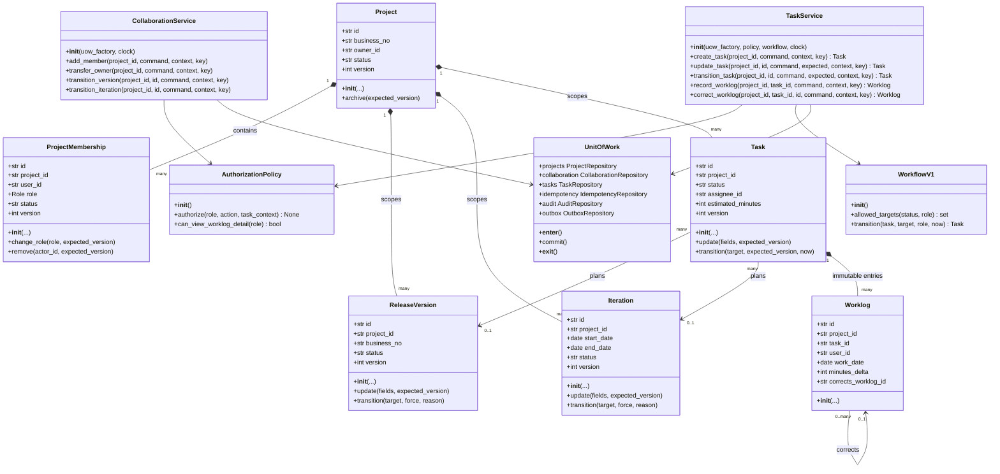
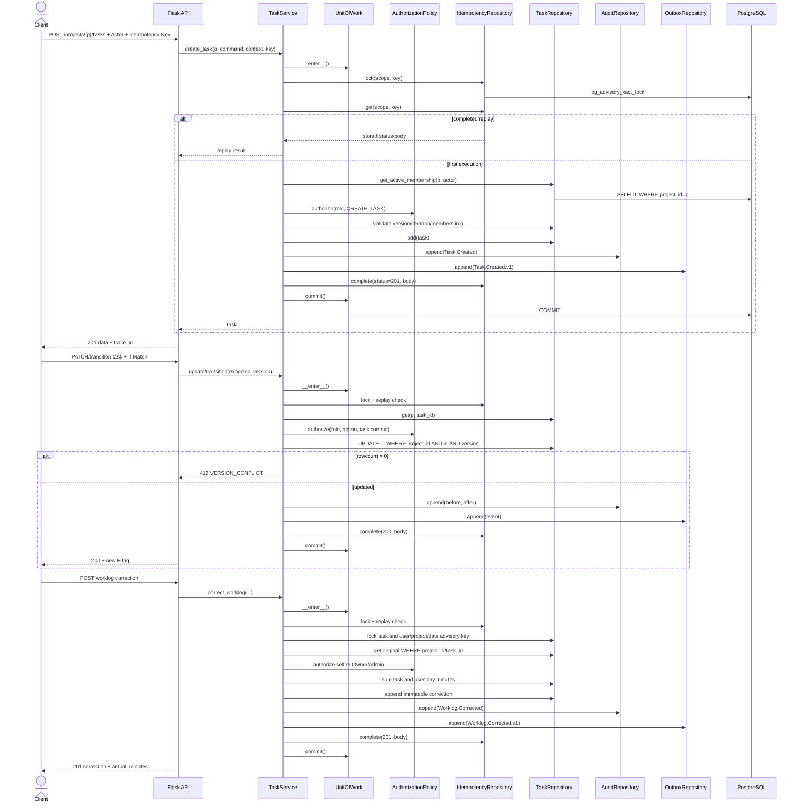
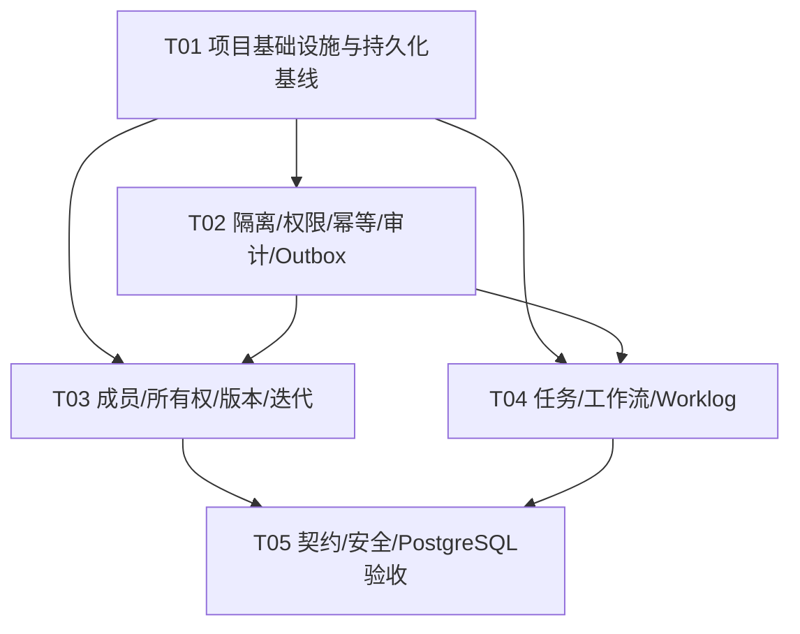

# project-service 项目协作增量架构设计与实施计划

- 日期：2026-08-02
- 状态：可实施（P0 裁决版）
- 基线：现有 `project-service` 0.2.0、迁移 `0001`
- 技术栈：Python 3.13、Flask 3.1、SQLAlchemy 2、PostgreSQL、Alembic
- 范围：项目成员/角色、版本、迭代、任务、Worklog；本地实现与测试优先

## Part A：系统设计

## 1. 实施方案与技术选型

### 1.1 现状与核心难点

现有服务已经具备 Flask application factory、RFC 9457 风格错误、`API → Service → Repository/UoW`、PostgreSQL advisory transaction lock 幂等、SQLAlchemy/Alembic 基线，但当前项目访问仅按 `projects.owner_id`，幂等记录只能引用 `projects.id`，领域事件在事务提交后写入进程内 list 且异常被吞掉。本增量的关键难点是：

1. 在不引入共享数据库、IAM 或分布式事务的前提下，落实项目级对象隔离和 Owner/Admin/Member/Viewer 权限。
2. 以数据库约束、事务内复核和乐观锁共同保证唯一 Owner、唯一 active 迭代、跨项目关联不可注入。
3. 让所有写 API 复用通用幂等执行器，能够重放任意资源/响应，而非只重放项目创建。
4. Worklog 只能追加、修正可追溯，同时并发下保证任务净工时与用户日净工时不越界。
5. 固定工作流的显式转换、版本检查、审计和 Outbox 必须处于同一事务。

### 1.2 架构裁决

- 保持 **Feature-first + Application Service + Repository/UoW**；领域 dataclass 不依赖 SQLAlchemy，ORM Row 只存在于 persistence 层。
- 不引入独立 workflow-service；P0 在本服务使用版本化固定模板和纯函数状态机。
- 使用 Flask Blueprint，不新增 Web 框架；请求 DTO 采用显式解析/规范化函数，OpenAPI 为契约事实源。
- 使用 SQLAlchemy 2 typed declarative 与 PostgreSQL 原生约束/部分唯一索引/行锁/advisory lock。
- UUID 继续用标准库 `uuid4()`，避免在本轮引入 UUIDv7 包和迁移风险；API 仍只承诺 UUID。
- 任务参与人使用关联表，不使用 PostgreSQL array；利于成员校验、查询和约束。
- `actual_minutes` 不持久化到 tasks，由 Worklog `SUM(minutes_delta)` 查询得出；避免双写漂移。
- 审计与领域事件分别落 `audit_records`、`outbox_events`，均与业务写同事务；P0 不实现 RabbitMQ publisher，不同步直发。
- 远程镜像构建/部署不作为本轮 DoD；仅保留现有 Docker 文件，不因公网 443 阻塞修改业务范围。

### 1.3 PRD 待确认项的 P0 明确裁决

1. 任务必须挂版本或迭代至少一个，不允许两者都空。
2. 不限制 30 天补录和跨月修正；`work_date` 不得晚于 UTC 当前日期，全部留审计。
3. 仅执行 1,440 分钟硬上限，不做 8/12 小时告警。
4. Owner/Admin 可强制发布版本或完成迭代，必须 `force=true` 且 `reason` 1～1000 字符。
5. 移除成员不阻塞；历史 assignee/participant 关系保留，后续只能分派给当前有效非 Viewer 成员。
6. 项目内无私密任务；所有有效成员可见任务。
7. Viewer 只读聚合 `actual_minutes`，Worklog 明细端点返回 403。
8. 项目角色由 project-service 持有；未来 IAM 仅提供主体身份，迁移通过身份适配器，不迁移项目授权主数据。
9. `VER-{sequence}`、`ITR-{sequence}` 为项目内编号；`TSK-{sequence}` 沿用全局序列。项目内编号通过计数器表原子递增，避免动态 PostgreSQL sequence。
10. P0 同事务落 Outbox 和审计；消息发布器、重试 worker、外部 audit-service 投递为后续批次。

### 1.4 分批交付

- **首批 P0-A**：基础设施演进、迁移、通用幂等/审计/Outbox、Owner 成员回填。
- **首批 P0-B**：成员权限、版本/迭代、任务/Worklog、OpenAPI 与全套本地测试。
- **后续 P1**：筛选排序、批量调整、项目工时汇总、剩余工时/容量/超期、Outbox publisher。
- **暂缓**：远程部署、RabbitMQ、IAM、前端、自定义工作流及所有 P2。

## 2. 数据库设计

### 2.1 表、索引与约束

| 表 | 关键列 | 约束与索引 |
|---|---|---|
| `projects`（修改） | 现有列；`owner_id` 保留为快速快照 | Owner 移交事务同步更新；列表改为 join membership；`status in ('active','archived')`；乐观锁 `version` |
| `project_memberships` | `id, project_id, user_id, role, status, joined_*, removed_*, version` | FK project RESTRICT；`status/role` check；部分唯一索引 `(project_id,user_id) WHERE status='active'`；部分唯一 `(project_id) WHERE status='active' AND role='owner'`；索引 `(user_id,status,project_id)` |
| `project_counters` | `project_id, counter_type, next_value` | PK `(project_id,counter_type)`；行锁原子分配 VER/ITR |
| `release_versions` | UUID、project、business_no、name、description、status、dates、version、审计时间 | UNIQUE `(project_id,business_no)`；唯一 `lower(btrim(name))`；status check；索引 `(project_id,status,id)` |
| `iterations` | UUID、project、business_no、name、goal、日期、capacity、status、version | 日期/capacity check；同项目编号/规范化名称唯一；部分唯一 `(project_id) WHERE status='active'`；索引 `(project_id,status,start_date,id)` |
| `tasks` | UUID、全局 business_no、project、版本/迭代 FK、字段、assignee、工作流、version、时间 | 至少一个范围 FK 非空；时间/预估/status check；复合 FK `(project_id,release_version_id)`、`(project_id,iteration_id)` 防跨项目；索引 `(project_id,status,created_at,id)`、`(project_id,assignee_id,status,id)`、范围索引 |
| `task_participants` | `project_id,task_id,user_id,added_at,added_by` | PK `(task_id,user_id)`；复合 FK `(project_id,task_id)`；索引 `(project_id,user_id,task_id)` |
| `worklogs` | UUID、project、task、user、recorded_by、日期、delta、description、corrects、reason、created_at | 无 updated_at；delta != 0 且范围；复合 FK `(project_id,task_id)`；自引用修正 RESTRICT；索引 `(project_id,task_id,work_date,created_at,id)`、`(project_id,user_id,work_date)`、`corrects_worklog_id` |
| `idempotency_records`（修改） | 增加 `operation, response_body JSONB, response_headers JSONB, expires_at`；`resource_id` 改为无 FK nullable UUID | UNIQUE `(scope,key)` 保持；完成态保存完整成功响应；旧记录兼容回填；索引 `expires_at` |
| `audit_records` | UUID、occurred_at、trace/actor/project/resource/action/result、before/after JSONB、reason/source/key | 仅 repository 提供 append；索引 `(project_id,occurred_at,id)`、`(trace_id)`、`(resource_type,resource_id,occurred_at)` |
| `outbox_events` | UUID、event_type/version、aggregate、project、payload JSONB、trace、occurred/available、status、attempts | status check；索引 `(status,available_at,occurred_at)`；P0 只插入 pending |

所有正式资产 FK 使用 `ON DELETE RESTRICT`，不提供业务物理删除 API。数据库层通过复合唯一键 `(project_id,id)` 作为跨项目复合 FK 的被引用键。

### 2.2 并发策略

- 幂等：先获取 `pg_advisory_xact_lock(hash(actor + operation + key))`，随后读取/创建幂等记录。
- Owner 移交：`SELECT project FOR UPDATE` 并锁定当前/目标 membership；单事务更新两个 membership 和 `projects.owner_id`；部分唯一索引作最终防线。
- 激活迭代：锁项目行，再转换状态；部分唯一索引防止两个并发 active。
- 可变聚合更新：SQL `UPDATE ... WHERE project_id=:p AND id=:id AND version=:expected`，`rowcount=0` 后区分不可见和版本冲突，成功 `version=version+1`。
- Worklog：按 `(project_id,user_id,work_date)` 获取 advisory transaction lock，同时锁任务行；事务内重新汇总用户日净额和任务净额，再追加记录。这样可防并发越过日上限或将任务净额修正为负数。
- 普通读取使用 READ COMMITTED；不提升全局隔离级别。

## 3. 文件清单（准确相对路径）

以下均相对 `project-service/`。首批控制为 32 个修改/新增源与测试文件；每个功能目录只保留 models/repository/service/api 四层，状态机与策略为共享纯逻辑。

```text
pyproject.toml                                      # 修改：契约测试依赖
openapi.yaml                                       # 修改：完整 OpenAPI 3.1
migrations/versions/0002_project_collaboration.py  # 新增
src/project_service/app.py                         # 修改：装配 Blueprint/Service
src/project_service/shared/errors.py               # 修改：412、状态冲突等
src/project_service/shared/http.py                 # 新增：If-Match、幂等头、游标/响应辅助
src/project_service/shared/idempotency.py          # 新增：规范化 hash 与执行器
src/project_service/shared/audit.py                # 新增：AuditRecord/OutboxEvent 工厂
src/project_service/projects/models.py             # 修改：Project 状态与 owner 快照
src/project_service/projects/repository.py         # 修改：project-scoped 接口
src/project_service/projects/service.py            # 修改：创建自动 Owner、成员项目列表
src/project_service/projects/api.py                # 修改：契约/访问语义
src/project_service/collaboration/models.py        # 新增：Membership/Version/Iteration
src/project_service/collaboration/repository.py    # 新增：协议
src/project_service/collaboration/policies.py      # 新增：动作-角色策略、状态机
src/project_service/collaboration/service.py       # 新增：成员/Owner/版本/迭代用例
src/project_service/collaboration/api.py           # 新增：相关路由
src/project_service/tasks/models.py                # 新增：Task/Worklog
src/project_service/tasks/repository.py            # 新增：协议
src/project_service/tasks/workflow.py              # 新增：固定模板 v1
src/project_service/tasks/service.py               # 新增：任务/Worklog 用例
src/project_service/tasks/api.py                   # 新增：相关路由
src/project_service/persistence/tables.py           # 修改：全部 ORM Row
src/project_service/persistence/repositories.py     # 修改：SQLAlchemy repositories
src/project_service/persistence/idempotency.py      # 修改：通用响应重放
src/project_service/persistence/uow.py              # 修改：暴露全部 repository

tests/test_collaboration_domain.py                  # 新增：权限、Owner、生命周期
tests/test_task_workflow.py                         # 新增：任务工作流/乐观锁规则
tests/test_worklogs.py                              # 新增：不可变修正/上限
tests/test_api_contract.py                          # 新增：OpenAPI/RFC9457/头
tests/test_project_isolation.py                     # 新增：跨项目/角色矩阵
tests/test_collaboration_postgres.py                # 新增：迁移/约束/并发/幂等/E2E
```

不新增空壳 `schemas.py`、publisher、metrics 模块。

## 4. 领域模型与接口



Repository 关键接口必须带 `project_id`：

```python
get(project_id: str, resource_id: str, *, for_update: bool = False) -> T | None
list(project_id: str, cursor: Cursor, filters: Filters) -> Page[T]
update(resource: T, expected_version: int) -> bool
get_active_membership(project_id: str, user_id: str, *, for_update: bool = False) -> ProjectMembership | None
sum_task_minutes(project_id: str, task_id: str) -> int
sum_user_day_minutes(project_id: str, user_id: str, work_date: date) -> int
append(worklog: Worklog) -> None
```

## 5. REST API 清单

所有 POST/PATCH/DELETE 均要求 `Idempotency-Key`；PATCH/transition/DELETE 还要求 `If-Match: \"<version>\"`。POST 成功 201，PATCH/transition 200，移除 204；重放返回首次状态码和主体。列表默认 50、最大 200，游标编码稳定排序键 `(created_at,id)` 或领域日期加 id。

| 方法 | 路径 | P0 权限/说明 |
|---|---|---|
| GET | `/api/v1/projects` | 有效成员项目，替换仅 owner 列表 |
| POST | `/api/v1/projects` | actor 成为 Owner；保留现有 API |
| GET | `/api/v1/projects/{project_id}` | 任一有效成员；非成员 404 |
| GET/POST | `/api/v1/projects/{project_id}/members` | GET 任一成员；POST Owner/Admin |
| PATCH/DELETE | `/api/v1/projects/{project_id}/members/{membership_id}` | Owner/Admin；Owner 禁止普通修改/移除 |
| POST | `/api/v1/projects/{project_id}/owner-transfers` | 仅 Owner |
| GET/POST | `/api/v1/projects/{project_id}/versions` | GET 任一成员；POST Owner/Admin |
| GET/PATCH | `/api/v1/projects/{project_id}/versions/{version_id}` | GET 任一成员；PATCH Owner/Admin |
| POST | `/api/v1/projects/{project_id}/versions/{version_id}/transitions` | Owner/Admin，支持受控 force |
| GET/POST | `/api/v1/projects/{project_id}/iterations` | 同版本 |
| GET/PATCH | `/api/v1/projects/{project_id}/iterations/{iteration_id}` | 同版本 |
| POST | `/api/v1/projects/{project_id}/iterations/{iteration_id}/transitions` | Owner/Admin，支持受控 force |
| GET/POST | `/api/v1/projects/{project_id}/tasks` | GET 全员；POST 非 Viewer |
| GET/PATCH | `/api/v1/projects/{project_id}/tasks/{task_id}` | GET 全员；PATCH 管理者或关联 Member |
| POST | `/api/v1/projects/{project_id}/tasks/{task_id}/transitions` | 管理者或模板允许且关联的 Member |
| GET | `/api/v1/projects/{project_id}/tasks/{task_id}/worklogs` | Owner/Admin/Member；Viewer 403 |
| POST | `/api/v1/projects/{project_id}/tasks/{task_id}/worklogs` | 本人；Owner/Admin 可代录且需原因 |
| POST | `/api/v1/projects/{project_id}/tasks/{task_id}/worklogs/{worklog_id}/corrections` | 本人；Owner/Admin 可代修且需原因 |

P1 `/worklogs/summary` 不在首批 OpenAPI 路由中；任务响应中的 `actual_minutes` 已提供可信聚合。

## 6. 权限判定流程

1. API 只从路径读取 `project_id`，解析受信 `X-Actor-Id` 和 trace；请求体不得决定项目。
2. Service 在 UoW 内查询 `get_active_membership(project_id, actor_id)`；不存在统一 404。
3. 查询项目状态；写请求若 archived 返回 409。
4. Policy 根据角色和 action 判定；角色不足 403。
5. 对 Member 的任务修改/流转，额外确认 actor 为 creator、assignee 或 participant，并校验目标转换允许 Member。
6. Repository 以 `project_id + resource_id` 查询对象；未命中统一 404。
7. 写关联对象在同事务内按同项目重新查询；被分派者必须是 active owner/admin/member。
8. Viewer 永不读取 Worklog 描述、修正原因和明细。
9. 失败的越权/非法流转：鉴权前不可泄露资源；在同一业务事务可记录的失败审计追加。对因回滚产生的失败审计，P0 采用独立最小审计事务 best-effort；不可因此改变错误响应，外部可靠失败审计留待 audit-service。

## 7. 工作流状态机

- Version：`planned→active|canceled`，`active→released|canceled`，`released→archived`。这里裁决 PRD 的“终态”歧义：released 可且仅可转 archived；canceled、archived 终态。
- Iteration：`planned→active|canceled`，`active→completed|canceled`；completed/canceled 终态。
- Task：`todo→in_progress|canceled`，`in_progress→done|canceled`，`done→closed|in_progress`；closed/canceled 终态。
- 版本 released 和迭代 completed 默认检查关联任务状态；Version 仅接受 closed/canceled，Iteration 接受 done/closed/canceled。强制动作绕过检查但不能绕过角色、乐观锁、reason 和审计。
- Task `todo→in_progress` 首次填 actual_start；`in_progress→done` 填 actual_end；`done→in_progress` 清当前 actual_end、保留 actual_start。实例固定 `workflow_template_key='task-default'`、`workflow_version=1`。

## 8. Worklog 不可变与修正模型

- 普通记录：`minutes_delta ∈ [1,1440]`，description 必填，`corrects_worklog_id=NULL`。
- 修正记录：`minutes_delta ∈ [-1440,1440]\{0}`，引用同项目、同任务、同 user 的任一既有记录；reason 必填。它是差额，不是替换值。
- 代录：`user_id/on_behalf_of_user_id` 为工时归属人，`recorded_by` 永远取 actor；actor 与归属人不同必须是 Owner/Admin 且 reason 必填。API 统一归一为 `user_id`，不存重复语义列。
- 不提供 Worklog PATCH/DELETE；ORM repository 不实现 update/delete；数据库角色权限收紧属于部署阶段，本地先靠 API、接口和测试保证。
- `actual_minutes=max(0,SUM(delta))`；插入前强制 SUM 后不得小于 0，因此正常情况下无需 max，仅作为读取防御。
- 用户日上限按同项目内该 user/date 的净额计算；“跨项目”不引入共享锁或跨库事务，因此不执行跨项目总和，明确解释 PRD 的“跨任务”为同项目跨任务。
- 已完成任务只允许 `work_date <= actual_end_at` 的业务日期；closed/canceled 禁止新增与修正。

## 9. 幂等、乐观锁与事务边界

### 9.1 通用幂等

幂等 scope 裁决为 `actor:{actor_id}|operation:{method canonical_path}`，key 区分大小写。请求 hash 包含 API 版本、method、路由模板、path IDs、规范化 query/body 和期望 version；同 key/同 hash 返回记录的完整 `response_status/response_body/headers`，不同 hash 返回 409。所有业务写、审计、Outbox、幂等完成在一次事务提交；失败不完成记录，允许安全重试。

### 9.2 乐观锁

所有可变聚合从 version=1 开始；`If-Match` 为必填强 ETag，格式 `"1"`。普通 POST Worklog 不要求任务 If-Match，因为以任务行锁和专用日锁串行；correction 同理。版本不匹配返回 RFC9457 412 `VERSION_CONFLICT`。

### 9.3 单用例事务

每个 service 写方法只开启一个 UoW：身份/项目状态复核 → 幂等锁与重放 → 对象/关联锁与校验 → 业务变更 → audit append → outbox append → idempotency complete → commit。禁止在事务内发 HTTP/RabbitMQ，禁止跨服务/跨库事务。

## 10. 审计与 Outbox 本轮边界

- 成功关键变更同时追加 audit 与 pending outbox；事件 payload 使用现有 envelope/audit schema 的字段风格，不含敏感数据。
- 审计 `before/after` 只保存变更字段；Worklog 保存 delta、归属人、日期和修正引用，不复制不必要正文。
- P0 Outbox repository 只支持 append/list pending 的未来接口，业务运行时不启动 publisher；不得继续使用 `event_store.append` 作为可靠事件。
- 非法流转/明确 403 的失败审计按第 6 节 best-effort 独立事务处理，这是“失败响应与审计同事务”不可同时满足的工程边界；成功审计绝不 best-effort。

## 11. Alembic 迁移策略

1. 新建单一 `0002_project_collaboration`，从 0001 正向升级；不修改 0001。
2. 先建新表、复合唯一键、序列/计数器和可空扩展列。
3. 为每个现有 project 插入 active Owner membership，来源 `projects.owner_id`；用 SQL 验证每个项目恰一 Owner。
4. 扩展 idempotency：移除 `resource_id→projects` FK，新增 operation/JSONB 响应列；旧 completed 记录保留 resource_id，API 项目创建仍可兼容读取。
5. 建索引时本地/测试普通创建即可；未来大表生产迁移另拆 `CREATE INDEX CONCURRENTLY`，本轮不存在大数据前提。
6. downgrade 只允许测试环境：先删除 0002 新表/索引/列并恢复幂等 FK；若存在非 project resource id 的幂等记录则显式阻止降级，避免静默破坏。
7. 测试验证 `0001→head`、`head→0001`（空增量数据）、重新 upgrade，以及约束和 Owner 回填。

## 12. 程序调用流程



## 13. 依赖包

运行时不新增第三方包：

- `Flask>=3.1,<4`：HTTP/API 框架（已有）
- `SQLAlchemy>=2.0.41,<2.1`：ORM、事务和 typed declarative（已有）
- `psycopg[binary]>=3.2.9,<4`：PostgreSQL 驱动（已有）
- `Alembic>=1.16.4,<2`：数据库迁移（已有）
- `gunicorn>=23,<24`：生产 WSGI（已有，本轮不远程部署）

开发依赖：

- `pytest>=8.4,<9`：单元/集成测试（已有）
- `PyYAML>=6.0.2,<7`：OpenAPI 解析（已有）
- `ruff>=0.12,<1`：格式与静态检查（已有）
- `jsonschema>=4.23,<5`：校验 RFC9457/事件 JSON Schema（新增 dev）
- `openapi-spec-validator>=0.7.2,<1`：OpenAPI 3.1 结构校验（新增 dev）

## Part B：任务分解

## 14. 测试策略

- 单元：policy 全矩阵、三个状态机、日期/范围、Worklog 修正链、规范化 hash；关键分支 ≥90%。
- PostgreSQL 集成：0001→0002、Owner 部分唯一、active iteration 部分唯一、复合 FK、乐观锁并发、幂等并发、Worklog 日锁并发。
- API/契约：OpenAPI validator、成功 envelope、RFC9457、每个错误码、Idempotency-Key/If-Match/ETag、游标稳定性。
- 安全：每种角色跨项目 ID 注入，非成员统一 404，成员角色不足 403，Viewer 明细屏蔽。
- E2E 黄金链：创建项目（自动 Owner）→加 Admin/Member→版本/迭代→任务→Worklog→修正→任务流转→发布/完成→工时一致。
- 性能：本地 PostgreSQL 记录 explain/基准，不把远程 P95 作为本轮阻塞项；查询必须命中上述 project 前缀索引。

## 15. 有序任务列表（硬上限 5）

### T01 项目基础设施与持久化基线
- **源文件**：`pyproject.toml`、`src/project_service/app.py`、`src/project_service/persistence/tables.py`、`src/project_service/persistence/uow.py`、`migrations/versions/0002_project_collaboration.py`、`src/project_service/shared/errors.py`
- **内容**：依赖声明、应用装配入口、全部表/约束/索引、UoW repository 插槽、迁移与 0001 Owner 回填、412/RFC9457 错误。
- **依赖**：无
- **优先级**：P0

### T02 横切能力：项目隔离、权限、幂等、审计与 Outbox
- **源文件**：`src/project_service/shared/http.py`、`src/project_service/shared/idempotency.py`、`src/project_service/shared/audit.py`、`src/project_service/persistence/idempotency.py`、`src/project_service/persistence/repositories.py`、`src/project_service/projects/models.py`、`src/project_service/projects/repository.py`、`src/project_service/projects/service.py`、`src/project_service/projects/api.py`
- **内容**：通用写幂等和完整响应重放、If-Match/游标、scoped repository、自动 Owner membership、成员项目列表、audit/outbox append。
- **依赖**：T01
- **优先级**：P0

### T03 成员、所有权、版本与迭代模块
- **源文件**：`src/project_service/collaboration/models.py`、`src/project_service/collaboration/repository.py`、`src/project_service/collaboration/policies.py`、`src/project_service/collaboration/service.py`、`src/project_service/collaboration/api.py`、`tests/test_collaboration_domain.py`
- **内容**：角色策略、成员任期、Owner 移交、版本/迭代 CRUD 与状态机、强制动作和审计。
- **依赖**：T01、T02
- **优先级**：P0

### T04 任务、工作流与不可变 Worklog 模块
- **源文件**：`src/project_service/tasks/models.py`、`src/project_service/tasks/repository.py`、`src/project_service/tasks/workflow.py`、`src/project_service/tasks/service.py`、`src/project_service/tasks/api.py`、`tests/test_task_workflow.py`、`tests/test_worklogs.py`
- **内容**：任务 CRUD/游标、参与人/负责人、固定工作流、乐观锁、Worklog 追加/代录/差额修正和并发净额校验。
- **依赖**：T01、T02；与 T03 可在接口冻结后并行开发，集成前依赖 T03 的 membership policy 实现
- **优先级**：P0

### T05 契约、安全与 PostgreSQL 集成验收
- **源文件**：`openapi.yaml`、`tests/test_api_contract.py`、`tests/test_project_isolation.py`、`tests/test_collaboration_postgres.py`、`tests/test_service.py`、`tests/test_postgres_integration.py`
- **内容**：完整 OpenAPI 3.1、既有测试适配、迁移/约束/并发/幂等、角色越权、E2E 黄金链与本地性能检查。
- **依赖**：T03、T04
- **优先级**：P0

## 16. 共享约定

- API JSON 为 `snake_case`；成功响应 `{data, meta:{trace_id,...}}`；错误为 `application/problem+json` RFC9457。
- UUID 为技术 ID；日期 `YYYY-MM-DD`；时间为 ISO 8601 UTC；数据库使用 timestamptz。
- actor 仅来自受信 `X-Actor-Id` 适配器；公网生产不得直信该头。
- 所有 repository 对项目资源必须以 `project_id` 为首参数和 SQL 条件，禁止 ID 后过滤。
- 非成员或跨项目资源统一 404；有效成员角色不足 403；校验 422；状态冲突 409；版本冲突 412。
- 写 API 强制 Idempotency-Key；可变聚合写强制 If-Match；状态不能通过普通 PATCH 修改。
- 正式资产、Worklog、审计、Outbox 不物理删除；Worklog 不更新。
- 单业务用例一个本地数据库事务；事务内不调用外部服务；不使用共享数据库和分布式事务。
- Outbox 本轮只可靠落库，不发布；远程部署暂缓，不影响本地 DoD。

## 17. 任务依赖图



## 18. 尚不清晰但不阻塞 P0 的事项

- 公司审计最低保留期、未来 audit-service 的失败审计可靠投递协议尚未确定；P0 不删除并预留 Outbox。
- 未来 IAM 的主体注销/合并语义尚未确定；P0 把 user_id 当不可变字符串。
- “同一自然日”项目时区未定义；P0 使用 UTC 业务日期，后续若引入项目时区需新 PRD 和数据迁移。
- 生产大数据迁移规模未知；P0 面向当前本地小数据，生产上线前需单独评审并发索引与回填批次。
