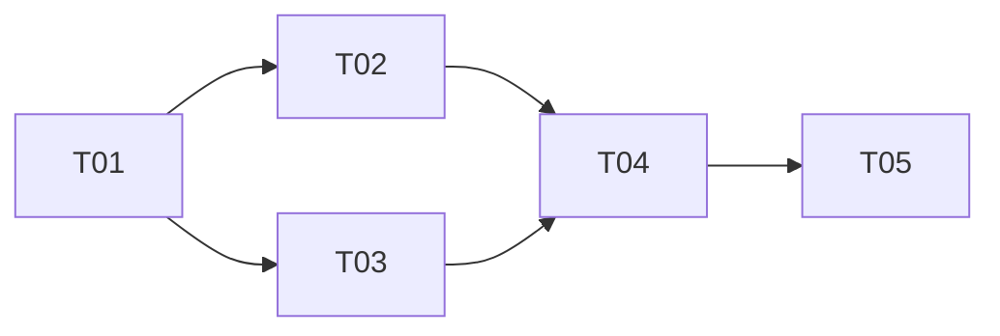

# Python 3.12.12 远程调试双兼容增量裁决

日期：2026-08-03  
范围：`project-service`、`iam-service`、`devops-api-gateway`、`workflow-service`、`audit-service`、`notification-service`、`platform-contracts` 测试、`platform-deployment` 测试。

## 1. 裁决

**有条件允许。** 允许将 **Python 3.12.12** 用作远程开发和集成调试镜像；源码、项目元数据、依赖资产和测试必须支持 **3.12/3.13 双兼容**。**生产正式基线、默认 Docker 基础镜像和发布门禁暂保留 Python 3.13**。每次构建、测试及验收报告必须记录实际的 `python --version`、镜像引用（最好含 digest）、平台及 wheelhouse 标识。

硬性边界：

1. 禁止把任何 `cp313`、`py3-none-*-cp313` 或其他仅匹配 CPython 3.13 ABI 的 wheel 安装到 3.12；安装前后均须校验 wheel tag。
2. 当前 Linux x86_64 CPython 3.13 wheelhouse **不能整体复用**。只有经清单确认的 `py3-none-any.whl` 可复制到共享纯 Python 层；二进制依赖必须为 3.12 新建 wheelhouse。
3. 不修改、不停止、不重建任何非 `wkDEVOPS` 容器；发现宿主机端口占用时只选择新端口，不抢占、不停服。
4. 3.12 调试通过不改变生产 3.13 裁决；生产基线变更需另行评审。

## 2. 现状与兼容评估

### 2.1 源码与项目元数据

- 6 个服务的 `pyproject.toml` 当前均为 `requires-python = ">=3.13"`，这是启用 3.12 的**明确阻断项**；应统一改为 `>=3.12,<3.14`（若团队不希望上界，则至少 `>=3.12`，但本计划推荐显式上界以避免未经验证的 3.14）。
- `project-service`、`iam-service` 的 Ruff 目标当前为 `py313`，应改为最低支持版本 `py312`；其余服务补齐相同配置。
- 对受管 `src/`、`tests/`、`migrations/`、`scripts/` 的静态检索未发现已知 3.13 专属 API/语法（如 `typing.TypeIs/ReadOnly` 直接导入、`copy.replace`、`sys._is_gil_enabled`、PEP 695 默认类型参数等）。现有 `datetime.UTC`、内置泛型和 `X | Y` 均可由 3.12 支持。
- 工作区存在大量 `cpython-313.pyc` 和本地 3.13 虚拟环境；它们不是源码兼容证据，也不得打包或复制到 3.12 镜像。构建上下文和发布清单应排除 `.venv*`、`__pycache__`、`*.pyc`、`.pytest_cache`、`.ruff_cache`。
- 最终语法裁决仍以 **3.12.12 容器内**执行 `python -m compileall`、安装和全量测试为准；本机 Python 启动异常使本轮不能用本机解释器代替该门禁。

### 2.2 依赖版本裁决

当前直接依赖版本区间总体具备 Python 3.12 候选版本：Flask 3.1、SQLAlchemy 2.0、Alembic 1.16+、psycopg 3.2+、Gunicorn 23、PyJWT 2.10、argon2-cffi 25、pyotp 2.9、Jinja2 3.1、pytest 8.4、Ruff 0.12、PyYAML 6、jsonschema 4、OpenAPI validator 0.7+。但目前没有统一锁文件，宽松上界会导致 3.12/3.13 解析漂移，因此：

- 为 3.12 与 3.13 从同一份直接依赖约束分别解析并生成带 hash 的约束/锁定资产；若解析结果不同，差异必须进入报告，不得静默漂移。
- 对有本地二进制的包重点验证：`psycopg-binary`、`argon2-cffi`/`cffi`、`cryptography`、`PyYAML`（可能选 C 扩展）、`MarkupSafe`、`greenlet`（SQLAlchemy 可选/传递）、Ruff。必须获得 Linux x86_64、目标 libc、CPython 3.12 可安装 wheel，或在受控构建镜像中构建并留存 SBOM/hash。
- `platform-contracts` 测试需要显式测试依赖 `jsonschema`、`PyYAML`；`platform-deployment/tests/golden_chain.py` 需要各服务运行/测试依赖。目前它明确跳过真实 PostgreSQL/RabbitMQ，不得把该测试宣称为基础设施验收。

## 3. 文件清单（增量实施）

### 必改

- `project-service/pyproject.toml`
- `iam-service/pyproject.toml`
- `devops-api-gateway/pyproject.toml`
- `workflow-service/pyproject.toml`
- `audit-service/pyproject.toml`
- `notification-service/pyproject.toml`
- `project-service/Dockerfile`
- `project-service/compose.debug.yaml`
- `project-service/compose.cached-runtime-debug.yaml`（移除“3.12 不支持”的过期失败占位，改为受控 3.12 调试入口或删除引用）
- `project-service/.env.example`
- `project-service/scripts/deploy.sh`
- `project-service/scripts/rollback.sh`
- `project-service/scripts/download_docker_image.py`
- `project-service/scripts/select_port.py`
- `platform-deployment/tests/golden_chain.py`
- `platform-contracts/tests/test_contracts.py`
- `platform-contracts/tests/test_openapi_documents.py`

### 建议新增（统一资产，避免各服务复制逻辑）

- `constraints/runtime.in`：共享直接依赖输入/允许区间。
- `constraints/cp312-linux-x86_64.txt`、`constraints/cp313-linux-x86_64.txt`：解析后的带 hash 约束。
- `scripts/build-wheelhouse.sh`：在对应解释器/目标镜像内构建 wheelhouse并拒绝错误 ABI。
- `scripts/verify-wheelhouse.py`：用 `packaging.tags` 校验所有 wheel 与当前解释器/平台匹配。
- `scripts/run-python-matrix.sh`：统一 3.12.12/3.13 服务、契约和部署测试。
- `.github/workflows/python-compatibility.yml`（或现有 CI 平台等价文件）：双版本矩阵。
- `platform-deployment/compose.integration.yaml`：仅创建隔离的 `wkDEVOPS-*` PostgreSQL/RabbitMQ/服务容器和动态宿主端口。
- `platform-deployment/tests/test_runtime_report.py`：断言报告包含实际 Python 版本和镜像信息。

> 若仓库实际 CI 不使用 GitHub Actions，应将上述 workflow 映射到正式 CI 配置，不能并存两套失真的门禁。

## 4. 依赖资产与 wheelhouse 策略

采用“**共享纯 Python 层 + ABI/平台隔离层**”：

```text
wheelhouse/
  common-py3-none-any/          # 仅经 tag 和 hash 清单确认的 py3-none-any
  linux-x86_64-cp312/           # Python 3.12 专属/兼容二进制及完整离线安装集合
  linux-x86_64-cp313/           # 保留现有 3.13 集合，重新生成清单
  manifests/
    cp312.json                  # Python、平台、libc、文件、sha256、来源
    cp313.json
```

执行规则：

1. 在 `python:3.12.12-slim`（或批准的等价 digest）内解析/下载 3.12 资产；在生产基线 3.13 镜像内解析 3.13 资产。
2. 目标为 Linux x86_64；必须同时匹配 manylinux/musllinux 与实际基础镜像 libc。不要把 Alpine wheelhouse 用于 Debian slim，反之亦然。
3. 允许复用的仅是文件名 tag 为 `py3-none-any` 且其 `Requires-Python` 接受 3.12/3.13 的 wheel；仍需校验 hash 和依赖闭包。
4. 3.12 离线安装命令必须指向 `common` + `cp312`，带 `--no-index --require-hashes`；安装后执行 `pip check` 和 ABI 扫描。3.13 同理。
5. 产物命名建议：`wkdevops-wheelhouse-linux-x86_64-cp312-<lockHash>.tar.zst` 与 `...-cp313-...`；应用镜像建议 `<registry>/wkdevops/<service>:<version>-py312-debug`，生产仍为 `<version>-py313`/正式不可变 tag。Docker 引用与容器名区分大小写语义：镜像仓库使用小写 `wkdevops`，运行容器保持现有 `wkDEVOPS-<service>-<role>-<env>` 约束。

## 5. 镜像、Compose 与部署参数化

- Dockerfile 保持 `ARG PYTHON_IMAGE`，默认值仍为生产 `python:3.13-slim`；调试显式传入 `python:3.12.12-slim` 或内部镜像 digest，禁止用浮动 `3.12`/`latest` 作为验收证据。
- Compose 给 `migrate`、`api` 的 `build.args.PYTHON_IMAGE` 传 `${PYTHON_IMAGE:-python:3.13-slim}`，并显式设置镜像名 `${APP_IMAGE:-wkdevops/project-service:dev-py313}`。其他服务后续 Docker 化使用同一约定。
- `deploy.env`/部署报告增加 `PYTHON_IMAGE`、`PYTHON_VERSION_EXPECTED`、`APP_IMAGE`、`WHEELHOUSE_ID`；启动前在镜像内执行版本断言，启动后从日志或诊断端点记录实际版本。
- `download_docker_image.py` 的默认生产 tag 可保留 3.13，但参数必须支持 `3.12.12-slim`，离线 repo tag 必须包含 `py312`/完整版本；下载报告记录 digest、OS/arch。
- `select_port.py` 继续“冲突则递增选新端口”，扩展为各暴露服务分别选端口并写入部署报告。不得通过 `docker stop/rm`、固定 5432/5672/15672 或修改已有容器解决冲突。
- 部署脚本只可对当前 Compose project `wkdevops-*` 执行 `up/down/rollback`；任何清理动作必须先按 label `com.docker.compose.project` 与名称双重确认，拒绝触及非 `wkDEVOPS` 对象。

## 6. PostgreSQL、Alembic 与 RabbitMQ

- Python 版本不改变 PostgreSQL 协议和 Alembic migration 语义。`project-service` 已使用 PostgreSQL JSONB、UUID、部分索引，因此 3.12 验收必须复用同一迁移链，在隔离 PostgreSQL 上执行 `upgrade head`，并至少做一次 `downgrade` 到安全边界后再次 `upgrade head`；禁止对共享/生产数据库做回退试验。
- `psycopg[binary]` 是 ABI 敏感点：3.12 必须使用 cp312/manylinux 兼容资产；不能复用 cp313 wheel。PostgreSQL 16/17 均可作为协议测试对象，但集成基线应固定一个版本（建议与现有 Compose 的 17 一致），另用 16 做非阻断兼容冒烟，避免把 Python 切换和数据库升级混成一次变更。
- RabbitMQ definitions（topic exchange、quorum queues、DLX 参数）与 Python 版本无关，但当前服务依赖中没有 AMQP 客户端，`golden_chain.py` 也明确跳过真实 RabbitMQ。因此 RabbitMQ 只能裁决为“配置静态兼容、运行链未被证明”。若要求真实事件链，需先明确并锁定 AMQP 客户端（如 `pika`/`kombu`/`aio-pika` 之一），实现发布/消费后再纳入 3.12/3.13 阻断矩阵。

## 7. CI 矩阵与测试边界

最小矩阵：

| 维度 | Python 3.12.12 | Python 3.13.x |
|---|---:|---:|
| 六服务 `compileall`、Ruff(py312)、单元/内存集成测试 | 必须通过 | 必须通过 |
| 六服务构建、离线安装、`pip check`、wheel tag 校验 | 必须通过 | 必须通过 |
| `platform-contracts` JSON Schema/OpenAPI 测试 | 必须通过 | 必须通过 |
| `platform-deployment` Flask golden chain | 必须通过但标记为内存链 | 必须通过但标记为内存链 |
| PostgreSQL 隔离实例、Alembic、关键 CRUD/并发 | 调试准入阻断 | 生产发布阻断 |
| RabbitMQ definitions 导入/拓扑检查 | 必须通过 | 必须通过 |
| 真实 RabbitMQ 事件 E2E | 当前不宣称；实现客户端后阻断 | 当前不宣称；实现客户端后阻断 |

所有 job 首行输出并归档：`python --version`、`sys.implementation.cache_tag`、`pip debug --verbose`、镜像 ID/digest、约束 hash、wheelhouse manifest hash。测试报告文件名带 `py312` 或 `py313`，不允许只写“兼容通过”。

## 8. 实施任务顺序（依赖有序，不超过 5 项）

### T01 项目元数据与静态兼容门禁（P0）

- 修改 6 个 `pyproject.toml`：`requires-python >=3.12,<3.14`，Ruff 最低目标 `py312`。
- 建立统一约束输入、缓存排除规则、3.12 `compileall`/API 扫描。
- 依赖：无。

### T02 双 wheelhouse 与基础镜像资产（P0）

- 从相同输入生成 cp312/cp313 锁定约束、hash 清单和 SBOM。
- 仅抽取经验证的 `py3-none-any` 到 common；增加错误 ABI fail-fast 测试。
- 获取/镜像化 Python 3.12.12 基础镜像并记录 digest。
- 依赖：T01。

### T03 Docker/Compose/部署安全参数化（P0）

- 参数化 `PYTHON_IMAGE`、应用镜像、wheelhouse、实际运行版本报告。
- 替换 3.12 “unsupported” 占位；实现新端口选择和 `wkDEVOPS` 对象保护。
- 3.13 保持默认，3.12 只能由显式 debug profile/tag 启用。
- 依赖：T01；可与 T02 并行开发，集成时需要 T02 资产。

### T04 双版本服务、契约与基础设施测试（P0）

- 建立 3.12.12/3.13 CI 矩阵，运行六服务、`platform-contracts`、`platform-deployment`。
- 在隔离 `wkDEVOPS` PostgreSQL/RabbitMQ Compose project 中执行迁移、CRUD、拓扑验收；真实事件 E2E 仍按当前缺口明确标为不宣称。
- 依赖：T02、T03。

### T05 远程灰度、证据归档与生产不变确认（P1）

- 使用新端口启动 `-py312-debug`，验证健康、关键 API、数据库迁移和报告版本；不触碰非 `wkDEVOPS` 容器。
- 同提交执行 3.13 回归，确认生产默认镜像/流水线未切换。
- 依赖：T04。



## 9. 回滚

1. 运行回滚：停止/移除**仅属于本次 Compose project 且名称以 `wkDEVOPS-` 开头**的 3.12 debug 容器；保留数据库卷快照用于排障，不操作外部容器。
2. 镜像回滚：将 `PYTHON_IMAGE`、`APP_IMAGE`、`WHEELHOUSE_ID` 恢复到已记录的 3.13 digest/hash，使用 `previous` release 重建当前 `wkDEVOPS` project。
3. 源码回滚：如发现语义差异，回退 `requires-python`/Ruff/部署参数化提交；不得通过向 3.12 强装 cp313 wheel规避。
4. 数据回滚：优先应用向前修复；只有在本次隔离库且 migration 明确可逆时执行 downgrade。生产/共享数据库仍遵循现有备份恢复流程。
5. 触发条件：任何 ABI 错误、依赖无法从批准来源闭包、迁移不一致、关键 CRUD/鉴权/幂等失败、报告版本与预期不符、或操作范围可能越过 `wkDEVOPS` 边界，立即终止 3.12 灰度并恢复 3.13。

## 10. 验收标准

全部满足才可签署“Python 3.12.12 远程开发/集成调试允许”：

- 六服务能在 3.12.12 与 3.13 从干净环境安装，`pip check` 通过；项目元数据接受两版本。
- 3.12 安装日志和 wheel manifest 中不存在 `cp313`，3.13 资产也未被误标成通用；所有文件有 hash。
- 两版本 `compileall`、Ruff(py312)、服务测试、契约测试、内存 golden chain 全绿，报告清晰标注实际版本。
- 3.12 隔离 PostgreSQL 上 Alembic `upgrade head` 和关键 CRUD/幂等/并发测试通过；3.13 同提交回归通过。
- RabbitMQ definitions 能导入隔离 broker，exchange/queue/DLX/quorum 参数符合预期；在 AMQP 客户端实现前，报告明确写“未验证真实事件 E2E”，不得扩大结论。
- 远程容器和 Compose project 均满足 `wkDEVOPS` 命名/label 约束；审计记录证明未停止、修改或删除非 `wkDEVOPS` 容器。
- 端口冲突时成功使用新端口，部署报告记录映射；没有占用或强制释放既有端口。
- 生产默认仍为 Python 3.13，不使用 `py312-debug` 镜像/tag；回滚演练可恢复已知 3.13 digest。

## 11. 最终边界说明

本裁决只授权 **Python 3.12.12 远程开发与集成调试**。它不等于生产降级、不等于现有 cp313 wheelhouse 可复用，也不证明当前尚未实现的真实 RabbitMQ 发布/消费链。工程师应按 T01→T05 执行，以双版本测试证据完成最终签署。
