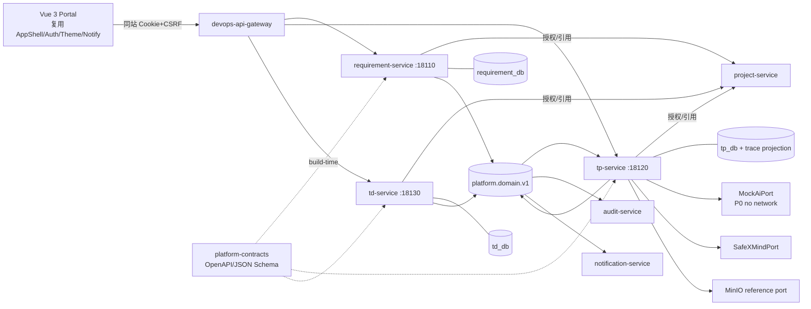
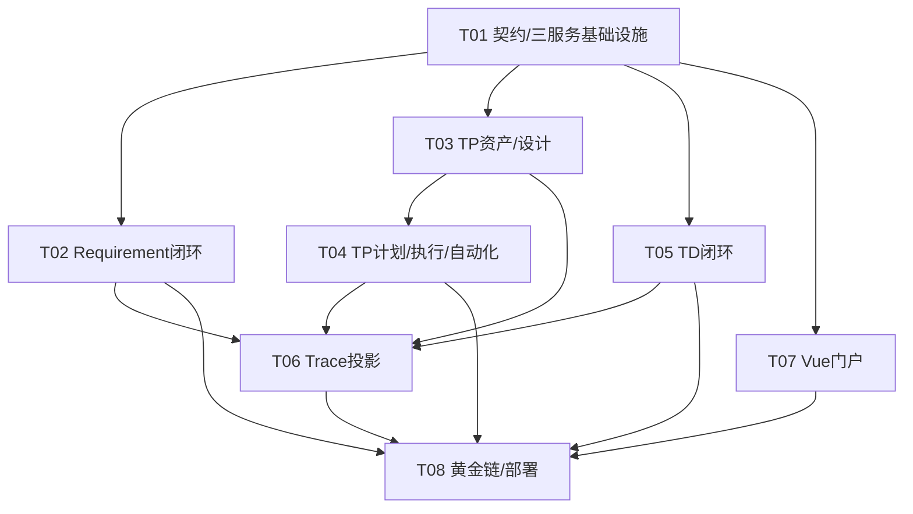

# 需求、TP 测试、TD 缺陷与追溯增量架构

- 日期：2026-08-03
- 状态：架构裁决完成，可实施
- 输入：`docs/superpowers/specs/2026-08-03-requirement-tp-td-increment-prd.md`
- 已核对基线：公司 DevOps 总体设计、platform-foundation 架构、project collaboration 架构、`platform-contracts`、现有 `project-service`/IAM/workflow/audit/notification/portal/deployment 结构
- 运行基线：Python `>=3.12,<3.14`（生产 3.13，调试 3.12.12）；Flask 3.1、SQLAlchemy 2、PostgreSQL、Alembic；Vue 3/TS/Vite/Pinia/Vuetify 3

## Part A：系统设计

## 1. 实施方法与关键裁决

### 1.1 难点与选型

1. 三个领域都包含不可变快照、显式状态机和跨域引用，且严禁共享 DB/跨库 FK。采用 **Feature-first + Domain Model + Application Service + Repository/UoW + Ports/Adapters**；ORM Row 只在 persistence，领域对象不依赖 Flask/SQLAlchemy。
2. 跨服务强一致不可得。一个命令只开启一个服务私库事务：授权与远端引用在事务前批量校验；事务内再次校验本域事实并写业务/历史/幂等/Outbox；事件最终一致构建投影。同步依赖不可用时强关联失败关闭 503。
3. 不可变资产与可变聚合并存。RequirementRevision、BaselineSnapshot、TestCaseVersion、StageArtifact、冻结计划范围、已发布 Report、验证证据均追加；可变聚合使用 `version` 和 `If-Match`，SQL `UPDATE ... WHERE project_id AND id AND version`。
4. AI/XMind 是不可信边界。定义端口；P0 只装配确定性离线 Mock。XMind 使用标准库 `zipfile` + `defusedxml` 流式解析约定模板，不执行宏、不取外链、不解压到用户路径。
5. 跨域查询不能实时扇出形成深调用链。每服务拥有本域发出的权威 link；`tp-service` 内置 `trace_projection` 消费各域事件，BFF 只调用一个统一查询端点，并可并行补齐当前用户可看的少量摘要。投影绝不是授权事实源。
6. 首轮控制文件规模：每服务仅 `app/config/database/api/domain/service/repository/persistence/integrations/messaging`，TP 内按 `library/design/execution/automation` 四个 P0 内部批次，先共用 persistence/UoW，不为每张表创建文件。

依赖选择：Flask/SQLAlchemy/Alembic/psycopg 延续平台样板；Pydantic 2 负责 HTTP/端口边界；Kombu 管 RabbitMQ publisher/consumer；Celery 不进入 P0 核心命令，Stage worker 使用 Kombu consumer + application handler，避免两套重试语义；`defusedxml` 处理 XMind/JUnit XML；`jsonschema` 校验事件和自动化 JSON；前端复用已有 AppShell/auth/theme/notification/api client，只增业务 feature。

### 1.2 服务边界（不得互相越界）

| 服务 | 权威聚合/职责 | 明确不负责 |
|---|---|---|
| requirement-service | Requirement/Revision、ReviewRound/Decision、Baseline、ChangeRequest；需求发出的 links；需求事件 | 用例、任务、版本成员事实；AI/XMind；跨域报表 |
| tp-service | Folder/TestCase/Version/Step、DesignSession/StageRun/Artifact/Gate/ImportBatch、Environment/Plan/Execution/CaseRun/Report、Automation Asset/Suite/Task/Ingestion；统一 trace 只读投影/查询 | 需求正文、缺陷状态、项目权限事实、真实 AI/Runner/GitLab |
| td-service | Defect、状态历史、重复关系、SLA 快照、Fix/Verification Evidence；缺陷发出的 links | 用例/执行事实、真实 MR 合并验证、发布门禁 |
| project-service | 项目成员/角色/归档、版本/迭代/任务存在性和最终授权事实源 | 三域对象和追溯投影 |
| BFF/Portal | Cookie/JWT 转发、CSRF、统一入口、少量并行摘要聚合 | 业务状态判断、投影授权、Token 暴露给 JS |

每个服务写前调用 project-service：
- `POST /internal/api/v1/authorization/check`：`actor_id,project_id,action,resource`；800ms 超时、失败关闭。
- `POST /internal/api/v1/references/check`：批量验证 project/version/iteration/task/member，响应逐项 `exists,same_project,active,role`；一次命令最多 200 项，服务 JWT scope `project:references:check`。
- 三服务各自提供同名 references/check，仅验证自己的端点，供关系拥有方调用；不返回敏感正文。

### 1.3 总体架构



## 2. 数据库、聚合、约束与迁移

通用表（每库独立）：`idempotency_records` 唯一 `(scope,key)` 并保存 request_hash/完整成功响应；`outbox_events` 索引 `(status,available_at,id)`；`processed_events` 主键 `(consumer_name,event_id)`；`audit_outbox` 可复用领域 Outbox 的 AuditEvent，不另做跨库写；`traceability_links` 仅在拥有关系的服务存在。所有 UUID、`timestamptz`；正式资产 RESTRICT/无 DELETE API；JSONB 有应用 schema 与字节上限。

### 2.1 requirement_db

| 表 | 关键约束与索引 |
|---|---|
| `requirements` | unique `(project_id,business_no)`；check type/source/priority/status/baseline_status；`version>=1`；FK `(project_id,parent_id)` 指向本表复合唯一；索引 `(project_id,status,updated_at desc,id desc)`、`(project_id,parent_id,type)`、`(project_id,release_version_id,iteration_id)`、`(project_id,owner_id,status)`；title 1..200 在 DB check |
| `requirement_revisions` | unique `(requirement_id,revision_no)`、unique `(requirement_id,content_hash)`；正文/AC/父/范围完整快照，创建后 trigger 拒绝 UPDATE/DELETE；索引 `(project_id,requirement_id,revision_no desc)` |
| `requirement_reviews` | unique `(requirement_id,round_no)`；status check；固定 `revision_id/submitted_by`；索引 `(project_id,status,submitted_at,id)` |
| `review_assignments` | PK `(review_id,reviewer_id)`；提交人不可作 reviewer 的 service+check 约束（跨行规则由事务验证） |
| `review_decisions` | append-only；unique `(review_id,reviewer_id,sequence_no)`；latest 由查询；decision check；不覆盖历史 |
| `requirement_baselines` | unique `(project_id,baseline_no)`、unique `(project_id,release_version_id) WHERE status='active'`；status check；激活后 trigger 禁止内容更新 |
| `baseline_items` | PK `(baseline_id,requirement_id)`；unique `(baseline_id,revision_id)`；保存 revision_hash；不可变 |
| `change_requests` | unique `(requirement_id,change_no)`；status/urgency check；`base_revision_id` 固定；proposed_patch 仅允许字段白名单；version |
| `change_reviews` | append-only批准证据；Owner 紧急审批规则由 policy |
| `requirement_acceptance_results` | append-only AC 结论；unique `(requirement_id,revision_id,criterion_id,sequence_no)` |

**层级算法**：只允许 `epic→feature→user_story→fr|nfr|ac`，每节点最多一个父；设置父节点时锁当前 requirement 和候选父，执行 recursive CTE 从候选父向祖先走，若遇当前 id 则 409 `REQUIREMENT_CYCLE`；深度硬上限 4；同项目复合 FK 为最后防线。父子/正文/AC/范围变更先产生 draft revision；对象一旦 baselined，普通 PATCH 对上述字段返回 409 `CHANGE_REQUEST_REQUIRED`。

**状态与事务**：
- Requirement：`draft→in_review→approved→active→completed`；`in_review→rejected→draft`；`active→canceled`；`completed→active`（Owner/Admin+reason）。状态只通过 transition。
- Review submit 固定 revision，至少一个指定非提交人；每位 reviewer 决策追加。approve transition 要至少一人 approve、无当前 unresolved reject。
- Baseline activate：锁 release 范围和项目计数器；验证所有 revision approved、同项目/版本；插 baseline items；旧 active baseline→superseded；新 baseline→active；相关 Requirement approved→active；同事务 Outbox。
- ChangeRequest `draft→in_review→approved|rejected|canceled`；`approved→applied` 单事务锁 Requirement/CR，校验 base revision 仍 current，应用白名单 patch 生成 `revision_no+1` 和 hash，更新 current_revision/version，创建新 baseline（旧 supersede），CR applied；旧 revision/baseline 不变。并发 base 已变化返回 412。

迁移：`0001_requirement_core`（通用+requirements/revisions）→`0002_requirement_governance`（reviews/baselines/change）→`0003_requirement_trace`（links/约束 trigger/索引）。空库逐条升级；不与其他服务迁移排序耦合。

### 2.2 tp_db（按内部批次建模，避免文件爆炸）

**P0-A 测试资产/设计：**
- `test_folders`：unique `(project_id,parent_id,normalized_name) NULLS NOT DISTINCT`；`path` 仅缓存，真实树以 parent_id；active/archived；移动使用 recursive CTE 禁止自身/后代，锁源/目标，同项目，最大深度 20。
- `test_cases`：unique `(project_id,business_no)`；索引 project/folder/status、owner；current_version_no；active 后内容不能 PATCH。
- `test_case_versions`：unique `(case_id,version_no)`、unique `(case_id,content_hash)`；immutable trigger；pre/postconditions/source/source node；`test_case_steps` unique `(case_version_id,sequence)`，sequence 1..500，action/expected 非空；Requirement refs 单独 `test_case_requirement_refs`，最多100且保存 requirement/revision/hash。
- `design_sessions`、`stage_runs` unique `(session_id,stage,attempt)`、`stage_artifacts` unique `(stage_run_id,result_version)`、`review_gates` append-only、`import_batches`、`import_mappings`。Artifact 只保存对象引用/hash/安全元数据，正式二进制在 MinIO；provider/model/prompt/adapter/参数摘要齐全。

DesignSession 状态：`draft→analyzing→analysis_review→designing→design_review→generating_cases→cases_review→ready_to_import→imported`；异步运行失败为 `failed`，记录 `resume_state`，显式 retry 回该阶段；未 imported 可 canceled。每次 stage run 在短事务创建 queued+Outbox，worker 在独立事务 claim，调用端口（事务外），再以 CAS 写 completed/failed+artifact+Outbox；项目归档时只允许落 failed/canceled 草稿，不导入正式资产。Gate 是人工命令：下一阶段检查最近成功 run 的最新 approved gate；Member 自己生成的 gate 默认不能自批，Owner/Admin 可批但仍记录例外。Import 整批单事务，最多1000 cases；任何 validation/conflict 错误整体回滚。`update_if_same_source` 仅对同 source node 且已有新 gate 的 case 新增版本，永不 UPDATE 旧版本。

**XMind 安全算法（实现不得自行简化）：**
1. 仅接受已扫描对象引用，读取流最多 50 MiB；检查 ZIP magic，拒绝加密 entry、软链接/特殊文件、重复规范化名称、绝对路径、盘符、NUL、反斜杠及 `..`。
2. 逐 entry 检查 `file_size≤50MiB`、总展开 `≤200MiB`、entry 数 `≤2000`、`file_size/max(compress_size,1)≤100`；只允许白名单 `content.json|content.xml|metadata.json|manifest.json|Thumbnails/*`，未知文件不解压且计入限额。
3. 不落磁盘；`ZipFile.open` 分块读取并维护实际总字节，声明值与实际不符即拒绝。XML 用 `defusedxml`; JSON 最大嵌套20；禁 DTD/entity、外链/URI、宏/脚本/公式。
4. 解析约定 schema，节点深度≤20、总节点≤10000、单标题≤500、单 notes≤20000、用例≤1000；节点 ID/父关系唯一且无环；输出规范化 IR 后做 SHA-256。任何失败删除临时草稿引用、审计错误码，不回显包内容。

**P0-B 计划/执行/自动化：**
- `test_environments` unique `(project_id,normalized_name)`；classification check；configuration_summary≤8KiB；只存 `secret_ref_count`，键名含 secret/token/password 即 422。
- `test_plans` unique `(project_id,business_no)`；`plan_scope_items` 保存 requirement revision/case version/environment 快照，ready 时冻结并由 trigger 禁改；计划 `draft→ready→in_progress→completed→closed`，前三态可 canceled。ready 校验每 requirement 有用例且 case active；in_progress 后只能新增 execution round。
- `test_executions` unique `(plan_id,round_no)`；`case_runs` unique `(execution_id,case_version_id,attempt_no)`；attempt 追加。`not_run→running→passed|failed|blocked|skipped`；终态更正创建 attempt+1。失败/阻塞必须 actual_result；evidence refs 上限50。
- `test_reports` unique `(execution_id,revision)`；draft 可重算；publish 固定 metrics/coverage/open defect summary/hash，trigger immutable。
- `automation_assets` unique `(project_id,normalized_name)`；`automation_suites`、`automation_suite_cases`、`automation_tasks`、`result_ingestions` unique `(project_id,source,external_run_ref)` 并保存 payload_hash、`automation_result_items`。首次相同 source/run/hash 重放原响应；同 run 不同 hash 409。JUnit 也用 defusedxml，payload≤10MiB、tests≤10000、属性/文本限长、不解析外部实体；JSON 只接受固定 schema、≤10MiB/10000 items。映射不到 case version 记录 unmapped，不伪造；映射到冻结 run 时新增 automation attempt，不覆盖人工结果。

迁移：`0001_tp_library_design` → `0002_tp_plans_execution` → `0003_tp_automation` → `0004_tp_trace_projection`。T03 只需 0001；T04 依次升级后续。每条迁移含通用表演进但不得修改前序 revision。

### 2.3 td_db

- `defects`：unique `(project_id,business_no)`；字段枚举 check、标题长度、`version>=1,reopen_count>=0`；索引 `(project_id,status,updated_at desc,id)`、`(project_id,assignee_id,status)`、`(project_id,severity,status)`、SLA due/breach 部分索引。
- `defect_reproduction_steps` unique `(defect_id,sequence)` 1..50；正式记录不物理删，编辑生成 history diff。
- `defect_history` append-only unique `(defect_id,sequence_no)`。
- `defect_links`（领域稳定 refs）unique `(defect_id,target_service,target_type,target_id,target_version,link_type) WHERE status='active'`，最多每类100；也是 Defect 发出的 TraceabilityLink 权威来源。
- `defect_fix_evidence`、`defect_verification_evidence` append-only，引用/摘要/分类，不保存下载 URL。
- `defect_sla_snapshots` 与 defect 1:1，创建时按 severity 固化 policy_key/version/时限；UTC 连续时间。rejected/duplicate/closed 停止；pending_verification 不暂停。定时 scanner 只以幂等 `SlaBreached` 事件提示。
- `defect_duplicates` unique `(duplicate_id)`，master 同项目、非自身；设置时 recursive CTE 沿 master 链检查无环，且 master 不得自身为 duplicate；反向查询索引 `(project_id,master_id)`。

状态动作固定为 `assign,start,reject,mark_fixed,submit_verification,verify_close,verify_fail,manual_reopen,mark_duplicate`，普通 PATCH 不含 status/assignee 之外受限动作字段：
- new→assigned 需 active 非 Viewer assignee；assigned→in_progress 仅 assignee/Owner/Admin。
- in_progress→fixed 同一动作强制 fix_version + fix_evidence + summary；fixed→pending_verification 强制 active verifier。
- pending_verification→closed 强制 passed、verification environment/evidence、root_cause；失败→reopened；reopened→assigned 可由同一命令分派。
- closed→reopened 仅 Owner/Admin/原 verifier/报告人且理由；事务内 `reopen_count+1`，第二次起通知 Owner/Admin。
- new|assigned|in_progress→duplicate→closed 为一个原子动作，原因+master 必填；rejected/duplicate 不要求 root cause。

迁移：`0001_td_core` → `0002_td_sla_trace`；先主表/history/evidence，再 SLA/links/duplicate 索引。

## 3. Traceability 所有权、投影与完整性

### 3.1 所有权白名单

关系的 `source` 所在领域拥有创建、校验、supersede 和事件：requirement-service 拥有 `requirement parent_of/implemented_by/analyzed_by/covered_by/targeted_to`；tp-service 拥有 `test_case_version included_in|executed_as`、`case_run found`、`test_plan targeted_to`；td-service 拥有 `defect affects|detected_by|fixed_by|verified_by|targeted_to`。project-service 将来拥有 task/code/version/release 发出的关系。客户端不能通过任一服务创建 source 不属本域的 link；反向关系只查询，不重复存权威行。

创建流程：先本域授权和 source 当前版本校验；批量调用远端 reference port 验证 target 存在且同项目；依赖不可用 503；本地事务 insert link+Outbox。删除语义仅 `active→superseded`。远端删除/废弃事件使投影 `broken`，不篡改权威 link。

### 3.2 投影和统一查询

`tp_db` 的 `trace_nodes(project_id,service,type,id,source_version,label,status,last_event_at,stale_at,deleted_at)`、`trace_edges(project_id,owner_service,link_id,source_key,target_key,link_type,status,verified_at,last_event_id)`、`trace_projection_offsets(consumer,event_id,occurred_at)`；唯一 node key、edge owner/link；消费者在同一事务插 processed_event/upsert projection。事件乱序：仅当 `(aggregate.version,occurred_at,event_id)` 更新颖才覆盖；gap 标记 stale 并进入 reconciliation queue，不猜状态。

`GET /traceability` 由 tp-service 执行 recursive CTE：direction `forward|reverse|both`，默认 depth4/最大8、默认节点500；维护 visited node+edge 防循环，稳定排序；达到上限返回 `truncated=true` 和 frontier，不静默遗漏。`stale=true`：节点最后事件超过 `TRACE_STALE_SECONDS=30` 或发现版本 gap；`broken=true`：端点 tombstone/引用校验明确不存在；依赖暂不可达只能 stale，不能 broken。BFF 不拼接三套图，只转发查询，再针对当前页面首屏最多20节点并行取已授权摘要；摘要失败保留节点状态。

完整性 API 对 release scope 产生 rules：R1 active/completed baselined requirement→task；R2→active case version（NFR exception 可满足）；R3 ready plan 每 requirement 有 case；R4 case 有 requirement 或 exploratory；R5 failed run 有 defect/exception；R6 blocker/critical 计划关闭前有 defect/Owner exception；R7 closed defect 有 fix version/evidence 与 verification run/evidence。结果为 `pass|fail|unknown`；任何相关 stale/broken/truncated 令规则 unknown，绝不报 pass。

## 4. 类图

```mermaid
classDiagram
  class Requirement {+UUID id +UUID project_id +RequirementType type +RequirementStatus status +int current_revision +int version +__init__() +set_parent() +transition()}
  class RequirementRevision {+int revision_no +str content_hash +dict snapshot +__init__()}
  class ReviewRound {+int round_no +ReviewStatus status +UUID revision_id +decide() +close()}
  class Baseline {+str baseline_no +BaselineStatus status +activate()}
  class ChangeRequest {+int change_no +ChangeStatus status +dict proposed_patch +transition() +apply()}
  class RequirementService {+__init__(uow,authorizer,refs) +create() +patch() +submit_review() +decide() +activate_baseline() +apply_change()}
  Requirement "1" *-- "many" RequirementRevision
  Requirement "1" *-- "many" ReviewRound
  Baseline "1" o-- "many" RequirementRevision
  Requirement "1" *-- "many" ChangeRequest
  RequirementService --> Requirement

  class TestCase {+UUID id +UUID folder_id +CaseStatus status +int current_version +activate_version()}
  class TestCaseVersion {+int version_no +str content_hash +CaseSource source}
  class TestStep {+int sequence +str action +str expected}
  class DesignSession {+SessionStatus status +int version +start_stage() +apply_gate() +mark_imported()}
  class StageRun {+Stage stage +int attempt +RunStatus status +str provider +complete() +fail()}
  class ReviewGate {+GateDecision decision +UUID reviewer_id}
  class TestPlan {+PlanStatus status +datetime scope_frozen_at +freeze() +transition()}
  class TestExecution {+int round_no +ExecutionStatus status +start() +complete()}
  class CaseRun {+int attempt_no +RunResult status +transition() +rerun()}
  class AutomationTask {+AutomationStatus status +transition()}
  class ResultIngestion {+str external_run_ref +str payload_hash +IngestStatus status}
  class TpService {+__init__(uow,authorizer,refs,ai,xmind) +create_case_version() +run_stage() +gate() +import_cases() +freeze_plan() +transition_case_run() +ingest_results()}
  class AiPort {<<interface>> +run(stage,input_ref,parameters) Artifact}
  class XMindPort {<<interface>> +validate(stream) IR +generate(IR) Artifact +parse(stream) IR}
  TestCase "1" *-- "many" TestCaseVersion
  TestCaseVersion "1" *-- "many" TestStep
  DesignSession "1" *-- "many" StageRun
  StageRun "1" *-- "many" ReviewGate
  TestPlan "1" *-- "many" TestExecution
  TestExecution "1" *-- "many" CaseRun
  TpService --> AiPort
  TpService --> XMindPort

  class Defect {+UUID id +DefectStatus status +Severity severity +int reopen_count +int version +assign() +mark_fixed() +submit_verification() +close() +reopen() +mark_duplicate()}
  class SlaSnapshot {+str policy_version +datetime response_due_at +datetime resolution_due_at +bool breached +evaluate()}
  class FixEvidence {+EvidenceType type +str external_ref +str summary}
  class VerificationEvidence {+str environment_ref +str conclusion +list evidence_refs}
  class DefectService {+__init__(uow,authorizer,refs,clock) +create() +patch() +transition() +scan_sla()}
  Defect "1" *-- "1" SlaSnapshot
  Defect "1" *-- "many" FixEvidence
  Defect "1" *-- "many" VerificationEvidence
  DefectService --> Defect

  class UnitOfWork {<<interface>> +repositories +__enter__() +commit() +__exit__()}
  class ProjectAuthorizationPort {<<interface>> +check(actor,project,action,resource) Decision}
  class ReferenceValidationPort {<<interface>> +check(project,refs) ValidationResult}
  class TraceabilityLink {+UUID id +Endpoint source +Endpoint target +str link_type +LinkStatus status +supersede()}
  class TraceProjectionService {+consume(event) +query(root,direction,depth,limit) Graph +completeness(scope) Rules}
  RequirementService --> UnitOfWork
  TpService --> UnitOfWork
  DefectService --> UnitOfWork
  RequirementService --> ProjectAuthorizationPort
  TpService --> ProjectAuthorizationPort
  DefectService --> ProjectAuthorizationPort
  RequirementService --> ReferenceValidationPort
  TpService --> TraceProjectionService
  TraceProjectionService --> TraceabilityLink
```



## 5. 关键程序调用流

```mermaid
sequenceDiagram
  actor U as Portal User
  participant B as BFF
  participant R as RequirementService
  participant P as project-service
  participant RDB as requirement_db
  participant MQ as RabbitMQ
  participant TP as TpService/Worker
  participant TDB as tp_db
  participant AI as MockAiPort/XMindPort
  participant TD as DefectService
  participant DDB as td_db
  participant Q as TraceProjection

  U->>B: POST requirement + Idempotency-Key
  B->>R: JWT/trace/command
  R->>P: authorization.check + references.check
  P-->>R: allowed, same project
  R->>RDB: tx requirement+revision+audit+outbox+idem
  RDB-->>R: commit; ETag 1
  MQ-->>Q: Requirement.Created v1
  U->>R: submit review / decisions + If-Match
  R->>RDB: append review/decisions; CAS aggregate; outbox
  U->>R: activate baseline + If-Match
  R->>RDB: tx lock scope; immutable items; activate requirements; outbox
  MQ-->>Q: Requirement.Baselined

  U->>TP: POST design-session(revision refs)
  TP->>P: authorize + validate refs
  TP->>TDB: tx session + trace links + outbox
  loop analysis/design/cases
    U->>TP: POST stage-run + If-Match
    TP->>TDB: tx queued run + outbox
    TP-->>U: 202
    TP->>TDB: worker claim
    TP->>AI: deterministic offline run (outside tx)
    AI-->>TP: artifact hash/ref provider=mock
    TP->>TDB: tx CAS complete + artifact + outbox
    U->>TP: POST review-gate + If-Match
    TP->>TDB: tx append human gate + advance session
  end
  U->>TP: POST imports
  TP->>TDB: tx validate all; insert cases/immutable versions/links/mappings
  U->>TP: ready plan then execution/case-run failed
  TP->>TDB: freeze scope; append run result; outbox

  U->>TD: POST defect linked to run/requirement/task
  TD->>P: authorize/project refs
  TD->>TP: references.check(case/run)
  TD->>R: references.check(requirement)
  TD->>DDB: tx defect+SLA+links+history+outbox
  U->>TD: assign→start→fixed→pending verification→close
  TD->>DDB: each command CAS + gates + history/evidence/outbox
  MQ-->>Q: domain/link events
  U->>B: GET traceability direction=both
  B->>Q: one graph query
  Q->>TDB: recursive CTE + completeness
  Q-->>B: graph stale/broken/truncated flags
  B-->>U: authorized graph + summaries
```

## 6. API、事件、审计与通知契约

### 6.1 REST

PRD 第 10 节所有 P0 路由原样实现，补充：
- 三服务 `GET /health`、`GET /ready`、`POST /internal/api/v1/references/check`；tp-service 提供 traceability 两个 GET。
- BFF upstream 前缀不改，仍代理 `/api/v1/**`；路由按 path 映射到三服务。
- 成功 `{data,meta:{trace_id,next_cursor?}}`；204 无体；RFC9457 `application/problem+json`。400 头格式、401 身份、403 角色、404 不可见/跨项目、409 状态/幂等负载冲突、412 版本、413 文件、422 schema、503 依赖。
- 所有写请求要求 `Idempotency-Key`；PATCH/transition/review/gate/import/freeze/publish 等修改现有聚合要求 `If-Match: "n"`，响应 `ETag: "n+1"`。幂等 scope=`actor|service|method|route-template`，hash 含 path/body/query/expected version。
- 游标是 URL-safe base64 的版本化 JSON，包含稳定排序末项 `(updated_at,id)`；默认50、最大200；不接受 offset。

### 6.2 platform-contracts

新增 OpenAPI：`openapi/{requirement,tp,td}.yaml`，公共 `$ref common.yaml`；新增 Schema：
- `schemas/requirement-events.v1.schema.json`
- `schemas/tp-events.v1.schema.json`
- `schemas/td-events.v1.schema.json`
- `schemas/traceability-events.v1.schema.json`
- `schemas/reference-check.v1.schema.json`
- `schemas/automation-result.v1.schema.json`

事件 envelope 沿用现有 `event-envelope.schema.json`，exchange `platform.domain.v1`，routing key 为小写事件族（如 `requirement.baseline_changed`），event_type 保留 PRD Pascal 事实名，`event_version=1`。队列：每个消费者独立 quorum queue；publisher confirm；5s/30s/5m，最多5次，之后 `platform.dlx.v1`。Topic 完整清单即 PRD 11.1；每个 schema 使用 `oneOf event_type` 且 `additionalProperties:false`。Breaking change 必须新 event_version/schema/topic 消费能力，不能原地改 v1 必填字段。

事件只含 id/business_no/status/version、revision/hash、必要 recipient ids 和统计摘要；严禁正文、AC全文、prompt、测试数据、复现步骤、附件 URL、环境配置、Cookie/Token/Secret。Actor 只含稳定主体/类型/break_glass，不携项目角色作授权。

### 6.3 审计/通知映射

- 所有成功命令各发一个领域事实和一个最小 AuditEvent（或由 audit consumer 确定性映射，禁止双重记录）；失败的权限/文件/AI安全拒绝发安全审计，不能含恶意 payload。
- Requirement review/decision/change/baseline → reviewer、owner、受影响计划 owner；TP queued failure/gate/execution assignment/failed/blocked/report → session/plan owner、assignee；TD assigned/verification/SLA/reopen>=2 → assignee/verifier/Owner/Admin。
- notification-service 去重 `(recipient_id,source_event_id,template_key)`；target 仅 `/app/projects/{project_id}/...` 白名单。`Traceability.ProjectionUpdated` 不生成通知。

## 7. 完整文件清单（首轮受控）

```text
platform-contracts/
  openapi/{common.yaml,requirement.yaml,tp.yaml,td.yaml}
  schemas/{event-envelope,requirement-events.v1,tp-events.v1,td-events.v1,traceability-events.v1,reference-check.v1,automation-result.v1}.schema.json
  tests/{test_contracts.py,test_openapi_documents.py,test_domain_contracts.py}

requirement-service/
  pyproject.toml alembic.ini .env.example Dockerfile
  openapi/openapi.yaml
  src/requirement_service/{__init__.py,app.py,config.py,database.py,api.py,domain.py,service.py,repository.py,persistence.py}
  src/requirement_service/integrations/{project_authorization.py,reference_validation.py}
  src/requirement_service/messaging/{outbox.py,publisher.py}
  migrations/{env.py,script.py.mako,versions/0001_requirement_core.py,versions/0002_requirement_governance.py,versions/0003_requirement_trace.py}
  tests/{conftest.py,test_domain.py,test_governance.py,test_api.py,test_postgres.py,test_contracts.py}

tp-service/
  pyproject.toml alembic.ini .env.example Dockerfile
  openapi/openapi.yaml
  src/tp_service/{__init__.py,app.py,config.py,database.py,api.py,domain.py,service.py,repository.py,persistence.py}
  src/tp_service/library/{models.py,service.py}
  src/tp_service/design/{models.py,service.py,ports.py,mock_ai.py,safe_xmind.py}
  src/tp_service/execution/{models.py,service.py}
  src/tp_service/automation/{models.py,service.py,ingestion.py}
  src/tp_service/traceability/{models.py,service.py,consumer.py,api.py}
  src/tp_service/integrations/{project_authorization.py,reference_validation.py,object_storage.py}
  src/tp_service/messaging/{outbox.py,publisher.py,worker.py}
  migrations/{env.py,script.py.mako,versions/0001_tp_library_design.py,versions/0002_tp_plans_execution.py,versions/0003_tp_automation.py,versions/0004_tp_trace_projection.py}
  tests/{conftest.py,test_library_domain.py,test_design_gates.py,test_xmind_security.py,test_execution.py,test_automation_ingestion.py,test_traceability.py,test_api.py,test_postgres.py,test_contracts.py}

td-service/
  pyproject.toml alembic.ini .env.example Dockerfile
  openapi/openapi.yaml
  src/td_service/{__init__.py,app.py,config.py,database.py,api.py,domain.py,service.py,repository.py,persistence.py}
  src/td_service/integrations/{project_authorization.py,reference_validation.py,fix_evidence.py}
  src/td_service/messaging/{outbox.py,publisher.py,sla_worker.py}
  migrations/{env.py,script.py.mako,versions/0001_td_core.py,versions/0002_td_sla_trace.py}
  tests/{conftest.py,test_domain.py,test_sla_duplicate.py,test_api.py,test_postgres.py,test_contracts.py}

devops-api-gateway/
  src/gateway/{app.py,upstream.py}                         # 仅增加三 upstream 映射

devops-portal/
  package.json package-lock.json                          # 只增测试/生成依赖
  src/router/index.ts                                     # 增量路由
  src/layouts/AppShell.vue                                # 增量导航，不重写壳
  src/api/{generated.ts,requirements.ts,tp.ts,td.ts,traceability.ts}
  src/stores/{requirements.ts,testManagement.ts,defects.ts,traceability.ts}
  src/components/common/{DomainState.vue,VersionConflictDialog.vue,StatusActionMenu.vue}
  src/features/requirements/components/{RequirementForm.vue,AcceptanceCriteriaEditor.vue,ReviewPanel.vue,BaselinePanel.vue,ChangeRequestPanel.vue}
  src/features/testing/components/{FolderTree.vue,CaseTable.vue,CaseVersionPanel.vue,CaseStepsEditor.vue,DesignStepper.vue,StageArtifactPreview.vue,ReviewGateDialog.vue,PlanScopePanel.vue,ExecutionGrid.vue,ReportSummary.vue,AutomationIngestPanel.vue}
  src/features/defects/components/{DefectForm.vue,DefectActions.vue,SlaPanel.vue,EvidencePanel.vue,DefectHistory.vue}
  src/features/traceability/components/{TraceGraph.vue,TraceTable.vue,CompletenessPanel.vue,TraceWarnings.vue}
  src/views/{RequirementListView.vue,RequirementEditView.vue,RequirementDetailView.vue,RequirementReviewView.vue,TestLibraryView.vue,TestCaseDetailView.vue,TestDesignListView.vue,TestDesignDetailView.vue,TestPlanListView.vue,TestPlanDetailView.vue,TestExecutionView.vue,TestReportView.vue,DefectListView.vue,DefectEditView.vue,DefectDetailView.vue,TraceabilityView.vue}
  tests/unit/{requirements.spec.ts,design-stepper.spec.ts,execution.spec.ts,defects.spec.ts,traceability.spec.ts}
  tests/e2e/{requirement-tp-td-golden-chain.spec.ts,requirement-tp-td-accessibility.spec.ts}

platform-deployment/
  compose.integration.yaml .env.example
  postgres/init-databases.sql
  rabbitmq/definitions.json
  images/{Dockerfile.python313,Dockerfile.python312-debug}
  scripts/{build-wheelhouse.ps1,build-wheelhouse.sh,validate-wheelhouse.py,deploy-wkdevops.sh,rollback-wkdevops.sh}
  tests/{golden_chain.py,test_runtime_report.py,test_wheelhouse_validation.py}
```

## 8. Vue 具体集成

路由严格采用 PRD 第13节，作为 `/app/projects/:project_id` 的懒加载 children；meta 只做 UX：`domainAction` 与 active project，后端最终授权。Pinia 只保存当前详情/草稿/ETag和跨页面选择：requirements、testManagement、defects、traceability；列表筛选/游标放 URL+composable，避免全局缓存污染。clients 包装现有 `client.ts`，不再实现 refresh/CSRF/problem。

DesignStepper 以服务返回 `allowed_actions/blocked_reasons/provider` 驱动，不在前端复制状态机；provider=mock 常驻标签。所有状态动作由 `StatusActionMenu` 打开领域表单，提交 If-Match，412 用统一冲突框刷新。TraceGraph 必须同时有 TraceTable；图组件 P0 用 SVG/HTML 自绘分组有向边，不引入重型图库。窄屏 FolderTree 为 drawer、列表为 cards。已有 AppShell/auth/theme/notification/tokens/global CSS 只能增导航/token，禁止复制。

## 9. 安全红线与环境变量

**红线**：生产不得 trusted actor headers、Mock AI/Mock fix validator 暗中冒充真实能力、外部 AI 网络、跨库 ORM/FK、共享 DB 账号、明文 Secret、任意 URL fetch、XMind 路径解压、XML entity、状态 PATCH、正式资产 UPDATE/DELETE、投影授权、绕过人工 gate、跨项目错误泄露。`APP_ENV=production` 且 `AI_ADAPTER=mock` 仅在 `ALLOW_EXPLICIT_MOCK_CAPABILITY=true` 的验收环境可启动，并在 `/ready` 和 UI 标为 degraded；正式生产发布门禁禁止该值。

通用：`APP_ENV,SERVICE_NAME,DATABASE_URL,LOG_LEVEL,JWT_ISSUER,JWT_AUDIENCE,JWKS_URL,PROJECT_SERVICE_URL,PROJECT_AUTH_TIMEOUT_MS=800,RABBITMQ_URL,RABBITMQ_EXCHANGE=platform.domain.v1,OUTBOX_POLL_MS=500,OTEL_EXPORTER_OTLP_ENDPOINT`。

Requirement：`REQUIREMENT_BUSINESS_PREFIX=REQ,MAX_REQUIREMENTS_PER_BASELINE=5000,REFERENCE_CHECK_TIMEOUT_MS=1000`。

TP：`AI_ADAPTER=mock,XMIND_ADAPTER=safe,OBJECT_STORAGE_ENDPOINT,OBJECT_STORAGE_BUCKET,MAX_XMIND_UPLOAD_BYTES=52428800,MAX_XMIND_EXPANDED_BYTES=209715200,MAX_XMIND_RATIO=100,MAX_XMIND_ENTRIES=2000,MAX_XMIND_NODES=10000,MAX_XMIND_DEPTH=20,MAX_IMPORT_CASES=1000,MAX_AUTOMATION_PAYLOAD_BYTES=10485760,TRACE_DEFAULT_DEPTH=4,TRACE_MAX_DEPTH=8,TRACE_MAX_NODES=500,TRACE_STALE_SECONDS=30`。

TD：`SLA_SCAN_INTERVAL_SECONDS=60,FIX_EVIDENCE_ADAPTER=placeholder,REOPEN_ESCALATION_THRESHOLD=2`。Portal：`VITE_BFF_BASE_URL=/`，不得含 secret/upstream token。

## Part B：实施与验收

## 10. Required Packages

- `Flask>=3.1,<4`、`SQLAlchemy>=2.0.41,<2.1`、`psycopg[binary]>=3.2.9,<4`、`Alembic>=1.16.4,<2`、`gunicorn>=23,<24`
- `pydantic>=2.11,<3`：HTTP/端口边界；`kombu>=5.5,<6`：RabbitMQ；`jsonschema>=4.23,<5`：事件/JSON ingestion；`defusedxml>=0.7.1,<1`：XMind/JUnit；`structlog>=25,<26`、OpenTelemetry Flask/SQLAlchemy
- 开发：`pytest>=8.4,<9`、`pytest-cov>=6,<7`、`testcontainers[postgres,rabbitmq]>=4.10,<5`、`openapi-spec-validator>=0.7.2,<1`、`ruff>=0.12,<1`、`mypy>=1.17,<2`
- 前端沿用 `vue@^3.5`、`vue-router@^4.5`、`pinia@^3`、`vuetify@^3.9`；新增/确认 `openapi-typescript@^7.8`、`vitest@^3.2`、`@vue/test-utils@^2.4`、`msw@^2.10`、`@playwright/test@^1.54`、`@axe-core/playwright@^4.10`
- 不引入 networkx、第三方 XMind SDK、Allure parser、真实 AI SDK、GitLab SDK或第二套 UI/CSS 框架。

## 11. 测试策略

- 领域单元：全部合法/非法状态边；review 自批、baseline/change 不可变；folder/requirement/duplicate 无环；gate 顺序；plan/case-run；TD fix/verify/reopen；完整性三值逻辑。
- API：角色矩阵、非成员/跨项目404、Viewer写403、所有写缺 key、同 key 同/异 payload、If-Match 缺失/并发412、游标、RFC9457、OpenAPI 生成 client 无 diff。
- PostgreSQL：每服务空库 upgrade、逐 migration、约束/部分唯一/trigger、并发 CAS/幂等/Outbox 原子；真实 PG 未提供时以 `pytest.mark.integration` 明确 skip 并写原因，不能以 SQLite 通过替代最终 DoD。
- XMind/AI：Zip Slip、bomb、伪造 size/ratio、加密、重复路径、symlink、DTD/entity、深度/节点/标题/notes、未知模板、恶意 JSON；Mock 确定性/hash/provider；失败恢复；跳 gate/自批/归档竞态；正式 case 防覆盖。
- 自动化：JUnit/JSON 正反例、entity bomb、重复 ingest、同 run 异 hash、unmapped、10000边界、映射冻结 run attempt。
- RabbitMQ：schema、confirm、重复/乱序/gap、5s/30s/5m/DLQ、replay 幂等；无 broker 时 contract/fake 测试可跑且 broker tests skip，最终黄金链必须真实 broker。
- 跨域 consumer/provider contract：project authorization/reference、requirement/tp/td references、所有事件 v1、字段最小化。
- Portal：Vitest stores/actions/Stepper/trace table/412；`vue-tsc --noEmit`、Vite production build；Playwright 360/768/1280、200% zoom、keyboard/focus、light/dark/system、axe 无 serious/critical。浏览器环境缺失可 skip Playwright，但 Vitest/build 不得 skip，最终 DoD 仍需补证。
- Flask 黄金链：PRD 第15节全链，另含跨项目、Viewer、幂等、并发、恶意包、AI fail、duplicate loop、非法关闭、projection stale/broken/truncated。

## 12. Docker、双版本 wheelhouse 与恢复策略

- 集成端口：requirement `18110`、TP `18120`、TD `18130`；仅绑定 `127.0.0.1` 或 wkDEVOPS 内网，避开旧 `18080`。PostgreSQL/RabbitMQ 继续可配置 `25432/25672/25673`。
- 所有新容器名以 `wkDEVOPS-` 开头；脚本在变更前检查并拒绝 stop/rm 非此前缀容器，绝不操作旧 18080 服务。Compose project name 固定 `wkdevops-rttd`。
- 默认镜像 Python 3.13 digest；3.12.12 debug 镜像独立 tag/profile，不进入 production compose。wheelhouse 按 `cp313-manylinux_x86_64`、`cp312-manylinux_x86_64` 分目录，纯 Python wheel 可复制但 manifest 分别校验；lock/manifest/SHA256/许可证/漏洞报告齐全，`pip --no-index --require-hashes` 安装。
- migration job 顺序是各服务内部 revision 顺序；三服务可并行迁移，健康前必须 head；失败停止该服务部署，不回滚其他库数据。应用镜像非 root、只读 rootfs、临时目录限额、健康/就绪、优雅停止。
- 远程基础设施可延后：本地 memory adapters（auth/ref/event/object storage/AI）和 Flask API 组件链必须测试；真实 PG/Rabbit/MinIO/Playwright 明确 skip 项写报告。恢复条件：内部 Python/Node 镜像或离线 OCI+双 wheel/npm cache、独立 DB账号/vhost/TLS/secret、卷备份、镜像 Critical=0、本地黄金链全绿。
- 远程部署采用 expand→migrate→逐服务 canary→smoke→切 BFF route；回滚先恢复旧 BFF route/镜像，不 destructive downgrade；若新 schema 向后兼容保留。数据恢复按每私库 PITR，RPO≤15m/RTO≤2h；Outbox 从 last confirmed 重放。部署/回滚脚本只接受 allowlist service/container。

## 13. 顶层任务（8项，按依赖）

### T01 契约与三服务项目基础设施（P0）
- **Source Files**：platform-contracts 新 OpenAPI/Schema/tests；三服务 `pyproject.toml/alembic.ini/.env.example/Dockerfile/app.py/config.py/database.py/api.py/repository.py/persistence.py`；deployment DB/Rabbit 定义。
- **Dependencies**：无。
- **验收**：Python 3.12/3.13 lint/type/unit；三服务 health/ready；私库/迁移入口；公共 RFC9457/幂等/ETag/游标；事件 schema；内存 adapters；无业务假成功。

### T02 requirement-service 完整闭环（P0）
- **Source Files**：requirement domain/service/persistence/integrations/messaging、0001~0003、OpenAPI、tests。
- **Dependencies**：T01。
- **验收**：层级/无环、revision/review/baseline/change 状态机；激活/应用事务不可变；项目授权、跨项目404；并发412/幂等/Outbox；全部 API/事件。

### T03 TP 测试库与设计生产链（P0）
- **Source Files**：tp library/design/integrations、safe_xmind/mock_ai、0001、tests。
- **Dependencies**：T01；仅依赖 T02 冻结的 requirement reference/event contract，不依赖其代码完成。
- **验收**：folder 无环/唯一；case immutable versions/steps/refs；完整 Stepper 状态、每阶段 artifact metadata、人 gate、整批 import；全部 XMind 恶意包和 AI 防绕门禁测试。

### T04 TP 计划、执行、报告与自动化摄取（P0）
- **Source Files**：tp execution/automation、0002/0003、worker/API/OpenAPI/tests。
- **Dependencies**：T01、T03。
- **验收**：ready 冻结范围；execution/case attempts；published report 不可变；environment 无 secret；asset/suite/task；JUnit/JSON 安全摄取、重复幂等/异 hash409、unmapped 可见。

### T05 td-service 缺陷闭环（P0）
- **Source Files**：td domain/service/persistence/integrations/messaging、0001/0002、OpenAPI/tests。
- **Dependencies**：T01；引用契约冻结后可与 T02-T04 并行。
- **验收**：全部显式动作/角色；fix/verify/close/reopen gate；duplicate 无环；SLA snapshot/breach；跨域引用项目一致；历史/证据/Outbox 原子。

### T06 Traceability 与事件投影（P0）
- **Source Files**：三服务 links/event publisher/consumer；tp traceability、0004；platform-contracts trace schema；审计/通知映射测试。
- **Dependencies**：T02、T03、T04、T05。
- **验收**：权威 ownership 不可伪造；正反向一致；乱序/重复/gap；stale/broken/truncated；完整性 pass/fail/unknown；深度/节点限额；P95设计索引；投影不授权。

### T07 Vue 门户业务能力（P0）
- **Source Files**：router/AppShell 增量、四 clients/stores、common 和 requirement/testing/defect/trace components、16 views、Vitest。
- **Dependencies**：T01 的 OpenAPI；可按 mock 与 T02-T06 并行，集成验收依赖 T02-T06。
- **验收**：PRD 全路由非占位；Design Stepper/gates/action forms/412；trace graph+table；稳定 URL筛选；复用壳/auth/theme/notify；Vitest/type/build、三主题/响应式/键盘。

### T08 黄金链、真实基础设施与部署资产（P0）
- **Source Files**：deployment compose/init/Rabbit/images/scripts/tests、三服务集成/契约测试、Portal Playwright。
- **Dependencies**：T02、T03、T04、T05、T06、T07。
- **验收**：完整黄金链及负例；可用时真实 PG/RabbitMQ/Playwright，全缺失项明确 skip 和补验条件；双 Python wheelhouse；wkDEVOPS allowlist、端口不碰18080；恢复/回滚演练证据。



## 14. 共享约定

- JSON snake_case；UUID 技术 ID；时间 UTC ISO8601/timestamptz；日期 `YYYY-MM-DD`；正文受控 Markdown 作为文本渲染。
- project-service 是成员/角色/归档唯一事实源；JWT 不携项目角色事实；非成员/跨项目404，角色不足403。
- Repository 的首参数/首 SQL 条件必须 `project_id`；跨域只存稳定 id/type/version/hash，无共享 ORM/DB/FK。
- 命令顺序：外部批量引用预校验→本地 UoW 内授权上下文复核/幂等锁→聚合锁/状态校验→业务+history+links+outbox+idem commit；事务内禁止 HTTP/MQ/AI/对象存储。
- 事件事实名+event_version；消费者 processed_event 与投影同事务；Outbox publisher confirm 后标 sent；DLQ 仅受控重放。
- 正式历史只追加；状态只显式 action；前端动作显隐不替代 API 授权；projection 不替代事实源。
- 日志、事件、审计、通知禁止 Token/Cookie/password/OTP/secret、全文/提示词/测试数据/复现详情/附件 URL。

## 15. 尚不清晰事项与本设计确定假设

PRD 已足够实施。本设计固定：业务号使用各私库 project counter（REQ/TPD/TC/TP/TE/TD），不追求跨服务连续；`ac` 既可作为需求节点也可作为结构化 criterion，两者通过稳定 ref 关联但不自动互相生成；P0 Review 最新结论以追加序列计算；计划 completed 与 closed 分离，closed 执行完整性提示但不阻塞 project release；SLA “工作日”P0 按 PRD 裁决为 UTC 连续时间；P0 trace query 落 tp-service 而非新建第四服务；MinIO 不可用时本地内存对象 adapter 只用于测试且返回 `adapter=memory`；真实 AI、GitLab MR、Runner、Allure 和 release 实现均不进入本批次。

## 16. 全局 Definition of Done

1. 三服务独立启动，私库 Alembic 空库到 head；所有 P0 API/字段/状态/权限/事件实现且 OpenAPI 生成前端类型无 drift。
2. Requirement 版本/评审/基线/变更、TP 设计门禁/用例/冻结执行/报告/自动化、TD 修复验证/重复/SLA 均满足上述事务与不可变规则。
3. 每次成功写的业务、history、幂等、Outbox 原子；RabbitMQ 重投去重、退避、DLQ可证；审计/通知映射可证。
4. 跨域关系所有权、正反向、stale/broken/truncated、完整性三值正确；不共享 DB、不跨库 FK、不把投影用于授权。
5. 权限/跨项目、幂等、乐观锁、迁移、恶意 XMind/XML/JSON、AI gate、防 secret、自动化摄取测试通过；关键状态/权限/幂等/安全分支≥90%。
6. Portal 全部 P0 页面非占位，复用平台壳；Vitest/typecheck/build 全绿；有环境时 Playwright/axe 三主题三宽度/200%完成，无 serious/critical。
7. Python 3.13 生产矩阵与3.12.12调试矩阵均绿；生产默认3.13。真实 PG/Rabbit/Playwright 暂缺只允许显式 skip，不得宣称最终基础设施验收完成。
8. 双版本离线构建资产、SHA256、wkDEVOPS 容器/端口 allowlist、迁移/回滚/恢复说明齐全；不停止、删除或改写旧18080及任何非 wkDEVOPS 容器。
